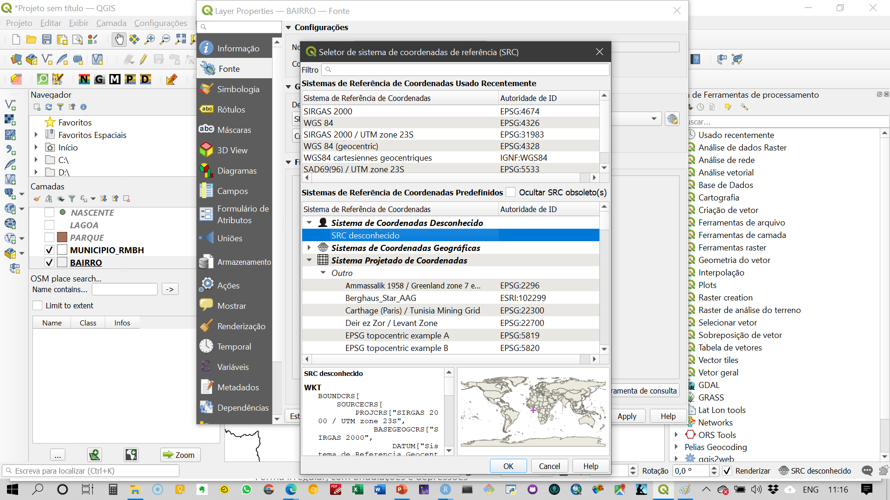
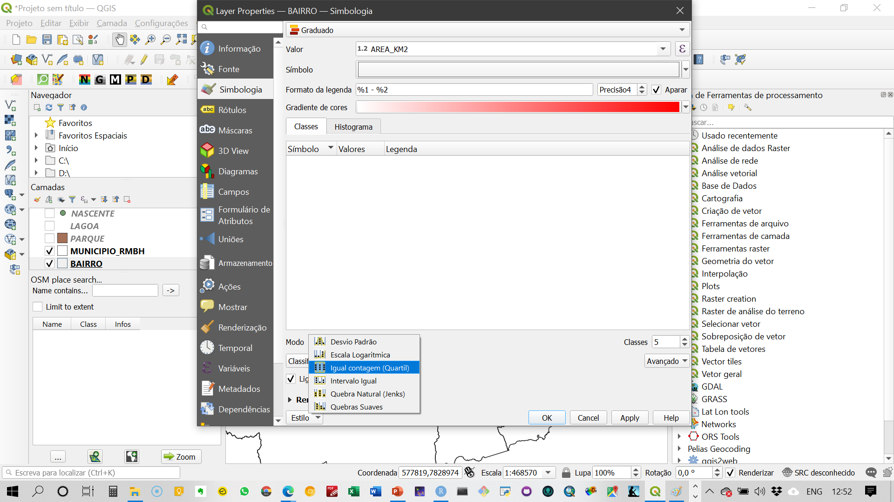
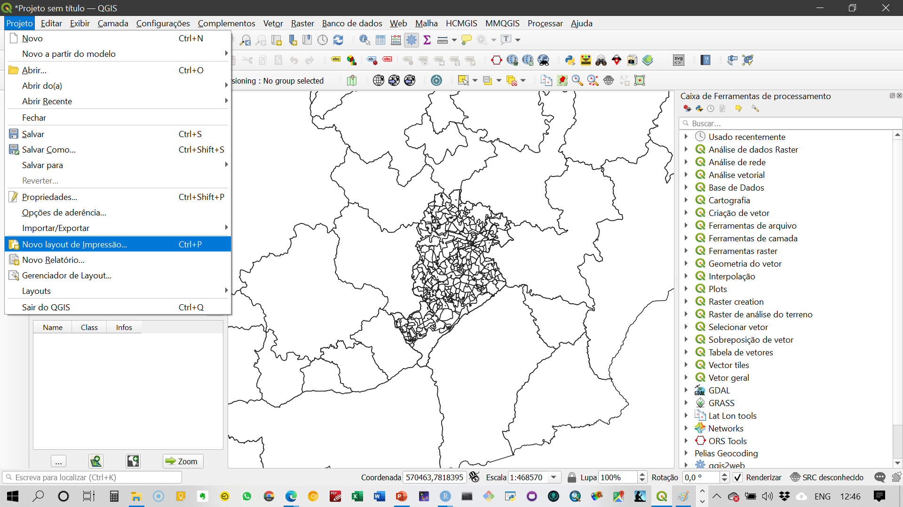
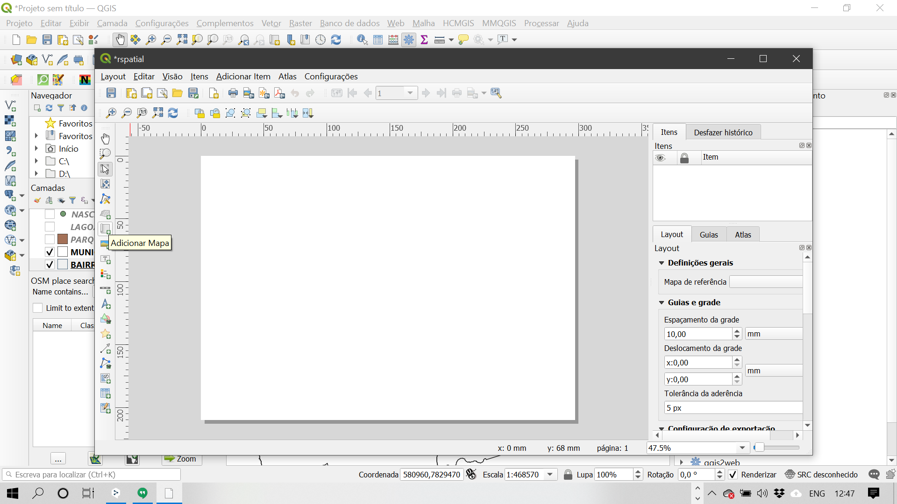

## Instalação dos software QGIS e GeoDa  {.tabset .tabset-fade .tabset-pills}

:::justa
Nesta seção são apresentados links para efetivação da instalação dos software necessários para desenvolvimento das práticas propostas. 
:::

### QGIS
:::justa

Baixar e Instalar o QGIS:  

> <a href="https://download.osgeo.org/osgeo4w/osgeo4w-setup-x86_64.exe" target="_blank">64 bits</a>    
> <a href="https://download.osgeo.org/osgeo4w/osgeo4w-setup-x86.exe" target="_blank">32 bits</a>

> <iframe width="560" height="315" src="https://www.youtube.com/embed/pV84APESgXc" frameborder="0" allow="accelerometer; autoplay; encrypted-media; gyroscope; picture-in-picture" allowfullscreen></iframe>

:::

---

### GeoDa
:::justa
> Baixar e instalar o GeoDa: <a href="https://geodacenter.github.io/download.html" target="_blank">link</a>

:::
---

## Ambiente e funcionalidades básicas do QGIS  {.tabset .tabset-fade .tabset-pills}  

### Ambiente geral   

```{r echo=FALSE}
knitr::include_graphics('./img/q1.png')
```

---

### Complementos   

```{r echo=FALSE}
knitr::include_graphics('./img/q2.png')
```

---

### Acesso aos dados espaciais   

Vamos trabalhar com dados na estrutura `shapefile` - camadas vetoriais   

```{r echo=FALSE}
knitr::include_graphics('./img/q3.png')
```

```{r echo=FALSE}
knitr::include_graphics('./img/q4.png')
```


<iframe width="560" height="315" src="https://www.youtube.com/embed/crS7iLxq-ZM" frameborder="0" allow="accelerometer; autoplay; clipboard-write; encrypted-media; gyroscope; picture-in-picture" allowfullscreen></iframe>

---

### Mudança de atributos dos shapefiles   

Mudança de cores das camadas    

- acesso às propriedades da camada   

```{r echo=FALSE}
knitr::include_graphics('./img/q7.png')
```

- Recursos para alteração da representação das feições nas camadas    

```{r echo=FALSE}
knitr::include_graphics('./img/q5.png')
```

> Pode haver incompatibilidade entre feições causadas pela qualidade do dado vetorial ou por uso de diferentes projeções. Isso não inviabiliza o uso do dado espacial, mas podem ser necessárias conversões de sistemas de referência ou mesmo tratamento da geometria das feições.   

```{r echo=FALSE}
knitr::include_graphics('./img/q8.png')
```

<iframe width="560" height="315" src="https://www.youtube.com/embed/PJQKkRpvkTI" frameborder="0" allow="accelerometer; autoplay; clipboard-write; encrypted-media; gyroscope; picture-in-picture" allowfullscreen></iframe>

---

### Mudança de datum e sistemas de coordenadas   

Transformações on-the-fly   

O mecanismo de transformações `on-the-fly` realiza reprojeções automáticas para fins de visualização/renderização.

São reprojeções dinâmicas, que não afetam o dado original   

```{r echo=FALSE}
knitr::include_graphics('./img/q9.png')
```

```{r echo=FALSE}
knitr::include_graphics('./img/q10.png')
```

```{r echo=FALSE}

```

```{r echo=FALSE}
knitr::include_graphics('./img/q12.png')
```

Reprojetar ou converter   
Para reprojetar ou converter para outro formato: 
Salvar a camada com o novo sistema de referência/formato
Botão direito sobre a camada > Save as... 

```{r echo=FALSE}
knitr::include_graphics('./img/q13.png')
```

```{r echo=FALSE}
knitr::include_graphics('./img/q14.png')
```

---

### Tabela de atributos    

A `tabela de atributos` pode ser acessada pelo mesmo menu da camada. Na `tabela de atributos` são apresentadas as observações e os atributos de cada feição geométrica gerreferenciada. É análoga a uma planilha ou a um data.frame (`R`). É importante lembrar que só é possível associar um banco de dados (tabela de atributos) a um dado vetorial. Cada observação é uma feição geométrica desse dado.    

```{r echo=FALSE}
knitr::include_graphics('./img/q17.png')
```


```{r echo=FALSE}
knitr::include_graphics('./img/q18.png')
```

<iframe width="560" height="315" src="https://www.youtube.com/embed/PJQKkRpvkTI" frameborder="0" allow="accelerometer; autoplay; clipboard-write; encrypted-media; gyroscope; picture-in-picture" allowfullscreen></iframe>

<iframe width="560" height="315" src="https://www.youtube.com/embed/P97ae67rad4" frameborder="0" allow="accelerometer; autoplay; clipboard-write; encrypted-media; gyroscope; picture-in-picture" allowfullscreen></iframe>

---

### Geocodificação   

O complemento que utilizo para geocodificação é o `MMQGIS`, que conecta direto com as APIs do Google e do OSM. Para fazer a geocodificação pelo Google, é necessária chave de acesso e token, pois acima de 2.500 requisiçoes por IP por dia são cobradas. Assim, recomendo a utilização do `OSM`. 

O arquivo a ser organizado e importado no `QGIS` para geocodificação é no formato `.csv` e codificação `UTF-8`. Nesse arquivo devem ser organizadas as informações sobre o endereço em quatro colunas:   
- address   
- city   
- state   
- country   

Na primeira coluna colocamos o endereço completo sem as informações de cidade, estado e país.   

```{r echo=FALSE}
knitr::include_graphics('./img/q16.png')
```

<iframe width="560" height="315" src="https://www.youtube.com/embed/qvUgWpidJ5A" frameborder="0" allow="accelerometer; autoplay; encrypted-media; gyroscope; picture-in-picture" allowfullscreen></iframe>

<iframe width="560" height="315" src="https://www.youtube.com/embed/ZIeLmrR7Kz8" frameborder="0" allow="accelerometer; autoplay; encrypted-media; gyroscope; picture-in-picture" allowfullscreen></iframe>

<iframe width="560" height="315" src="https://www.youtube.com/embed/d9UAn8M9tZ8" frameborder="0" allow="accelerometer; autoplay; encrypted-media; gyroscope; picture-in-picture" allowfullscreen></iframe>

---

### Mapas temáticos 

Mapas temáticos são representações em feições geométricas do atributo de interesse utilizando elementos visuais para visualização da estrutura espacial desses dados. 

```{r echo=FALSE}
knitr::include_graphics('./img/q22.png')
```

```{r echo=FALSE}
knitr::include_graphics('./img/q23.png')
```

```{r echo=FALSE}

```

```{r echo=FALSE}
knitr::include_graphics('./img/q25.png')
```

```{r echo=FALSE}
knitr::include_graphics('./img/q26.png')
```

---

### Geração de Layout de impressão   
Para gerarmos o layout de impressão dos mapas, é necessário acessar o ambiente de edição do layout. 

```{r echo=FALSE}

```

O ambiente de edição de layout tem a seguinte estrutura:


```{r echo=FALSE}
knitr::include_graphics('./img/q20.png')
```

Para inserir os elementos gráficos e textuais no layout, você deve acessar o menu à esquerda da página em branco e incluir mapas, legendas, indicador de norte, escala, dentre outros elementos. 

```{r echo=FALSE}

```

<iframe width="560" height="315" src="https://www.youtube.com/embed/DDh4xEy3UTU" frameborder="0" allow="accelerometer; autoplay; clipboard-write; encrypted-media; gyroscope; picture-in-picture" allowfullscreen></iframe>

<iframe width="560" height="315" src="https://www.youtube.com/embed/D4_gwgAoVzM" frameborder="0" allow="accelerometer; autoplay; clipboard-write; encrypted-media; gyroscope; picture-in-picture" allowfullscreen></iframe>

<iframe width="560" height="315" src="https://www.youtube.com/embed/E7YFlqpFgbY" frameborder="0" allow="accelerometer; autoplay; clipboard-write; encrypted-media; gyroscope; picture-in-picture" allowfullscreen></iframe>

<iframe width="560" height="315" src="https://www.youtube.com/embed/y__Uf-6Mmik" frameborder="0" allow="accelerometer; autoplay; clipboard-write; encrypted-media; gyroscope; picture-in-picture" allowfullscreen></iframe>

---

### Manipulação de dados   
1. seleção por atributo e por localização   
2. join por código e join espacial   
3. geração de centroides e agregação de variaveis   

<iframe width="560" height="315" src="https://www.youtube.com/embed/kYKcKAKzooM" frameborder="0" allow="accelerometer; autoplay; clipboard-write; encrypted-media; gyroscope; picture-in-picture" allowfullscreen></iframe>

<iframe width="560" height="315" src="https://www.youtube.com/embed/UpDPEhGfREE" frameborder="0" allow="accelerometer; autoplay; clipboard-write; encrypted-media; gyroscope; picture-in-picture" allowfullscreen></iframe>

<iframe width="560" height="315" src="https://www.youtube.com/embed/VrchasljjyQ" frameborder="0" allow="accelerometer; autoplay; clipboard-write; encrypted-media; gyroscope; picture-in-picture" allowfullscreen></iframe>


---

### Dados no formato raster

[Metadados ANA](https://metadados.ana.gov.br/geonetwork/srv/pt/metadata.show?uuid=830d00e6-9924-469d-b24b-aff67a1fd432)

---

## GeoDa para análise espacial e econometria espacial    
[GeoDa - Documentação e download](https://geodacenter.github.io/)


---

## Fontes de dados
<iframe width="560" height="315" src="https://www.youtube.com/embed/OxIRfZ1hYt0" frameborder="0" allow="accelerometer; autoplay; clipboard-write; encrypted-media; gyroscope; picture-in-picture" allowfullscreen></iframe>

<iframe width="560" height="315" src="https://www.youtube.com/embed/wFiYf3XT3Lg" frameborder="0" allow="accelerometer; autoplay; clipboard-write; encrypted-media; gyroscope; picture-in-picture" allowfullscreen></iframe>

<iframe width="560" height="315" src="https://www.youtube.com/embed/uVe1HoACzbc" frameborder="0" allow="accelerometer; autoplay; clipboard-write; encrypted-media; gyroscope; picture-in-picture" allowfullscreen></iframe>

---

## Referências adicionais

+ [Livro sobre introdução a GIS e análise espacial](https://mgimond.github.io/Spatial/index.html)
+ [Site sobre uso de QGIS](https://docs.qgis.org/3.10/en/docs/training_manual/assessment/index.html)
+ [Tutoriais sobre QGIS e análise espacial](https://www.qgistutorials.com/en/)
+ [Plugins QGIS](https://plugins.qgis.org/)


