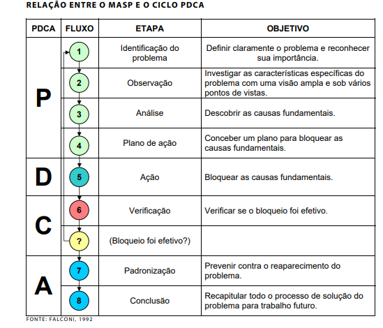
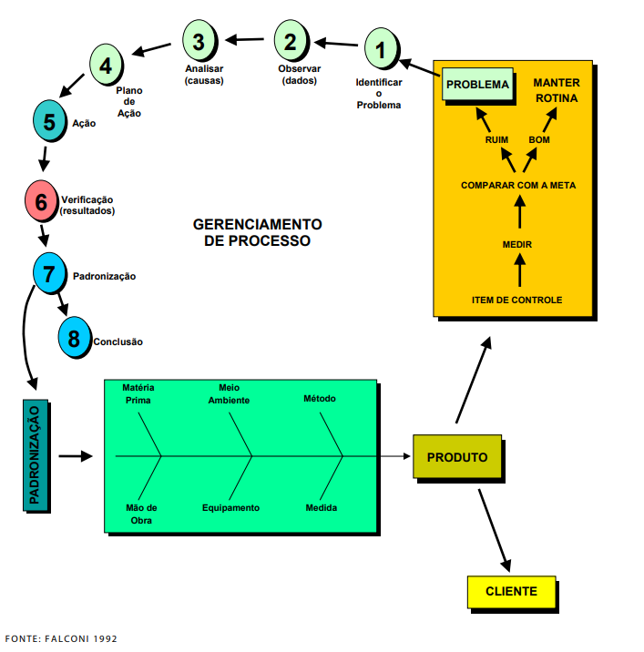
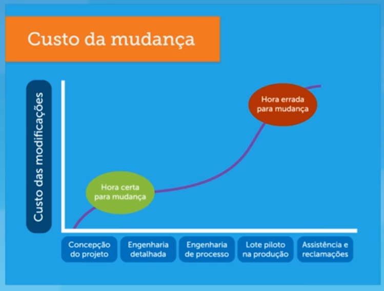
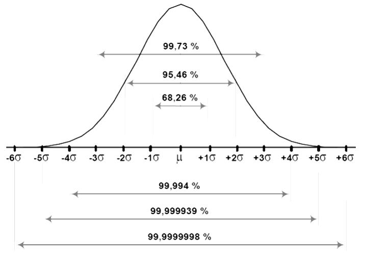

```{r setup, include=FALSE}
knitr::opts_chunk$set(echo = FALSE)
```

### Instrumentos de aprendizagem na disciplina

::: {.justa}
Esta disciplina será estruturada conforme unidades de ensino e com
periodicidade em ciclos semanais. Propõe-se, com foco nos objetivos de
aprendizagem centrados no estudante, as componentes apresentadas na
Tabela 2.
:::

Tabela 2: Estrutura Semanal da disciplina

```{r message=FALSE, warning=FALSE}
library(dplyr)
library(kableExtra)
library(rmarkdown)
library(readr)

tab1 <- read_delim("secXXI.csv", ";", escape_double = FALSE, trim_ws = TRUE)

#paged_table(tab1, options = list(rows.print = 4, cols.print = 3))
kable(tab1, escape = FALSE) %>%
  kable_styling("striped", full_width = FALSE)
```

### Encargos da disciplina

::: {.justa}
Os alunos deverão entregar 02 atividades semanais e participar dos
momentos síncronos. O registro da frequência será realizada por meio da
entrega das atividades semanais. Caso o aluno opte por não participar
dos encontros síncronos, bastará a entrega das atividades semanais.
Entretanto, caso os alunos não realizem a entrega de alguma das
atividades, o registro da frequência será realizado pela sua presença no
momento síncrono.
:::

### Instrumentos de avaliação

::: {.justa}
A proposta avaliativa para esta disciplina é fundamentada nos objetivos
de aprendizagem de cada componente. Assim, as atividades, bem como
pontuação, foram distribuídos por semanas. Toda semana será pontuada,
não sendo necessário provas ao longo da disciplina. Semanalmente, os
alunos terão 02 atividades: os CHECKPOINTS e as TAREFAS PRELIMINARES. Os
checkpoints serão momentos de verificação do conteúdo assimilado pelo
aluno na semana, podendo ser apresentados na forma de fóruns, quizzes ou
situações-problema. Já as TAREFAS PRELIMINARES são atividades
preliminares que farão o aluno perceber o conteúdo que será ministrado
na semana que ainda não se iniciou. Essas tarefas podem ser a gravação
de um pequeno vídeo, uma foto, participação em fóruns, etc. A carga de
trabalho está estruturada para fomentar a proposta de aprendizagem
centrada no estudante. Em todas as atividades semanais, foram propostas
rubricas (critérios) de avaliação para as atividades estruturadas.
:::

```{r echo=FALSE, message=FALSE, warning=FALSE, paged.print=TRUE, results='asis'}
library(dplyr)
library(kableExtra)
library(readr)
tab1 <- read_delim("quali.csv", ";", escape_double = FALSE, trim_ws = TRUE)
kable(tab1, escape = FALSE) %>%
  kable_styling("striped", full_width = FALSE)
```

### Condições para aprovação no curso

::: {.justa}
Para serem aprovados, cada aluno deve ter, no mínimo:

75% de cumprimento da carga horária da disciplina, **e** 60 pontos
:::

<hr>

# **Conteúdo Semanal**

<aside>

**Conteúdo da página** <a href="#estrutura-da-disciplina">Estrutura da
disciplina</a> <a href="#conteúdo-semanal">Conteúdo semanal</a>\
<a href="#top">Início</a>

</aside>

## Semana 1: 4a Revolução industrial e competências do século XXI

#### **Documentação**

[Aprendizagem baseada em
problemas](https://drive.google.com/file/d/1i88eNb0SFgOu3GZ7ViNNCe9cXfLMTgPk/view?usp=sharing)

[Contextualização - 4a revolução industrial e as competências do
profissional no século
XXI](https://drive.google.com/file/d/1DCHpym0QaGy5JzCnnh9YYnA5LVhn_7k0/view?usp=sharing)

#### **Checkpoint**

PRAZO PARA SUBMISSÃO: 22/08/2020

**Discussão: Como você se enxerga no mercado de trabalho do século
XXI?**

::: {.justa}
Instruções:

1.  Assista os vídeos.

2.  Faça uma revisão dos conteúdos desta unidade.

3.  Realize o teste de múltiplas inteligências(Links para um site
    externo.) neste link.

4.  Faça uma reflexão sobre as demandas do mercado de trabalho e o
    quanto você pode contribuir com sua formação. Responda uma das
    questões a seguir (200-500 palavras, 2-4 parágrafos).

-   O que você pode fazer para contribuir para sua formação no contexto
    do século XXI?\
-   Quais são suas inteligências mais predominantes e como elas se
    relacionam com as competências para o século XXI?

5.  Poste sua resposta no Fórum - [Checkpoint 1 -
    Canvas](https://canvas.instructure.com/courses/2212314/discussion_topics/9484973)
:::

<iframe width="560" height="315" src="https://www.youtube.com/embed/Ngf8Jq2nuGc" frameborder="0" allow="accelerometer; autoplay; encrypted-media; gyroscope; picture-in-picture" allowfullscreen>

</iframe>

<iframe width="560" height="315" src="https://www.youtube.com/embed/2j00U6lUC-c" frameborder="0" allow="accelerometer; autoplay; encrypted-media; gyroscope; picture-in-picture" allowfullscreen>

</iframe>

<iframe width="560" height="315" src="https://www.youtube.com/embed/RC--p1aCzWM" frameborder="0" allow="accelerometer; autoplay; encrypted-media; gyroscope; picture-in-picture" allowfullscreen>

</iframe>

<iframe width="560" height="315" src="https://www.youtube.com/embed/bKcBRTCXGEo" frameborder="0" allow="accelerometer; autoplay; encrypted-media; gyroscope; picture-in-picture" allowfullscreen>

</iframe>

<iframe width="560" height="315" src="https://www.youtube.com/embed/Bj9ciijbMj8" frameborder="0" allow="accelerometer; autoplay; encrypted-media; gyroscope; picture-in-picture" allowfullscreen>

</iframe>

#### **Tarefa preliminar**

PRAZO PARA SUBMISSÃO: 25/08/2020

**Discussão: Sistema input-output**

Instruções:

1.  Faça um pequeno vídeo (30 segundos a 1 minuto) registrando um
    processo de transformação.

2.  Explique qual é o processo que está sendo registrado no vídeo,
    enfatizando as suas entradas e as saídas.

3.  Poste sua resposta no [Fórum 1 - Tarefa preliminar
    1](https://canvas.instructure.com/courses/2212314/discussion_topics/9484958).

<hr>

## Semana 2: Modelo input-output

#### **Documentação**

Os vídeos desta semana estão no Canvas. A temática central é a modelagem
de processos de transformação por meio de modelos INPUT-OUTPUT. Alguns
termos-chave foram explorados no momento síncrono, a saber:\
+ modelos\
+ eficiência, eficácia e efetividade\
+ produtividade\
+ complexidade\
+ escopo e limitação do sistema\
+ foco no processo + foco no cliente

#### **Checkpoint**

PRAZO PARA SUBMISSÃO: 29/08/2020

[Checkpoint semana
2](https://canvas.instructure.com/courses/2212314/quizzes/5712185)

#### **Tarefa preliminar**

PRAZO PARA SUBMISSÃO: 01/09/2020

**Discussão: Você acha que a empresa do filme tem Qualidade?**

Instruções:

::: {.justa}
1.  Assista o vídeo

2.  Faça uma revisão dos conteúdos desta unidade.

3.  Faça uma reflexão sobre o conceito de qualidade e responda duas ou
    mais questões dentre as questões a seguir (200-500 palavras, 2-4
    parágrafos).

-   Analisando a empresa de fast-food que atende ao cliente do filme,
    ela tem qualidade?\
-   Qualidade é ter um padrão de atendimento?\
-   Qualidade é ter uma norma a ser seguida?\
-   Qualidade é atender as necessidade do Cliente?\
-   É ter um produto melhor do que o concorrente em termos de
    características?\
-   É ter uma boa relação Custo x Benefício?

4.  Poste sua resposta no Fórum - [Tarefa Preliminar
    1](https://canvas.instructure.com/courses/2212314/discussion_topics/9484958)
:::

<iframe width="560" height="314" src="https://www.youtube.com/embed/8B9_kAGjrwg" frameborder="0" allow="accelerometer; autoplay; encrypted-media; gyroscope; picture-in-picture" allowfullscreen>

</iframe>

::: {.center}
**Conteúdo da página**\
<a href="#estrutura-da-disciplina">Estrutura da disciplina</a>\
<a href="#conteúdo-semanal">Conteúdo semanal</a>\
<a href="#top">Início</a>
:::

<HR>

## Semana 3: Evolução do conceito de qualidade

#### **Documentação**

Nesta semana foram discutidas as perspectivas históricas e fundamentos
da Gestão da Qualidade.

<iframe width="560" height="314" src="https://www.youtube.com/embed/ejFZJARN_Fc" frameborder="0" allow="accelerometer; autoplay; clipboard-write; encrypted-media; gyroscope; picture-in-picture" allowfullscreen>

</iframe>

<iframe width="560" height="314" src="https://www.youtube.com/embed/oVyZbFuMqjQ" frameborder="0" allow="accelerometer; autoplay; clipboard-write; encrypted-media; gyroscope; picture-in-picture" allowfullscreen>

</iframe>

<iframe width="560" height="314" src="https://www.youtube.com/embed/CP7uqDAA8GA" frameborder="0" allow="accelerometer; autoplay; clipboard-write; encrypted-media; gyroscope; picture-in-picture" allowfullscreen>

</iframe>

#### **Checkpoint**

PRAZO PARA SUBMISSÃO: 05/09/2020

[Checkpoint
3](https://canvas.instructure.com/courses/2212314/quizzes/5859819?module_item_id=35334445)

#### **Tarefa preliminar**

PRAZO PARA SUBMISSÃO: 08/09/2020

[Atividade preliminar
3](https://canvas.instructure.com/courses/2212314/assignments/17413114?module_item_id=36303387)

<hr>

## Semana 4: O que é qualidade?

#### **Documentação**

**Filosofia - qualidade** Um pouco de história e filosofia.....

Qualidade (do Latim qualitas) é um atributo ou uma propriedade. Os
atributos são imputáveis por um sujeito enquanto as propriedades são
inerentes. Na filosofia contemporânea, a ideia de qualidade e
especialmente como distinguir certos tipos de qualidade de outros
permanece controversa.

Qualidade é uma noção que foi desenvolvida por Platão no contexto de sua
Teoria das Formas, em que elaborou níveis de atributos e suas relações
participantes nas Ideias. Aristóteles analisou qualidades em seu livro
Categorias, trabalho lógico em que incluiu-a como uma das dez
categorias.

John Locke apresentou uma distinção entre qualidades primárias e
secundárias em Um Ensaio acerca do Entendimento Humano. Para Locke, uma
qualidade é uma ideia de uma sensação ou percepção. Locke afirma ainda
que as qualidades podem ser divididas em dois tipos: qualidades
primárias e secundárias. As qualidades primárias são intrínsecas a um
objeto - uma coisa ou uma pessoa - enquanto as qualidades secundárias
dependem da interpretação do modo subjetivo e do contexto da aparência.

De forma sintética e contemporânea, o conceito de qualidade pode ser
definido assim:

Qualidade é o grau de utilidade esperado ou adquirido de qualquer coisa,
verificável através da forma e dos elementos constitutivos do mesmo e
pelo resultado do seu uso. A palavra "qualidade" tem um conceito
subjetivo que está relacionada com as percepções, necessidades e
resultados em cada indivíduo. Diversos fatores, como a cultura, modelos
mentais, tipo e produto ou serviço prestado, necessidades e expectativas
influenciam diretamente a percepção da qualidade.

<iframe width="560" height="314" src="https://www.youtube.com/embed/N9CjgIqCixY" frameborder="0" allow="accelerometer; autoplay; clipboard-write; encrypted-media; gyroscope; picture-in-picture" allowfullscreen>

</iframe>

<iframe width="560" height="314" src="https://www.youtube.com/embed/U-aSq71QNNQ" frameborder="0" allow="accelerometer; autoplay; clipboard-write; encrypted-media; gyroscope; picture-in-picture" allowfullscreen>

</iframe>

<iframe width="560" height="314" src="https://www.youtube.com/embed/BZ2e1OVGx-4" frameborder="0" allow="accelerometer; autoplay; clipboard-write; encrypted-media; gyroscope; picture-in-picture" allowfullscreen>

</iframe>

<iframe width="560" height="314" src="https://www.youtube.com/embed/53yJWHyaA4Q" frameborder="0" allow="accelerometer; autoplay; clipboard-write; encrypted-media; gyroscope; picture-in-picture" allowfullscreen>

</iframe>

<iframe width="560" height="314" src="https://www.youtube.com/embed/yzvAPasFcAk" frameborder="0" allow="accelerometer; autoplay; clipboard-write; encrypted-media; gyroscope; picture-in-picture" allowfullscreen>

</iframe>

<iframe width="560" height="315" src="https://www.youtube.com/embed/5cjf53TNfPQ" frameborder="0" allow="accelerometer; autoplay; clipboard-write; encrypted-media; gyroscope; picture-in-picture" allowfullscreen>

</iframe>


#### **Checkpoint**

PRAZO PARA SUBMISSÃO: 12/09/2020

[Checkpoint
4](https://canvas.instructure.com/courses/2212314/assignments/17011518?module_item_id=35334483)

#### **Tarefa preliminar**

PRAZO PARA SUBMISSÃO: 15/09/2020

[Atividade preliminar
4](https://canvas.instructure.com/courses/2212314/quizzes/5860114)

<hr>

## Semana 5: Normalização e Normas ISO

#### **Documentação**

**Certificação** As empresas não são certificadas, e sim os processos.

A primeira etapa para certificação é a definição do escopo para
apropriação de certificação.

Obras são interessantes exemplos de processos que poderiam ser
padronizados por sua repetitividade, mas que, devido à intensividade do
uso de mão-de-obra e, usualmente, trata-se de uma mão-de-obra pouco
qualificada.

Se o processo não está orientado à padronização, não se justifica

Coca-cola não tem ISO. Coca-cola tem o sistema de qualidade dela mesma -
Kore. Ferramenta de governança e gestão por meio da qual ela consegue
avaliar o desempenho. Incorpora ISO 9000, ISO 14000 e outras
certificações.

A própria empresa audita e o mercado é o próprio mercado audita.

Década de 80, a indústria automobilística.

a série ISO 9000 é de certificação de processos e gestão. É uma série de
1987 e é modificada em 1994, 2000, 2008 e 2015.

**Histórico** 1987 - Criação da série ISO 9000 com foco em padronização
1994 - o foco é orientado aos requisitos da norma 2000 - foco no cliente
externo 2008 - requisitos. 2015 - flexibilização de requisitos.

a série ISO 14000 é a série de gestão ambiental.

Norma antiga não tinha preocupação com a qualidade e sim com
padronização dos processos. Norma não refletia envolvimento de
stakeholders e não deixava claro o comprometimento da alta administração
com a qualidade. Era uma norma de 2000, com versão atualizada em 2008 e
que em 2015 foi atualizada.

Padronização - estabelecer regra de forma que todo mundo desenvolva os
processos da mesma maneira.

Ter certificação para ganhar credibilidade no mercado.

No Brasil, temos cerca de 25.000 empresas certificadas na norma ISO.

Termo da ISO para falar que um procedimento está correto ou não é
conformidade ou não conformidade.

Há produtos brasileiros da Tramontina que precisam de certificação e
precisam finalizar a produção para sair de Portugal made in Portugal.

Quem financia - governo exige - FINAME - cliente exige pelas demandas
acessórias.

Pontos de atenção.

Quando a modificação da norma foi alterada em 2015, o prazo para mudança
era setembro 2018 para readequação. 90% não tinham pedido. Ou aprendi e
não preciso de certificação ou não consigo adequar. Norma nova exige
informação documentada e não mais procedimentos. Por outro lado, se
discutimos indústria 4.0, integração de processos com cliente em tempo
real, os procedimentos têm que ser o mais padronizados possíveis. Linha
de produção. Para projetos, por exemplo, pode haver uma diferenciação em
função do cliente e do escopo do projeto.

A norma ISO vale por 3 anos.

CEP - os gráficos falam que vai dar errado antes de acontecer.

No Brasil, a série ISO 9000 foi recepcionada pela ABNT, mas não há
obrigatoriedade

Normas servem para padronização de processos e do nosso funcionamento
como sociedade.

O organismo de creditação é aquele que fala que a empresa está de acordo
com a norma. Quando as auditorias internas estão com um nível de
maturidade adequado, é possível agendar a visita para certificação.

Certificação da norma nova é Bureau Veritas - empresa de creditação.

A norma mudou para independência da certificação. E para envolvimento da
gestão risco e meta. Incorpora partes interessada, compatibiliza com
outras normas de gestão e gestão pública, o número de exigência
documental é reduzido. Não há exigência de manual de qualidade
documentado com troca de documento controlada. Foi implantado também um
sistema de gestão de risco.

Pela primeira vez, em 2015, a norma ISO 9001 incorporou a gestão.

Liderança fica no meio, mas o pano de fundo é o processo. Todas as
referências baseadas em evidências. Processo de tomada de decisão em
evidências.

**Outros documentos**
<iframe width="560" height="314" src="https://www.youtube.com/embed/lhnO-sAuiUo" frameborder="0" allow="accelerometer; autoplay; clipboard-write; encrypted-media; gyroscope; picture-in-picture" allowfullscreen></iframe>

<iframe width="560" height="314" src="https://www.youtube.com/embed/kdlizwJLCME" frameborder="0" allow="accelerometer; autoplay; clipboard-write; encrypted-media; gyroscope; picture-in-picture" allowfullscreen>

</iframe>

<iframe width="560" height="314" src="https://www.youtube.com/embed/rIKVC1PEKiY" frameborder="0" allow="accelerometer; autoplay; clipboard-write; encrypted-media; gyroscope; picture-in-picture" allowfullscreen>

</iframe>

<iframe width="560" height="314" src="https://www.youtube.com/embed/skjEVAet35s" frameborder="0" allow="accelerometer; autoplay; clipboard-write; encrypted-media; gyroscope; picture-in-picture" allowfullscreen>

</iframe>

<iframe width="560" height="314" src="https://www.youtube.com/embed/-F4ShMqPM7c" frameborder="0" allow="accelerometer; autoplay; clipboard-write; encrypted-media; gyroscope; picture-in-picture" allowfullscreen>

</iframe>

<iframe width="560" height="314" src="https://www.youtube.com/embed/KzWsTqZMuEk" frameborder="0" allow="accelerometer; autoplay; clipboard-write; encrypted-media; gyroscope; picture-in-picture" allowfullscreen>

</iframe>

<iframe width="560" height="314" src="https://www.youtube.com/embed/BZFDcsWiGtQ" frameborder="0" allow="accelerometer; autoplay; clipboard-write; encrypted-media; gyroscope; picture-in-picture" allowfullscreen>

</iframe>

<iframe width="560" height="314" src="https://www.youtube.com/embed/KyNVxU5EU9Y" frameborder="0" allow="accelerometer; autoplay; clipboard-write; encrypted-media; gyroscope; picture-in-picture" allowfullscreen>

</iframe>

```{r , echo=FALSE}
knitr::include_url("https://places-research.github.io/qua_sinc_5/#1")
```

#### **Checkpoint**

PRAZO PARA SUBMISSÃO: 19/09/2020

[Checkpoint
5](https://canvas.instructure.com/courses/2212314/assignments/17575870?module_item_id=36697473)

#### **Tarefa preliminar**

PRAZO PARA SUBMISSÃO: 22/09/2020

[Atividade preliminar
5](https://canvas.instructure.com/courses/2212314/quizzes/6086974)

<hr>

## Semana 6: Kaizen, PDCA, MASP

#### **Documentação**

Kaizen foi traduzido como Melhoria Contínua para o mundo ocidental.

Mas, é mais que isso.

Kaizen é a insatisfação com o "status quo". É a melhoria de todo dia.
Vejam o que ensina o Prof. Imai.

<iframe width="560" height="314" src="https://www.youtube.com/embed/NUDkhmb7HFM" frameborder="0" allow="accelerometer; autoplay; clipboard-write; encrypted-media; gyroscope; picture-in-picture" allowfullscreen>

</iframe>

<p>

Para entendimento do processo de melhoria, duas questões devem ser
respondidas: 

</p>

<ul>

<li>

Por que é necessário fazer essa melhoria?

</li>

<li>

Para quem será feita essa melhoria?

</li>

</ul>

<p>

Assim, algumas estratégias e respectivos fundamentos podem ser pensados
para implementação do processo de melhoria, a saber:

</p>

<ol>

<li>

5S: estrutura - ambiente de trabalho, procedimentos e instruções,
anormalidades visíveis

</li>

<li>

<strong>Kaizen</strong>[: visão geral - gestão por KPIs, controle do
trabalho em processamento, cultura de melhoria
contínua]{style="font-size: 12pt;"}

</li>

<li>

Lean: estabilidade - processos estáveis, eliminação de desperdícios,
fluxo

</li>

<li>

Six Sigma: capacidade - redução da variabilidade, controle dos
processos, ferramentas estatísticas

</li>

<li>

DFSS (Design for Six Sigma): Robustez - planejamento para o seis sigma,
QFD

</li>

</ol>

<p>


</p>

<p>


</p>

<p>

A palavra "Kaizen" tem sua origem no idioma japonês e significa
"melhoria" e refere-se a filosofia ou práticas que incidem sobre a
melhoria contínua dos processos de manufatura, engenharia, gestão de
negócios ou qualquer processo como até mesmo na área da saúde, governos,
bancos e outras indústrias. Ao melhorar as atividades e processos
padronizados, kaizen tem como objetivo eliminar o desperdício
(ver manufatura enxuta). 

</p>

<p>

[O Kaizen tem origem no Japão (]{style="color: #000000;"}<em>Kaizen: The
Key to Japan's Competitive Success</em> em 1986, de Masaaki Imai). Ele
se baseia em uma série de princípios:

</p>

<ul>

<li>

[eliminação de desperdícios.]{style="color: #000000;"}

</li>

<li>

[orientação à processos.]{style="color: #000000;"}

</li>

<li>

[dados e fatos.]{style="color: #000000;"}

</li>

<li>

[atenção deve estar no local onde o valor é
criado.]{style="color: #000000;"}

</li>

<li>

[trabalho em equipe.]{style="color: #000000;"}

</li>

<li>

[realizar ações para conter e corrigir as causas bases dos
problemas.]{style="color: #000000;"}

</li>

</ul>

<h4>

[Por quê promover a melhoria
contínua?]{style="text-decoration: underline;"}

</h4>

<p>

Para atender aos requisitos da normalização, ou para atingir os
objetivos do <strong><i>kaizen,</i></strong> como:

</p>

<ul>

<li>

melhoria na qualidade;

</li>

<li>

redução de custos;

</li>

<li>

aumento na satisfação do cliente;

</li>

<li>

mais segurança;

</li>

<li>

redução de desperdício na empresa;

</li>

<li>

aumento de produtividade;

</li>

<li>

compartilhamento do conhecimento;

</li>

<li>

maior confiabilidade das máquinas/equipamentos.

</li>

</ul>

<h4>

[Caracterizando os métodos]{style="text-decoration: underline;"}

</h4>

<p>

No quadro a seguir são apresentados os métodos mais difundidos de
solução de problemas e melhoria contínua. De maneira sintética, os
métodos são desdobramento do ciclo de Deming.

</p>

<p>

A ideia é promover a análise de problemas considerando o método
científico, de maneira organizada e efetiva. 

</p>

31b8e172-b470-440e-83d8-e6b185028602:dAB5AHAAZQA6AE8AQQBCAGwAQQBHAFkAQQBOAFEAQgBoAEEARABjAEEATgB3AEEAeQBBAEMAMABBAFoAQQBCAGsAQQBEAFkAQQBNAHcAQQB0AEEARABRAEEATgBnAEEAeQBBAEQASQBBAEwAUQBBADQAQQBEAFEAQQBZAGcAQgBtAEEAQwAwAEEAWQBRAEIAbQBBAEQARQBBAE8AUQBBADUAQQBEAFUAQQBZAFEAQQB4AEEARwBJAEEATQBnAEIAaQBBAEQAawBBAAoAcABvAHMAaQB0AGkAbwBuADoATQBnAEEAegBBAEQAQQBBAE8AQQBBAHcAQQBBAD0APQAKAHAAcgBlAGYAaQB4ADoACgBzAG8AdQByAGMAZQA6AFAAQQBCADAAQQBHAEUAQQBZAGcAQgBzAEEARwBVAEEASQBBAEIAegBBAEgAUQBBAGUAUQBCAHMAQQBHAFUAQQBQAFEAQQBpAEEARwBJAEEAYgB3AEIAeQBBAEcAUQBBAFoAUQBCAHkAQQBDADAAQQBjAHcAQgAwAEEASABrAEEAYgBBAEIAbABBAEQAbwBBAEkAQQBCAGsAQQBHADgAQQBkAEEAQgAwAEEARwBVAEEAWgBBAEEANwBBAEMAQQBBAGQAdwBCAHAAQQBHAFEAQQBkAEEAQgBvAEEARABvAEEASQBBAEEAeABBAEQAVQBBAE8AQQBBAHoAQQBIAEEAQQBlAEEAQQA3AEEAQwBBAEEAWQBnAEIAdgBBAEgASQBBAFoAQQBCAGwAQQBIAEkAQQBMAFEAQgBqAEEARwA4AEEAYgBBAEIAdgBBAEgASQBBAE8AZwBBAGcAQQBHAEkAQQBiAEEAQgAxAEEARwBVAEEATwB3AEEAZwBBAEcAMABBAFkAUQBCAHkAQQBHAGMAQQBhAFEAQgB1AEEAQwAwAEEAYgBBAEIAbABBAEcAWQBBAGQAQQBBADYAQQBDAEEAQQBZAFEAQgAxAEEASABRAEEAYgB3AEEANwBBAEMAQQBBAGIAUQBCAGgAQQBIAEkAQQBaAHcAQgBwAEEARwA0AEEATABRAEIAeQBBAEcAawBBAFoAdwBCAG8AQQBIAFEAQQBPAGcAQQBnAEEARwBFAEEAZABRAEIAMABBAEcAOABBAE8AdwBBAGkAQQBDAEEAQQBZAGcAQgB2AEEASABJAEEAWgBBAEIAbABBAEgASQBBAFAAUQBBAGkAQQBEAEUAQQBJAGcAQQBnAEEASABjAEEAYQBRAEIAawBBAEgAUQBBAGEAQQBBADkAQQBDAEkAQQBNAFEAQQAxAEEARABnAEEATQB3AEEAaQBBAEQANABBAEMAZwBBADgAQQBIAFEAQQBZAGcAQgB2AEEARwBRAEEAZQBRAEEAKwBBAEEAbwBBAFAAQQBCADAAQQBIAEkAQQBQAGcAQQBLAEEARAB3AEEAZABBAEIAawBBAEMAQQBBAGMAdwBCADAAQQBIAGsAQQBiAEEAQgBsAEEARAAwAEEASQBnAEIAaQBBAEcAOABBAGMAZwBCAGsAQQBHAFUAQQBjAGcAQQB0AEEASABNAEEAZABBAEIANQBBAEcAdwBBAFoAUQBBADYAQQBDAEEAQQBaAEEAQgB2AEEASABRAEEAZABBAEIAbABBAEcAUQBBAE8AdwBBAGcAQQBHAEkAQQBiAHcAQgB5AEEARwBRAEEAWgBRAEIAeQBBAEMAMABBAFkAdwBCAHYAQQBHAHcAQQBiAHcAQgB5AEEARABvAEEASQBBAEIAaQBBAEcAdwBBAGQAUQBCAGwAQQBEAHMAQQBJAGcAQQBnAEEASABjAEEAYQBRAEIAawBBAEgAUQBBAGEAQQBBADkAQQBDAEkAQQBNAFEAQQAxAEEARABVAEEASQBnAEEAKwBBAEYAQQBBAFIAQQBCAEQAQQBFAEUAQQBQAEEAQQB2AEEASABRAEEAWgBBAEEAKwBBAEEAbwBBAFAAQQBCADAAQQBHAFEAQQBJAEEAQgB6AEEASABRAEEAZQBRAEIAcwBBAEcAVQBBAFAAUQBBAGkAQQBHAEkAQQBiAHcAQgB5AEEARwBRAEEAWgBRAEIAeQBBAEMAMABBAGMAdwBCADAAQQBIAGsAQQBiAEEAQgBsAEEARABvAEEASQBBAEIAawBBAEcAOABBAGQAQQBCADAAQQBHAFUAQQBaAEEAQQA3AEEAQwBBAEEAWQBnAEIAdgBBAEgASQBBAFoAQQBCAGwAQQBIAEkAQQBMAFEAQgBqAEEARwA4AEEAYgBBAEIAdgBBAEgASQBBAE8AZwBBAGcAQQBHAEkAQQBiAEEAQgAxAEEARwBVAEEATwB3AEEAaQBBAEMAQQBBAGQAdwBCAHAAQQBHAFEAQQBkAEEAQgBvAEEARAAwAEEASQBnAEEAeQBBAEQAQQBBAE4AQQBBAGkAQQBEADQAQQBUAFEAQgBCAEEARgBNAEEAVQBBAEEAOABBAEMAOABBAGQAQQBCAGsAQQBEADQAQQBDAGcAQQA4AEEASABRAEEAWgBBAEEAZwBBAEgATQBBAGQAQQBCADUAQQBHAHcAQQBaAFEAQQA5AEEAQwBJAEEAWQBnAEIAdgBBAEgASQBBAFoAQQBCAGwAQQBIAEkAQQBMAFEAQgB6AEEASABRAEEAZQBRAEIAcwBBAEcAVQBBAE8AZwBBAGcAQQBHAFEAQQBiAHcAQgAwAEEASABRAEEAWgBRAEIAawBBAEQAcwBBAEkAQQBCAGkAQQBHADgAQQBjAGcAQgBrAEEARwBVAEEAYwBnAEEAdABBAEcATQBBAGIAdwBCAHMAQQBHADgAQQBjAGcAQQA2AEEAQwBBAEEAWQBnAEIAcwBBAEgAVQBBAFoAUQBBADcAQQBDAEkAQQBJAEEAQgAzAEEARwBrAEEAWgBBAEIAMABBAEcAZwBBAFAAUQBBAGkAQQBEAEkAQQBNAEEAQQAwAEEAQwBJAEEAUABnAEEANABBAEUAUQBBAFAAQQBBAHYAQQBIAFEAQQBaAEEAQQArAEEAQQBvAEEAUABBAEIAMABBAEcAUQBBAEkAQQBCAHoAQQBIAFEAQQBlAFEAQgBzAEEARwBVAEEAUABRAEEAaQBBAEcASQBBAGIAdwBCAHkAQQBHAFEAQQBaAFEAQgB5AEEAQwAwAEEAYwB3AEIAMABBAEgAawBBAGIAQQBCAGwAQQBEAG8AQQBJAEEAQgBrAEEARwA4AEEAZABBAEIAMABBAEcAVQBBAFoAQQBBADcAQQBDAEEAQQBZAGcAQgB2AEEASABJAEEAWgBBAEIAbABBAEgASQBBAEwAUQBCAGoAQQBHADgAQQBiAEEAQgB2AEEASABJAEEATwBnAEEAZwBBAEcASQBBAGIAQQBCADEAQQBHAFUAQQBPAHcAQQBpAEEAQwBBAEEAZAB3AEIAcABBAEcAUQBBAGQAQQBCAG8AQQBEADAAQQBJAGcAQQB5AEEARABBAEEATgBBAEEAaQBBAEQANABBAFEAUQBBAHoAQQBEAHcAQQBMAHcAQgAwAEEARwBRAEEAUABnAEEASwBBAEQAdwBBAGQAQQBCAGsAQQBDAEEAQQBjAHcAQgAwAEEASABrAEEAYgBBAEIAbABBAEQAMABBAEkAZwBCAGkAQQBHADgAQQBjAGcAQgBrAEEARwBVAEEAYwBnAEEAdABBAEgATQBBAGQAQQBCADUAQQBHAHcAQQBaAFEAQQA2AEEAQwBBAEEAWgBBAEIAdgBBAEgAUQBBAGQAQQBCAGwAQQBHAFEAQQBPAHcAQQBnAEEARwBJAEEAYgB3AEIAeQBBAEcAUQBBAFoAUQBCAHkAQQBDADAAQQBZAHcAQgB2AEEARwB3AEEAYgB3AEIAeQBBAEQAbwBBAEkAQQBCAGkAQQBHAHcAQQBkAFEAQgBsAEEARABzAEEASQBnAEEAZwBBAEgAYwBBAGEAUQBCAGsAQQBIAFEAQQBhAEEAQQA5AEEAQwBJAEEATQBnAEEAdwBBAEQAUQBBAEkAZwBBACsAQQBFAFEAQQBUAFEAQgBCAEEARQBrAEEAUQB3AEEAOABBAEMAOABBAGQAQQBCAGsAQQBEADQAQQBDAGcAQQA4AEEASABRAEEAWgBBAEEAZwBBAEgATQBBAGQAQQBCADUAQQBHAHcAQQBaAFEAQQA5AEEAQwBJAEEAWQBnAEIAdgBBAEgASQBBAFoAQQBCAGwAQQBIAEkAQQBMAFEAQgB6AEEASABRAEEAZQBRAEIAcwBBAEcAVQBBAE8AZwBBAGcAQQBHAFEAQQBiAHcAQgAwAEEASABRAEEAWgBRAEIAawBBAEQAcwBBAEkAQQBCAGkAQQBHADgAQQBjAGcAQgBrAEEARwBVAEEAYwBnAEEAdABBAEcATQBBAGIAdwBCAHMAQQBHADgAQQBjAGcAQQA2AEEAQwBBAEEAWQBnAEIAcwBBAEgAVQBBAFoAUQBBADcAQQBDAEkAQQBJAEEAQgAzAEEARwBrAEEAWgBBAEIAMABBAEcAZwBBAFAAUQBBAGkAQQBEAEkAQQBNAEEAQQAwAEEAQwBJAEEAUABnAEIARwBBAEYAUQBBAFEAUQBBADgAQQBDADgAQQBkAEEAQgBrAEEARAA0AEEAQwBnAEEAOABBAEgAUQBBAFoAQQBBAGcAQQBIAE0AQQBkAEEAQgA1AEEARwB3AEEAWgBRAEEAOQBBAEMASQBBAFkAZwBCAHYAQQBIAEkAQQBaAEEAQgBsAEEASABJAEEATABRAEIAegBBAEgAUQBBAGUAUQBCAHMAQQBHAFUAQQBPAGcAQQBnAEEARwBRAEEAYgB3AEIAMABBAEgAUQBBAFoAUQBCAGsAQQBEAHMAQQBJAEEAQgBpAEEARwA4AEEAYwBnAEIAawBBAEcAVQBBAGMAZwBBAHQAQQBHAE0AQQBiAHcAQgBzAEEARwA4AEEAYwBnAEEANgBBAEMAQQBBAFkAZwBCAHMAQQBIAFUAQQBaAFEAQQA3AEEAQwBJAEEASQBBAEIAMwBBAEcAawBBAFoAQQBCADAAQQBHAGcAQQBQAFEAQQBpAEEARABJAEEATQBBAEEAMABBAEMASQBBAFAAZwBCAFMAQQBFAE0AQQBRAFEAQQA4AEEAQwA4AEEAZABBAEIAawBBAEQANABBAEMAZwBBADgAQQBIAFEAQQBaAEEAQQBnAEEASABNAEEAZABBAEIANQBBAEcAdwBBAFoAUQBBADkAQQBDAEkAQQBZAGcAQgB2AEEASABJAEEAWgBBAEIAbABBAEgASQBBAEwAUQBCAHoAQQBIAFEAQQBlAFEAQgBzAEEARwBVAEEATwBnAEEAZwBBAEcAUQBBAGIAdwBCADAAQQBIAFEAQQBaAFEAQgBrAEEARABzAEEASQBBAEIAaQBBAEcAOABBAGMAZwBCAGsAQQBHAFUAQQBjAGcAQQB0AEEARwBNAEEAYgB3AEIAcwBBAEcAOABBAGMAZwBBADYAQQBDAEEAQQBZAGcAQgBzAEEASABVAEEAWgBRAEEANwBBAEMASQBBAEkAQQBCADMAQQBHAGsAQQBaAEEAQgAwAEEARwBnAEEAUABRAEEAaQBBAEQASQBBAE0AQQBBADAAQQBDAEkAQQBQAGcAQgBVAEEAQwBZAEEAWgBRAEIAaABBAEcATQBBAGQAUQBCADAAQQBHAFUAQQBPAHcAQgBqAEEARwA0AEEAYQBRAEIAagBBAEcARQBBAGMAdwBBAGcAQQBHAFUAQQBJAEEAQgB0AEEAQwBZAEEAWgBRAEIAaABBAEcATQBBAGQAUQBCADAAQQBHAFUAQQBPAHcAQgAwAEEARwA4AEEAWgBBAEIAdgBBAEgATQBBAFAAQQBBAHYAQQBIAFEAQQBaAEEAQQArAEEAQQBvAEEAUABBAEEAdgBBAEgAUQBBAGMAZwBBACsAQQBBAG8AQQBQAEEAQgAwAEEASABJAEEAUABnAEEASwBBAEQAdwBBAGQAQQBCAGsAQQBDAEEAQQBjAHcAQgAwAEEASABrAEEAYgBBAEIAbABBAEQAMABBAEkAZwBCAGkAQQBHADgAQQBjAGcAQgBrAEEARwBVAEEAYwBnAEEAdABBAEgATQBBAGQAQQBCADUAQQBHAHcAQQBaAFEAQQA2AEEAQwBBAEEAWgBBAEIAdgBBAEgAUQBBAGQAQQBCAGwAQQBHAFEAQQBPAHcAQQBnAEEARwBJAEEAYgB3AEIAeQBBAEcAUQBBAFoAUQBCAHkAQQBDADAAQQBZAHcAQgB2AEEARwB3AEEAYgB3AEIAeQBBAEQAbwBBAEkAQQBCAGkAQQBHAHcAQQBkAFEAQgBsAEEARABzAEEASQBnAEEAZwBBAEgASQBBAGIAdwBCADMAQQBIAE0AQQBjAEEAQgBoAEEARwA0AEEAUABRAEEAaQBBAEQAYwBBAEkAZwBBAGcAQQBIAGMAQQBhAFEAQgBrAEEASABRAEEAYQBBAEEAOQBBAEMASQBBAE0AUQBBADEAQQBEAFUAQQBJAGcAQQArAEEARgBBAEEAYgBBAEIAaABBAEcANABBAFoAUQBCAHEAQQBHAEUAQQBjAGcAQQA4AEEAQwA4AEEAZABBAEIAawBBAEQANABBAEMAZwBBADgAQQBIAFEAQQBaAEEAQQBnAEEASABNAEEAZABBAEIANQBBAEcAdwBBAFoAUQBBADkAQQBDAEkAQQBZAGcAQgB2AEEASABJAEEAWgBBAEIAbABBAEgASQBBAEwAUQBCAHoAQQBIAFEAQQBlAFEAQgBzAEEARwBVAEEATwBnAEEAZwBBAEcAUQBBAGIAdwBCADAAQQBIAFEAQQBaAFEAQgBrAEEARABzAEEASQBBAEIAaQBBAEcAOABBAGMAZwBCAGsAQQBHAFUAQQBjAGcAQQB0AEEARwBNAEEAYgB3AEIAcwBBAEcAOABBAGMAZwBBADYAQQBDAEEAQQBZAGcAQgBzAEEASABVAEEAWgBRAEEANwBBAEMASQBBAEkAQQBCAHkAQQBHADgAQQBkAHcAQgB6AEEASABBAEEAWQBRAEIAdQBBAEQAMABBAEkAZwBBAHkAQQBDAEkAQQBJAEEAQgAzAEEARwBrAEEAWgBBAEIAMABBAEcAZwBBAFAAUQBBAGkAQQBEAEkAQQBNAEEAQQAwAEEAQwBJAEEAUABnAEIARQBBAEcAVQBBAFoAZwBCAHAAQQBHADQAQQBhAFEAQgB5AEEAQwBBAEEAYgB3AEEAZwBBAEgAQQBBAGMAZwBCAHYAQQBHAEkAQQBiAEEAQgBsAEEARwAwAEEAWQBRAEEAOABBAEMAOABBAGQAQQBCAGsAQQBEADQAQQBDAGcAQQA4AEEASABRAEEAWgBBAEEAZwBBAEgATQBBAGQAQQBCADUAQQBHAHcAQQBaAFEAQQA5AEEAQwBJAEEAWQBnAEIAdgBBAEgASQBBAFoAQQBCAGwAQQBIAEkAQQBMAFEAQgB6AEEASABRAEEAZQBRAEIAcwBBAEcAVQBBAE8AZwBBAGcAQQBHAFEAQQBiAHcAQgAwAEEASABRAEEAWgBRAEIAawBBAEQAcwBBAEkAQQBCAGkAQQBHADgAQQBjAGcAQgBrAEEARwBVAEEAYwBnAEEAdABBAEcATQBBAGIAdwBCAHMAQQBHADgAQQBjAGcAQQA2AEEAQwBBAEEAWQBnAEIAcwBBAEgAVQBBAFoAUQBBADcAQQBDAEkAQQBJAEEAQgB5AEEARwA4AEEAZAB3AEIAegBBAEgAQQBBAFkAUQBCAHUAQQBEADAAQQBJAGcAQQB5AEEAQwBJAEEASQBBAEIAMwBBAEcAawBBAFoAQQBCADAAQQBHAGcAQQBQAFEAQQBpAEEARABJAEEATQBBAEEAMABBAEMASQBBAFAAZwBCAEUAQQBEAEUAQQBJAEEAQQB0AEEAQwBBAEEAVABRAEIAdgBBAEcANABBAGQAQQBCAGgAQQBIAEkAQQBJAEEAQgBoAEEAQwBBAEEAWgBRAEIAeABBAEgAVQBBAGEAUQBCAHcAQQBHAFUAQQBJAEEAQgB0AEEASABVAEEAYgBBAEIAMABBAEcAawBBAFoAQQBCAHAAQQBIAE0AQQBZAHcAQgBwAEEASABBAEEAYgBBAEIAcABBAEcANABBAFkAUQBCAHkAQQBEAHcAQQBMAHcAQgAwAEEARwBRAEEAUABnAEEASwBBAEQAdwBBAGQAQQBCAGsAQQBDAEEAQQBjAHcAQgAwAEEASABrAEEAYgBBAEIAbABBAEQAMABBAEkAZwBCAGkAQQBHADgAQQBjAGcAQgBrAEEARwBVAEEAYwBnAEEAdABBAEgATQBBAGQAQQBCADUAQQBHAHcAQQBaAFEAQQA2AEEAQwBBAEEAWgBBAEIAdgBBAEgAUQBBAGQAQQBCAGwAQQBHAFEAQQBPAHcAQQBnAEEARwBJAEEAYgB3AEIAeQBBAEcAUQBBAFoAUQBCAHkAQQBDADAAQQBZAHcAQgB2AEEARwB3AEEAYgB3AEIAeQBBAEQAbwBBAEkAQQBCAGkAQQBHAHcAQQBkAFEAQgBsAEEARABzAEEASQBnAEEAZwBBAEgASQBBAGIAdwBCADMAQQBIAE0AQQBjAEEAQgBoAEEARwA0AEEAUABRAEEAaQBBAEQASQBBAEkAZwBBAGcAQQBIAGMAQQBhAFEAQgBrAEEASABRAEEAYQBBAEEAOQBBAEMASQBBAE0AZwBBAHcAQQBEAFEAQQBJAGcAQQArAEEARQBRAEEAWgBRAEIAbQBBAEcAawBBAGIAZwBCAHAAQQBIAEkAQQBJAEEAQgB3AEEASABJAEEAYgB3AEIAaQBBAEcAdwBBAFoAUQBCAHQAQQBHAEUAQQBQAEEAQQB2AEEASABRAEEAWgBBAEEAKwBBAEEAbwBBAFAAQQBCADAAQQBHAFEAQQBJAEEAQgB6AEEASABRAEEAZQBRAEIAcwBBAEcAVQBBAFAAUQBBAGkAQQBHAEkAQQBiAHcAQgB5AEEARwBRAEEAWgBRAEIAeQBBAEMAMABBAGMAdwBCADAAQQBIAGsAQQBiAEEAQgBsAEEARABvAEEASQBBAEIAawBBAEcAOABBAGQAQQBCADAAQQBHAFUAQQBaAEEAQQA3AEEAQwBBAEEAWQBnAEIAdgBBAEgASQBBAFoAQQBCAGwAQQBIAEkAQQBMAFEAQgBqAEEARwA4AEEAYgBBAEIAdgBBAEgASQBBAE8AZwBBAGcAQQBHAEkAQQBiAEEAQgAxAEEARwBVAEEATwB3AEEAaQBBAEMAQQBBAGMAZwBCAHYAQQBIAGMAQQBjAHcAQgB3AEEARwBFAEEAYgBnAEEAOQBBAEMASQBBAE0AZwBBAGkAQQBDAEEAQQBkAHcAQgBwAEEARwBRAEEAZABBAEIAbwBBAEQAMABBAEkAZwBBAHkAQQBEAEEAQQBOAEEAQQBpAEEARAA0AEEAUgBBAEIAbABBAEcAWQBBAGEAUQBCAHUAQQBHAGsAQQBjAGcAQQBnAEEAQwBnAEEAUgBBAEIAbABBAEcAWQBBAGEAUQBCAHUAQQBHAFUAQQBLAFEAQQA4AEEAQwA4AEEAZABBAEIAawBBAEQANABBAEMAZwBBADgAQQBIAFEAQQBaAEEAQQBnAEEASABNAEEAZABBAEIANQBBAEcAdwBBAFoAUQBBADkAQQBDAEkAQQBZAGcAQgB2AEEASABJAEEAWgBBAEIAbABBAEgASQBBAEwAUQBCAHoAQQBIAFEAQQBlAFEAQgBzAEEARwBVAEEATwBnAEEAZwBBAEcAUQBBAGIAdwBCADAAQQBIAFEAQQBaAFEAQgBrAEEARABzAEEASQBBAEIAaQBBAEcAOABBAGMAZwBCAGsAQQBHAFUAQQBjAGcAQQB0AEEARwBNAEEAYgB3AEIAcwBBAEcAOABBAGMAZwBBADYAQQBDAEEAQQBZAGcAQgBzAEEASABVAEEAWgBRAEEANwBBAEMASQBBAEkAQQBCAHkAQQBHADgAQQBkAHcAQgB6AEEASABBAEEAWQBRAEIAdQBBAEQAMABBAEkAZwBBAHkAQQBDAEkAQQBJAEEAQgAzAEEARwBrAEEAWgBBAEIAMABBAEcAZwBBAFAAUQBBAGkAQQBEAEkAQQBNAEEAQQAwAEEAQwBJAEEAUABnAEIARQBBAEcAVQBBAFoAZwBCAHAAQQBHADQAQQBhAFEAQgB5AEEAQwBBAEEAYgB3AEEAZwBBAEcAVQBBAGQAZwBCAGwAQQBHADQAQQBkAEEAQgB2AEEAQwBBAEEAWgBBAEIAbABBAEMAQQBBAGQAQQBCAHYAQQBIAEEAQQBiAHcAQQA4AEEAQwA4AEEAZABBAEIAawBBAEQANABBAEMAZwBBADgAQQBIAFEAQQBaAEEAQQBnAEEASABNAEEAZABBAEIANQBBAEcAdwBBAFoAUQBBADkAQQBDAEkAQQBZAGcAQgB2AEEASABJAEEAWgBBAEIAbABBAEgASQBBAEwAUQBCAHoAQQBIAFEAQQBlAFEAQgBzAEEARwBVAEEATwBnAEEAZwBBAEcAUQBBAGIAdwBCADAAQQBIAFEAQQBaAFEAQgBrAEEARABzAEEASQBBAEIAaQBBAEcAOABBAGMAZwBCAGsAQQBHAFUAQQBjAGcAQQB0AEEARwBNAEEAYgB3AEIAcwBBAEcAOABBAGMAZwBBADYAQQBDAEEAQQBZAGcAQgBzAEEASABVAEEAWgBRAEEANwBBAEMASQBBAEkAQQBCADMAQQBHAGsAQQBaAEEAQgAwAEEARwBnAEEAUABRAEEAaQBBAEQASQBBAE0AQQBBADAAQQBDAEkAQQBQAGcAQgBEAEEARwA4AEEAYgBBAEIAbABBAEgAUQBBAFkAUQBCAHkAQQBDAEEAQQBiAHcAQgB6AEEAQwBBAEEAWgBBAEIAaABBAEcAUQBBAGIAdwBCAHoAQQBEAHcAQQBMAHcAQgAwAEEARwBRAEEAUABnAEEASwBBAEQAdwBBAGQAQQBCAGsAQQBDAEEAQQBjAHcAQgAwAEEASABrAEEAYgBBAEIAbABBAEQAMABBAEkAZwBCAGkAQQBHADgAQQBjAGcAQgBrAEEARwBVAEEAYwBnAEEAdABBAEgATQBBAGQAQQBCADUAQQBHAHcAQQBaAFEAQQA2AEEAQwBBAEEAWgBBAEIAdgBBAEgAUQBBAGQAQQBCAGwAQQBHAFEAQQBPAHcAQQBnAEEARwBJAEEAYgB3AEIAeQBBAEcAUQBBAFoAUQBCAHkAQQBDADAAQQBZAHcAQgB2AEEARwB3AEEAYgB3AEIAeQBBAEQAbwBBAEkAQQBCAGkAQQBHAHcAQQBkAFEAQgBsAEEARABzAEEASQBnAEEAZwBBAEgASQBBAGIAdwBCADMAQQBIAE0AQQBjAEEAQgBoAEEARwA0AEEAUABRAEEAaQBBAEQASQBBAEkAZwBBAGcAQQBIAGMAQQBhAFEAQgBrAEEASABRAEEAYQBBAEEAOQBBAEMASQBBAE0AZwBBAHcAQQBEAFEAQQBJAGcAQQArAEEARQA4AEEAWQBnAEIAegBBAEcAVQBBAGMAZwBCADIAQQBHAEUAQQBKAGcAQgBqAEEARwBNAEEAWgBRAEIAawBBAEcAawBBAGIAQQBBADcAQQBDAFkAQQBZAFEAQgAwAEEARwBrAEEAYgBBAEIAawBBAEcAVQBBAE8AdwBCAHYAQQBDAEEAQQBaAFEAQQB2AEEARwA4AEEAZABRAEEAZwBBAEcAYwBBAGMAZwBBAG0AQQBHAEUAQQBZAFEAQgBqAEEASABVAEEAZABBAEIAbABBAEQAcwBBAFoAZwBCAHAAQQBHAE0AQQBiAHcAQQBnAEEARwBRAEEAWgBRAEEAZwBBAEYAQQBBAFkAUQBCAHkAQQBHAFUAQQBkAEEAQgB2AEEARAB3AEEATAB3AEIAMABBAEcAUQBBAFAAZwBBAEsAQQBEAHcAQQBMAHcAQgAwAEEASABJAEEAUABnAEEASwBBAEQAdwBBAGQAQQBCAHkAQQBEADQAQQBDAGcAQQA4AEEASABRAEEAWgBBAEEAZwBBAEgATQBBAGQAQQBCADUAQQBHAHcAQQBaAFEAQQA5AEEAQwBJAEEAWQBnAEIAdgBBAEgASQBBAFoAQQBCAGwAQQBIAEkAQQBMAFEAQgB6AEEASABRAEEAZQBRAEIAcwBBAEcAVQBBAE8AZwBBAGcAQQBHAFEAQQBiAHcAQgAwAEEASABRAEEAWgBRAEIAawBBAEQAcwBBAEkAQQBCAGkAQQBHADgAQQBjAGcAQgBrAEEARwBVAEEAYwBnAEEAdABBAEcATQBBAGIAdwBCAHMAQQBHADgAQQBjAGcAQQA2AEEAQwBBAEEAWQBnAEIAcwBBAEgAVQBBAFoAUQBBADcAQQBDAEkAQQBJAEEAQgAzAEEARwBrAEEAWgBBAEIAMABBAEcAZwBBAFAAUQBBAGkAQQBEAEkAQQBNAEEAQQAwAEEAQwBJAEEAUABnAEIATgBBAEcAOABBAGIAZwBCADAAQQBHAEUAQQBjAGcAQQBnAEEARwBFAEEASQBBAEIAbABBAEgARQBBAGQAUQBCAHAAQQBIAEEAQQBaAFEAQQBnAEEARwAwAEEAZABRAEIAcwBBAEgAUQBBAGEAUQBCAGsAQQBHAGsAQQBjAHcAQgBqAEEARwBrAEEAYwBBAEIAcwBBAEcAawBBAGIAZwBCAGgAQQBIAEkAQQBQAEEAQQB2AEEASABRAEEAWgBBAEEAKwBBAEEAbwBBAFAAQQBBAHYAQQBIAFEAQQBjAGcAQQArAEEAQQBvAEEAUABBAEIAMABBAEgASQBBAFAAZwBBAEsAQQBEAHcAQQBkAEEAQgBrAEEAQwBBAEEAYwB3AEIAMABBAEgAawBBAGIAQQBCAGwAQQBEADAAQQBJAGcAQgBpAEEARwA4AEEAYwBnAEIAawBBAEcAVQBBAGMAZwBBAHQAQQBIAE0AQQBkAEEAQgA1AEEARwB3AEEAWgBRAEEANgBBAEMAQQBBAFoAQQBCAHYAQQBIAFEAQQBkAEEAQgBsAEEARwBRAEEATwB3AEEAZwBBAEcASQBBAGIAdwBCAHkAQQBHAFEAQQBaAFEAQgB5AEEAQwAwAEEAWQB3AEIAdgBBAEcAdwBBAGIAdwBCAHkAQQBEAG8AQQBJAEEAQgBpAEEARwB3AEEAZABRAEIAbABBAEQAcwBBAEkAZwBBAGcAQQBIAGMAQQBhAFEAQgBrAEEASABRAEEAYQBBAEEAOQBBAEMASQBBAE0AZwBBAHcAQQBEAFEAQQBJAGcAQQArAEEARQA4AEEAWQBnAEIAegBBAEcAVQBBAGMAZwBCADIAQQBHAEUAQQBjAGcAQQBnAEEARwA4AEEASQBBAEIAcwBBAEcAOABBAFkAdwBCAGgAQQBHAHcAQQBQAEEAQQB2AEEASABRAEEAWgBBAEEAKwBBAEEAbwBBAFAAQQBCADAAQQBHAFEAQQBJAEEAQgB6AEEASABRAEEAZQBRAEIAcwBBAEcAVQBBAFAAUQBBAGkAQQBHAEkAQQBiAHcAQgB5AEEARwBRAEEAWgBRAEIAeQBBAEMAMABBAGMAdwBCADAAQQBIAGsAQQBiAEEAQgBsAEEARABvAEEASQBBAEIAawBBAEcAOABBAGQAQQBCADAAQQBHAFUAQQBaAEEAQQA3AEEAQwBBAEEAWQBnAEIAdgBBAEgASQBBAFoAQQBCAGwAQQBIAEkAQQBMAFEAQgBqAEEARwA4AEEAYgBBAEIAdgBBAEgASQBBAE8AZwBBAGcAQQBHAEkAQQBiAEEAQgAxAEEARwBVAEEATwB3AEEAaQBBAEMAQQBBAGQAdwBCAHAAQQBHAFEAQQBkAEEAQgBvAEEARAAwAEEASQBnAEEAeQBBAEQAQQBBAE4AQQBBAGkAQQBEADQAQQBSAEEAQQB5AEEAQwBBAEEATABRAEEAZwBBAEUAUQBBAFoAUQBCAHoAQQBHAE0AQQBjAGcAQgBsAEEASABZAEEAWgBRAEIAeQBBAEMAQQBBAGIAdwBBAGcAQQBIAEEAQQBjAGcAQgB2AEEARwBJAEEAYgBBAEIAbABBAEcAMABBAFkAUQBBADgAQQBDADgAQQBkAEEAQgBrAEEARAA0AEEAQwBnAEEAOABBAEgAUQBBAFoAQQBBAGcAQQBIAE0AQQBkAEEAQgA1AEEARwB3AEEAWgBRAEEAOQBBAEMASQBBAFkAZwBCAHYAQQBIAEkAQQBaAEEAQgBsAEEASABJAEEATABRAEIAegBBAEgAUQBBAGUAUQBCAHMAQQBHAFUAQQBPAGcAQQBnAEEARwBRAEEAYgB3AEIAMABBAEgAUQBBAFoAUQBCAGsAQQBEAHMAQQBJAEEAQgBpAEEARwA4AEEAYwBnAEIAawBBAEcAVQBBAGMAZwBBAHQAQQBHAE0AQQBiAHcAQgBzAEEARwA4AEEAYwBnAEEANgBBAEMAQQBBAFkAZwBCAHMAQQBIAFUAQQBaAFEAQQA3AEEAQwBJAEEASQBBAEIAMwBBAEcAawBBAFoAQQBCADAAQQBHAGcAQQBQAFEAQQBpAEEARABJAEEATQBBAEEAMABBAEMASQBBAFAAZwBCAEUAQQBHAFUAQQBjAHcAQgBqAEEASABJAEEAWgBRAEIAMgBBAEcAVQBBAGMAZwBBAGcAQQBHADgAQQBJAEEAQgB3AEEASABJAEEAYgB3AEIAaQBBAEcAdwBBAFoAUQBCAHQAQQBHAEUAQQBQAEEAQQB2AEEASABRAEEAWgBBAEEAKwBBAEEAbwBBAFAAQQBCADAAQQBHAFEAQQBJAEEAQgB6AEEASABRAEEAZQBRAEIAcwBBAEcAVQBBAFAAUQBBAGkAQQBHAEkAQQBiAHcAQgB5AEEARwBRAEEAWgBRAEIAeQBBAEMAMABBAGMAdwBCADAAQQBIAGsAQQBiAEEAQgBsAEEARABvAEEASQBBAEIAawBBAEcAOABBAGQAQQBCADAAQQBHAFUAQQBaAEEAQQA3AEEAQwBBAEEAWQBnAEIAdgBBAEgASQBBAFoAQQBCAGwAQQBIAEkAQQBMAFEAQgBqAEEARwA4AEEAYgBBAEIAdgBBAEgASQBBAE8AZwBBAGcAQQBHAEkAQQBiAEEAQgAxAEEARwBVAEEATwB3AEEAaQBBAEMAQQBBAGQAdwBCAHAAQQBHAFEAQQBkAEEAQgBvAEEARAAwAEEASQBnAEEAeQBBAEQAQQBBAE4AQQBBAGkAQQBEADQAQQBUAFEAQgBsAEEARwBRAEEAYQBRAEIAeQBBAEMAQQBBAEsAQQBCAE4AQQBHAFUAQQBZAFEAQgB6AEEASABVAEEAYwBnAEIAbABBAEMAawBBAFAAQQBBAHYAQQBIAFEAQQBaAEEAQQArAEEAQQBvAEEAUABBAEIAMABBAEcAUQBBAEkAQQBCAHoAQQBIAFEAQQBlAFEAQgBzAEEARwBVAEEAUABRAEEAaQBBAEcASQBBAGIAdwBCAHkAQQBHAFEAQQBaAFEAQgB5AEEAQwAwAEEAYwB3AEIAMABBAEgAawBBAGIAQQBCAGwAQQBEAG8AQQBJAEEAQgBrAEEARwA4AEEAZABBAEIAMABBAEcAVQBBAFoAQQBBADcAQQBDAEEAQQBZAGcAQgB2AEEASABJAEEAWgBBAEIAbABBAEgASQBBAEwAUQBCAGoAQQBHADgAQQBiAEEAQgB2AEEASABJAEEATwBnAEEAZwBBAEcASQBBAGIAQQBCADEAQQBHAFUAQQBPAHcAQQBpAEEAQwBBAEEAZAB3AEIAcABBAEcAUQBBAGQAQQBCAG8AQQBEADAAQQBJAGcAQQB5AEEARABBAEEATgBBAEEAaQBBAEQANABBAFEAdwBCAHYAQQBHADAAQQBjAEEAQgB5AEEARwBVAEEAWgBRAEIAdQBBAEcAUQBBAFoAUQBCAHkAQQBDAEEAQQBiAHcAQQBnAEEASABNAEEAYQBRAEIAegBBAEgAUQBBAFoAUQBCAHQAQQBHAEUAQQBQAEEAQQB2AEEASABRAEEAWgBBAEEAKwBBAEEAbwBBAFAAQQBCADAAQQBHAFEAQQBJAEEAQgB6AEEASABRAEEAZQBRAEIAcwBBAEcAVQBBAFAAUQBBAGkAQQBHAEkAQQBiAHcAQgB5AEEARwBRAEEAWgBRAEIAeQBBAEMAMABBAGMAdwBCADAAQQBIAGsAQQBiAEEAQgBsAEEARABvAEEASQBBAEIAawBBAEcAOABBAGQAQQBCADAAQQBHAFUAQQBaAEEAQQA3AEEAQwBBAEEAWQBnAEIAdgBBAEgASQBBAFoAQQBCAGwAQQBIAEkAQQBMAFEAQgBqAEEARwA4AEEAYgBBAEIAdgBBAEgASQBBAE8AZwBBAGcAQQBHAEkAQQBiAEEAQgAxAEEARwBVAEEATwB3AEEAaQBBAEMAQQBBAGMAZwBCAHYAQQBIAGMAQQBjAHcAQgB3AEEARwBFAEEAYgBnAEEAOQBBAEMASQBBAE0AZwBBAGkAQQBDAEEAQQBkAHcAQgBwAEEARwBRAEEAZABBAEIAbwBBAEQAMABBAEkAZwBBAHkAQQBEAEEAQQBOAEEAQQBpAEEARAA0AEEAUgBBAEIAbABBAEgATQBBAFkAdwBCAHkAQQBHAFUAQQBkAGcAQgBsAEEASABJAEEASQBBAEIAdgBBAEMAQQBBAGMAQQBCAHkAQQBHADgAQQBZAGcAQgBzAEEARwBVAEEAYgBRAEIAaABBAEQAdwBBAEwAdwBCADAAQQBHAFEAQQBQAGcAQQBLAEEARAB3AEEAZABBAEIAawBBAEMAQQBBAGMAdwBCADAAQQBIAGsAQQBiAEEAQgBsAEEARAAwAEEASQBnAEIAaQBBAEcAOABBAGMAZwBCAGsAQQBHAFUAQQBjAGcAQQB0AEEASABNAEEAZABBAEIANQBBAEcAdwBBAFoAUQBBADYAQQBDAEEAQQBaAEEAQgB2AEEASABRAEEAZABBAEIAbABBAEcAUQBBAE8AdwBBAGcAQQBHAEkAQQBiAHcAQgB5AEEARwBRAEEAWgBRAEIAeQBBAEMAMABBAFkAdwBCAHYAQQBHAHcAQQBiAHcAQgB5AEEARABvAEEASQBBAEIAaQBBAEcAdwBBAGQAUQBCAGwAQQBEAHMAQQBJAGcAQQBnAEEASABjAEEAYQBRAEIAawBBAEgAUQBBAGEAQQBBADkAQQBDAEkAQQBNAGcAQQB3AEEARABRAEEASQBnAEEAKwBBAEUARQBBAEoAZwBCAGoAQQBHAE0AQQBaAFEAQgBrAEEARwBrAEEAYgBBAEEANwBBAEMAWQBBAFkAUQBCADAAQQBHAGsAQQBiAEEAQgBrAEEARwBVAEEATwB3AEIAdgBBAEMAQQBBAFoAQQBCAGwAQQBDAEEAQQBZAHcAQgB2AEEARwA0AEEAZABBAEIAbABBAEcANABBAEoAZwBCAGoAQQBHAE0AQQBaAFEAQgBrAEEARwBrAEEAYgBBAEEANwBBAEMAWQBBAFkAUQBCADAAQQBHAGsAQQBiAEEAQgBrAEEARwBVAEEATwB3AEIAdgBBAEMAQQBBAFoAUQBBAGcAQQBHADgAQQBZAGcAQgB6AEEARwBVAEEAYwBnAEIAMgBBAEcARQBBAEoAZwBCAGoAQQBHAE0AQQBaAFEAQgBrAEEARwBrAEEAYgBBAEEANwBBAEMAWQBBAFkAUQBCADAAQQBHAGsAQQBiAEEAQgBrAEEARwBVAEEATwB3AEIAdgBBAEQAdwBBAEwAdwBCADAAQQBHAFEAQQBQAGcAQQBLAEEARAB3AEEATAB3AEIAMABBAEgASQBBAFAAZwBBAEsAQQBEAHcAQQBkAEEAQgB5AEEARAA0AEEAQwBnAEEAOABBAEgAUQBBAFoAQQBBAGcAQQBIAE0AQQBkAEEAQgA1AEEARwB3AEEAWgBRAEEAOQBBAEMASQBBAFkAZwBCAHYAQQBIAEkAQQBaAEEAQgBsAEEASABJAEEATABRAEIAegBBAEgAUQBBAGUAUQBCAHMAQQBHAFUAQQBPAGcAQQBnAEEARwBRAEEAYgB3AEIAMABBAEgAUQBBAFoAUQBCAGsAQQBEAHMAQQBJAEEAQgBpAEEARwA4AEEAYwBnAEIAawBBAEcAVQBBAGMAZwBBAHQAQQBHAE0AQQBiAHcAQgBzAEEARwA4AEEAYwBnAEEANgBBAEMAQQBBAFkAZwBCAHMAQQBIAFUAQQBaAFEAQQA3AEEAQwBJAEEASQBBAEIAeQBBAEcAOABBAGQAdwBCAHoAQQBIAEEAQQBZAFEAQgB1AEEARAAwAEEASQBnAEEAegBBAEMASQBBAEkAQQBCADMAQQBHAGsAQQBaAEEAQgAwAEEARwBnAEEAUABRAEEAaQBBAEQASQBBAE0AQQBBADAAQQBDAEkAQQBQAGcAQgBCAEEARwA0AEEAWQBRAEIAcwBBAEcAawBBAGMAdwBCAGgAQQBIAEkAQQBJAEEAQgBoAEEASABNAEEASQBBAEIAagBBAEcARQBBAGQAUQBCAHoAQQBHAEUAQQBjAHcAQQA4AEEAQwA4AEEAZABBAEIAawBBAEQANABBAEMAZwBBADgAQQBIAFEAQQBaAEEAQQBnAEEASABNAEEAZABBAEIANQBBAEcAdwBBAFoAUQBBADkAQQBDAEkAQQBZAGcAQgB2AEEASABJAEEAWgBBAEIAbABBAEgASQBBAEwAUQBCAHoAQQBIAFEAQQBlAFEAQgBzAEEARwBVAEEATwBnAEEAZwBBAEcAUQBBAGIAdwBCADAAQQBIAFEAQQBaAFEAQgBrAEEARABzAEEASQBBAEIAaQBBAEcAOABBAGMAZwBCAGsAQQBHAFUAQQBjAGcAQQB0AEEARwBNAEEAYgB3AEIAcwBBAEcAOABBAGMAZwBBADYAQQBDAEEAQQBZAGcAQgBzAEEASABVAEEAWgBRAEEANwBBAEMASQBBAEkAQQBCADMAQQBHAGsAQQBaAEEAQgAwAEEARwBnAEEAUABRAEEAaQBBAEQASQBBAE0AQQBBADAAQQBDAEkAQQBQAGcAQgBFAEEARABNAEEASQBBAEEAdABBAEMAQQBBAFMAUQBCAHQAQQBIAEEAQQBiAEEAQgBsAEEARwAwAEEAWgBRAEIAdQBBAEgAUQBBAFkAUQBCAHkAQQBDAEEAQQBaAFEAQQBnAEEASABZAEEAWgBRAEIAeQBBAEcAawBBAFoAZwBCAHAAQQBHAE0AQQBZAFEAQgB5AEEAQwBBAEEAWQBRAEEAbQBBAEcATQBBAFkAdwBCAGwAQQBHAFEAQQBhAFEAQgBzAEEARABzAEEASgBnAEIAdgBBAEgAUQBBAGEAUQBCAHMAQQBHAFEAQQBaAFEAQQA3AEEARwBVAEEAYwB3AEEAZwBBAEcAUQBBAFoAUQBBAGcAQQBHAE0AQQBiAHcAQgB1AEEASABRAEEAWgBRAEEAbQBBAEcATQBBAFkAdwBCAGwAQQBHAFEAQQBhAFEAQgBzAEEARABzAEEASgBnAEIAaABBAEgAUQBBAGEAUQBCAHMAQQBHAFEAQQBaAFEAQQA3AEEARwA4AEEAUABBAEEAdgBBAEgAUQBBAFoAQQBBACsAQQBBAG8AQQBQAEEAQgAwAEEARwBRAEEASQBBAEIAegBBAEgAUQBBAGUAUQBCAHMAQQBHAFUAQQBQAFEAQQBpAEEARwBJAEEAYgB3AEIAeQBBAEcAUQBBAFoAUQBCAHkAQQBDADAAQQBjAHcAQgAwAEEASABrAEEAYgBBAEIAbABBAEQAbwBBAEkAQQBCAGsAQQBHADgAQQBkAEEAQgAwAEEARwBVAEEAWgBBAEEANwBBAEMAQQBBAFkAZwBCAHYAQQBIAEkAQQBaAEEAQgBsAEEASABJAEEATABRAEIAagBBAEcAOABBAGIAQQBCAHYAQQBIAEkAQQBPAGcAQQBnAEEARwBJAEEAYgBBAEIAMQBBAEcAVQBBAE8AdwBBAGkAQQBDAEEAQQBkAHcAQgBwAEEARwBRAEEAZABBAEIAbwBBAEQAMABBAEkAZwBBAHkAQQBEAEEAQQBOAEEAQQBpAEEARAA0AEEAUgBBAEIAbABBAEcAWQBBAGEAUQBCAHUAQQBHAGsAQQBjAGcAQQBnAEEARwBFAEEASQBBAEIAdABBAEcAVQBBAGQAQQBCAGgAQQBEAHcAQQBMAHcAQgAwAEEARwBRAEEAUABnAEEASwBBAEQAdwBBAGQAQQBCAGsAQQBDAEEAQQBjAHcAQgAwAEEASABrAEEAYgBBAEIAbABBAEQAMABBAEkAZwBCAGkAQQBHADgAQQBjAGcAQgBrAEEARwBVAEEAYwBnAEEAdABBAEgATQBBAGQAQQBCADUAQQBHAHcAQQBaAFEAQQA2AEEAQwBBAEEAWgBBAEIAdgBBAEgAUQBBAGQAQQBCAGwAQQBHAFEAQQBPAHcAQQBnAEEARwBJAEEAYgB3AEIAeQBBAEcAUQBBAFoAUQBCAHkAQQBDADAAQQBZAHcAQgB2AEEARwB3AEEAYgB3AEIAeQBBAEQAbwBBAEkAQQBCAGkAQQBHAHcAQQBkAFEAQgBsAEEARABzAEEASQBnAEEAZwBBAEgASQBBAGIAdwBCADMAQQBIAE0AQQBjAEEAQgBoAEEARwA0AEEAUABRAEEAaQBBAEQAUQBBAEkAZwBBAGcAQQBIAGMAQQBhAFEAQgBrAEEASABRAEEAYQBBAEEAOQBBAEMASQBBAE0AZwBBAHcAQQBEAFEAQQBJAGcAQQArAEEARQBFAEEAYgBnAEIAaABBAEcAdwBBAGEAUQBCAHoAQQBHAEUAQQBjAGcAQQBnAEEAQwBnAEEAUQBRAEIAdQBBAEcARQBBAGIAQQBCADUAQQBIAE0AQQBaAFEAQQBwAEEARAB3AEEATAB3AEIAMABBAEcAUQBBAFAAZwBBAEsAQQBEAHcAQQBkAEEAQgBrAEEAQwBBAEEAYwB3AEIAMABBAEgAawBBAGIAQQBCAGwAQQBEADAAQQBJAGcAQgBpAEEARwA4AEEAYwBnAEIAawBBAEcAVQBBAGMAZwBBAHQAQQBIAE0AQQBkAEEAQgA1AEEARwB3AEEAWgBRAEEANgBBAEMAQQBBAFoAQQBCAHYAQQBIAFEAQQBkAEEAQgBsAEEARwBRAEEATwB3AEEAZwBBAEcASQBBAGIAdwBCAHkAQQBHAFEAQQBaAFEAQgB5AEEAQwAwAEEAWQB3AEIAdgBBAEcAdwBBAGIAdwBCAHkAQQBEAG8AQQBJAEEAQgBpAEEARwB3AEEAZABRAEIAbABBAEQAcwBBAEkAZwBBAGcAQQBIAGMAQQBhAFEAQgBrAEEASABRAEEAYQBBAEEAOQBBAEMASQBBAE0AZwBBAHcAQQBEAFEAQQBJAGcAQQArAEEARQBNAEEAYgB3AEIAdQBBAEgATQBBAGQAQQBCAHkAQQBIAFUAQQBhAFEAQgB5AEEAQwBBAEEAWQBRAEEAZwBBAEMAWQBBAFkAUQBCAGgAQQBHAE0AQQBkAFEAQgAwAEEARwBVAEEATwB3AEIAeQBBAEgAWQBBAGIAdwBCAHkAQQBHAFUAQQBJAEEAQgBrAEEARwBVAEEASQBBAEIAbQBBAEcARQBBAGIAQQBCAG8AQQBHAEUAQQBjAHcAQQA4AEEAQwA4AEEAZABBAEIAawBBAEQANABBAEMAZwBBADgAQQBIAFEAQQBaAEEAQQBnAEEASABNAEEAZABBAEIANQBBAEcAdwBBAFoAUQBBADkAQQBDAEkAQQBZAGcAQgB2AEEASABJAEEAWgBBAEIAbABBAEgASQBBAEwAUQBCAHoAQQBIAFEAQQBlAFEAQgBzAEEARwBVAEEATwBnAEEAZwBBAEcAUQBBAGIAdwBCADAAQQBIAFEAQQBaAFEAQgBrAEEARABzAEEASQBBAEIAaQBBAEcAOABBAGMAZwBCAGsAQQBHAFUAQQBjAGcAQQB0AEEARwBNAEEAYgB3AEIAcwBBAEcAOABBAGMAZwBBADYAQQBDAEEAQQBZAGcAQgBzAEEASABVAEEAWgBRAEEANwBBAEMASQBBAEkAQQBCADMAQQBHAGsAQQBaAEEAQgAwAEEARwBnAEEAUABRAEEAaQBBAEQASQBBAE0AQQBBADAAQQBDAEkAQQBQAGcAQgBKAEEARwBRAEEAWgBRAEIAdQBBAEgAUQBBAGEAUQBCAG0AQQBHAGsAQQBZAHcAQgBoAEEASABJAEEASQBBAEIAaABBAEgATQBBAEkAQQBCAGoAQQBHADgAQQBiAFEAQgB3AEEARwBVAEEAZABBAEEAbQBBAEcAVQBBAFkAdwBCAHAAQQBIAEkAQQBZAHcAQQA3AEEARwA0AEEAWQB3AEIAcABBAEcARQBBAGMAdwBBADgAQQBDADgAQQBkAEEAQgBrAEEARAA0AEEAQwBnAEEAOABBAEMAOABBAGQAQQBCAHkAQQBEADQAQQBDAGcAQQA4AEEASABRAEEAYwBnAEEAKwBBAEEAbwBBAFAAQQBCADAAQQBHAFEAQQBJAEEAQgB6AEEASABRAEEAZQBRAEIAcwBBAEcAVQBBAFAAUQBBAGkAQQBHAEkAQQBiAHcAQgB5AEEARwBRAEEAWgBRAEIAeQBBAEMAMABBAGMAdwBCADAAQQBIAGsAQQBiAEEAQgBsAEEARABvAEEASQBBAEIAawBBAEcAOABBAGQAQQBCADAAQQBHAFUAQQBaAEEAQQA3AEEAQwBBAEEAWQBnAEIAdgBBAEgASQBBAFoAQQBCAGwAQQBIAEkAQQBMAFEAQgBqAEEARwA4AEEAYgBBAEIAdgBBAEgASQBBAE8AZwBBAGcAQQBHAEkAQQBiAEEAQgAxAEEARwBVAEEATwB3AEEAaQBBAEMAQQBBAGMAZwBCAHYAQQBIAGMAQQBjAHcAQgB3AEEARwBFAEEAYgBnAEEAOQBBAEMASQBBAE0AZwBBAGkAQQBDAEEAQQBkAHcAQgBwAEEARwBRAEEAZABBAEIAbwBBAEQAMABBAEkAZwBBAHkAQQBEAEEAQQBOAEEAQQBpAEEARAA0AEEAUgBBAEEAMABBAEMAQQBBAEwAUQBBAGcAQQBFAEUAQQBiAGcAQgBoAEEARwB3AEEAYQBRAEIAegBBAEcARQBBAGMAZwBBAGcAQQBHAEUAQQBJAEEAQgBqAEEARwBFAEEAZABRAEIAegBBAEcARQBBAEkAQQBCAHkAQQBHAEUAQQBhAFEAQgA2AEEARAB3AEEATAB3AEIAMABBAEcAUQBBAFAAZwBBAEsAQQBEAHcAQQBkAEEAQgBrAEEAQwBBAEEAYwB3AEIAMABBAEgAawBBAGIAQQBCAGwAQQBEADAAQQBJAGcAQgBpAEEARwA4AEEAYwBnAEIAawBBAEcAVQBBAGMAZwBBAHQAQQBIAE0AQQBkAEEAQgA1AEEARwB3AEEAWgBRAEEANgBBAEMAQQBBAFoAQQBCAHYAQQBIAFEAQQBkAEEAQgBsAEEARwBRAEEATwB3AEEAZwBBAEcASQBBAGIAdwBCAHkAQQBHAFEAQQBaAFEAQgB5AEEAQwAwAEEAWQB3AEIAdgBBAEcAdwBBAGIAdwBCAHkAQQBEAG8AQQBJAEEAQgBpAEEARwB3AEEAZABRAEIAbABBAEQAcwBBAEkAZwBBAGcAQQBIAEkAQQBiAHcAQgAzAEEASABNAEEAYwBBAEIAaABBAEcANABBAFAAUQBBAGkAQQBEAEkAQQBJAGcAQQBnAEEASABjAEEAYQBRAEIAawBBAEgAUQBBAGEAQQBBADkAQQBDAEkAQQBNAGcAQQB3AEEARABRAEEASQBnAEEAKwBBAEUARQBBAGIAZwBCAGgAQQBHAHcAQQBhAFEAQgB6AEEARwBFAEEAYwBnAEEAZwBBAEcARQBBAEkAQQBCAGoAQQBHAEUAQQBkAFEAQgB6AEEARwBFAEEASQBBAEIAeQBBAEcARQBBAGEAUQBCADYAQQBEAHcAQQBMAHcAQgAwAEEARwBRAEEAUABnAEEASwBBAEQAdwBBAGQAQQBCAGsAQQBDAEEAQQBjAHcAQgAwAEEASABrAEEAYgBBAEIAbABBAEQAMABBAEkAZwBCAGkAQQBHADgAQQBjAGcAQgBrAEEARwBVAEEAYwBnAEEAdABBAEgATQBBAGQAQQBCADUAQQBHAHcAQQBaAFEAQQA2AEEAQwBBAEEAWgBBAEIAdgBBAEgAUQBBAGQAQQBCAGwAQQBHAFEAQQBPAHcAQQBnAEEARwBJAEEAYgB3AEIAeQBBAEcAUQBBAFoAUQBCAHkAQQBDADAAQQBZAHcAQgB2AEEARwB3AEEAYgB3AEIAeQBBAEQAbwBBAEkAQQBCAGkAQQBHAHcAQQBkAFEAQgBsAEEARABzAEEASQBnAEEAZwBBAEgASQBBAGIAdwBCADMAQQBIAE0AQQBjAEEAQgBoAEEARwA0AEEAUABRAEEAaQBBAEQATQBBAEkAZwBBAGcAQQBIAGMAQQBhAFEAQgBrAEEASABRAEEAYQBBAEEAOQBBAEMASQBBAE0AZwBBAHcAQQBEAFEAQQBJAGcAQQArAEEARQBFAEEAZABnAEIAaABBAEcAdwBBAGEAUQBCAGgAQQBIAEkAQQBJAEEAQgBoAEEAQwBBAEEASgBnAEIAaABBAEcARQBBAFkAdwBCADEAQQBIAFEAQQBaAFEAQQA3AEEASABJAEEAZABnAEIAdgBBAEgASQBBAFoAUQBBAGcAQQBHAFEAQQBaAFEAQQBnAEEARwBZAEEAWQBRAEIAcwBBAEcAZwBBAFkAUQBCAHoAQQBEAHcAQQBMAHcAQgAwAEEARwBRAEEAUABnAEEASwBBAEQAdwBBAGQAQQBCAGsAQQBDAEEAQQBjAHcAQgAwAEEASABrAEEAYgBBAEIAbABBAEQAMABBAEkAZwBCAGkAQQBHADgAQQBjAGcAQgBrAEEARwBVAEEAYwBnAEEAdABBAEgATQBBAGQAQQBCADUAQQBHAHcAQQBaAFEAQQA2AEEAQwBBAEEAWgBBAEIAdgBBAEgAUQBBAGQAQQBCAGwAQQBHAFEAQQBPAHcAQQBnAEEARwBJAEEAYgB3AEIAeQBBAEcAUQBBAFoAUQBCAHkAQQBDADAAQQBZAHcAQgB2AEEARwB3AEEAYgB3AEIAeQBBAEQAbwBBAEkAQQBCAGkAQQBHAHcAQQBkAFEAQgBsAEEARABzAEEASQBnAEEAZwBBAEgAYwBBAGEAUQBCAGsAQQBIAFEAQQBhAEEAQQA5AEEAQwBJAEEATQBnAEEAdwBBAEQAUQBBAEkAZwBBACsAQQBFAFUAQQBjAHcAQgAwAEEASABJAEEAZABRAEIAMABBAEgAVQBBAGMAZwBCAGgAQQBIAEkAQQBJAEEAQgBoAEEAQwBBAEEAWQBRAEIAdQBBAEMAWQBBAFkAUQBCAGgAQQBHAE0AQQBkAFEAQgAwAEEARwBVAEEATwB3AEIAcwBBAEcAawBBAGMAdwBCAGwAQQBEAHcAQQBMAHcAQgAwAEEARwBRAEEAUABnAEEASwBBAEQAdwBBAGQAQQBCAGsAQQBDAEEAQQBjAHcAQgAwAEEASABrAEEAYgBBAEIAbABBAEQAMABBAEkAZwBCAGkAQQBHADgAQQBjAGcAQgBrAEEARwBVAEEAYwBnAEEAdABBAEgATQBBAGQAQQBCADUAQQBHAHcAQQBaAFEAQQA2AEEAQwBBAEEAWgBBAEIAdgBBAEgAUQBBAGQAQQBCAGwAQQBHAFEAQQBPAHcAQQBnAEEARwBJAEEAYgB3AEIAeQBBAEcAUQBBAFoAUQBCAHkAQQBDADAAQQBZAHcAQgB2AEEARwB3AEEAYgB3AEIAeQBBAEQAbwBBAEkAQQBCAGkAQQBHAHcAQQBkAFEAQgBsAEEARABzAEEASQBnAEEAZwBBAEgAYwBBAGEAUQBCAGsAQQBIAFEAQQBhAEEAQQA5AEEAQwBJAEEATQBnAEEAdwBBAEQAUQBBAEkAZwBBACsAQQBFAEkAQQBjAGcAQgBoAEEARwBrAEEAYgBnAEIAegBBAEgAUQBBAGIAdwBCAHkAQQBHADAAQQBhAFEAQgB1AEEARwBjAEEATABBAEEAZwBBAEUAawBBAGMAdwBCAG8AQQBHAGsAQQBhAHcAQgBoAEEASABjAEEAWQBRAEEAZwBBAEcAVQBBAEkAQQBBADEAQQBDAEEAQQBVAEEAQgB2AEEASABJAEEAYwBRAEIAMQBBAEMAWQBBAFoAUQBCAGoAQQBHAGsAQQBjAGcAQgBqAEEARABzAEEAYwB3AEEAOABBAEMAOABBAGQAQQBCAGsAQQBEADQAQQBDAGcAQQA4AEEAQwA4AEEAZABBAEIAeQBBAEQANABBAEMAZwBBADgAQQBIAFEAQQBjAGcAQQArAEEAQQBvAEEAUABBAEIAMABBAEcAUQBBAEkAQQBCAHoAQQBIAFEAQQBlAFEAQgBzAEEARwBVAEEAUABRAEEAaQBBAEcASQBBAGIAdwBCAHkAQQBHAFEAQQBaAFEAQgB5AEEAQwAwAEEAYwB3AEIAMABBAEgAawBBAGIAQQBCAGwAQQBEAG8AQQBJAEEAQgBrAEEARwA4AEEAZABBAEIAMABBAEcAVQBBAFoAQQBBADcAQQBDAEEAQQBZAGcAQgB2AEEASABJAEEAWgBBAEIAbABBAEgASQBBAEwAUQBCAGoAQQBHADgAQQBiAEEAQgB2AEEASABJAEEATwBnAEEAZwBBAEcASQBBAGIAQQBCADEAQQBHAFUAQQBPAHcAQQBpAEEAQwBBAEEAYwBnAEIAdgBBAEgAYwBBAGMAdwBCAHcAQQBHAEUAQQBiAGcAQQA5AEEAQwBJAEEATQBnAEEAaQBBAEMAQQBBAGQAdwBCAHAAQQBHAFEAQQBkAEEAQgBvAEEARAAwAEEASQBnAEEAeQBBAEQAQQBBAE4AQQBBAGkAQQBEADQAQQBRAFEAQgB1AEEARwBFAEEAYgBBAEIAcABBAEgATQBBAFkAUQBCAHkAQQBDAEEAQQBZAFEAQQBnAEEARwBNAEEAWQBRAEIAMQBBAEgATQBBAFkAUQBBAGcAQQBIAEkAQQBZAFEAQQBtAEEARwBrAEEAWQBRAEIAagBBAEgAVQBBAGQAQQBCAGwAQQBEAHMAQQBlAGcAQQA4AEEAQwA4AEEAZABBAEIAawBBAEQANABBAEMAZwBBADgAQQBIAFEAQQBaAEEAQQBnAEEASABNAEEAZABBAEIANQBBAEcAdwBBAFoAUQBBADkAQQBDAEkAQQBZAGcAQgB2AEEASABJAEEAWgBBAEIAbABBAEgASQBBAEwAUQBCAHoAQQBIAFEAQQBlAFEAQgBzAEEARwBVAEEATwBnAEEAZwBBAEcAUQBBAGIAdwBCADAAQQBIAFEAQQBaAFEAQgBrAEEARABzAEEASQBBAEIAaQBBAEcAOABBAGMAZwBCAGsAQQBHAFUAQQBjAGcAQQB0AEEARwBNAEEAYgB3AEIAcwBBAEcAOABBAGMAZwBBADYAQQBDAEEAQQBZAGcAQgBzAEEASABVAEEAWgBRAEEANwBBAEMASQBBAEkAQQBCAHkAQQBHADgAQQBkAHcAQgB6AEEASABBAEEAWQBRAEIAdQBBAEQAMABBAEkAZwBBAHkAQQBDAEkAQQBJAEEAQgAzAEEARwBrAEEAWgBBAEIAMABBAEcAZwBBAFAAUQBBAGkAQQBEAEkAQQBNAEEAQQAwAEEAQwBJAEEAUABnAEEAMQBBAEYAYwBBAE0AZwBCAEkAQQBDAEEAQQBaAFEAQQBnAEEARQBjAEEAVgBRAEIAVQBBAEMAWQBBAGIAZwBCAGkAQQBIAE0AQQBjAEEAQQA3AEEARAB3AEEATAB3AEIAMABBAEcAUQBBAFAAZwBBAEsAQQBEAHcAQQBMAHcAQgAwAEEASABJAEEAUABnAEEASwBBAEQAdwBBAGQAQQBCAHkAQQBEADQAQQBDAGcAQQA4AEEASABRAEEAWgBBAEEAZwBBAEgATQBBAGQAQQBCADUAQQBHAHcAQQBaAFEAQQA5AEEAQwBJAEEAWQBnAEIAdgBBAEgASQBBAFoAQQBCAGwAQQBIAEkAQQBMAFEAQgB6AEEASABRAEEAZQBRAEIAcwBBAEcAVQBBAE8AZwBBAGcAQQBHAFEAQQBiAHcAQgAwAEEASABRAEEAWgBRAEIAawBBAEQAcwBBAEkAQQBCAGkAQQBHADgAQQBjAGcAQgBrAEEARwBVAEEAYwBnAEEAdABBAEcATQBBAGIAdwBCAHMAQQBHADgAQQBjAGcAQQA2AEEAQwBBAEEAWQBnAEIAcwBBAEgAVQBBAFoAUQBBADcAQQBDAEkAQQBJAEEAQgAzAEEARwBrAEEAWgBBAEIAMABBAEcAZwBBAFAAUQBBAGkAQQBEAEkAQQBNAEEAQQAwAEEAQwBJAEEAUABnAEIARgBBAEcAdwBBAFkAUQBCAGkAQQBHADgAQQBjAGcAQgBoAEEASABJAEEASQBBAEIAdgBBAEMAQQBBAGMAQQBCAHMAQQBHAEUAQQBiAGcAQgB2AEEAQwBBAEEAWgBBAEIAbABBAEMAQQBBAFkAUQBBAG0AQQBHAE0AQQBZAHcAQgBsAEEARwBRAEEAYQBRAEIAcwBBAEQAcwBBAEoAZwBCAGgAQQBIAFEAQQBhAFEAQgBzAEEARwBRAEEAWgBRAEEANwBBAEcAOABBAFAAQQBBAHYAQQBIAFEAQQBaAEEAQQArAEEAQQBvAEEAUABBAEIAMABBAEcAUQBBAEkAQQBCAHoAQQBIAFEAQQBlAFEAQgBzAEEARwBVAEEAUABRAEEAaQBBAEcASQBBAGIAdwBCAHkAQQBHAFEAQQBaAFEAQgB5AEEAQwAwAEEAYwB3AEIAMABBAEgAawBBAGIAQQBCAGwAQQBEAG8AQQBJAEEAQgBrAEEARwA4AEEAZABBAEIAMABBAEcAVQBBAFoAQQBBADcAQQBDAEEAQQBZAGcAQgB2AEEASABJAEEAWgBBAEIAbABBAEgASQBBAEwAUQBCAGoAQQBHADgAQQBiAEEAQgB2AEEASABJAEEATwBnAEEAZwBBAEcASQBBAGIAQQBCADEAQQBHAFUAQQBPAHcAQQBpAEEAQwBBAEEAZAB3AEIAcABBAEcAUQBBAGQAQQBCAG8AQQBEADAAQQBJAGcAQQB5AEEARABBAEEATgBBAEEAaQBBAEQANABBAFIAQQBBADEAQQBDAEEAQQBMAFEAQQBnAEEARQBVAEEAYgBBAEIAaABBAEcASQBBAGIAdwBCAHkAQQBHAEUAQQBjAGcAQQBnAEEASABBAEEAYgBBAEIAaABBAEcANABBAGIAdwBBAGcAQQBHAFEAQQBaAFEAQQBnAEEARwBFAEEASgBnAEIAagBBAEcATQBBAFoAUQBCAGsAQQBHAGsAQQBiAEEAQQA3AEEAQwBZAEEAWQBRAEIAMABBAEcAawBBAGIAQQBCAGsAQQBHAFUAQQBPAHcAQgB2AEEARAB3AEEATAB3AEIAMABBAEcAUQBBAFAAZwBBAEsAQQBEAHcAQQBkAEEAQgBrAEEAQwBBAEEAYwB3AEIAMABBAEgAawBBAGIAQQBCAGwAQQBEADAAQQBJAGcAQgBpAEEARwA4AEEAYwBnAEIAawBBAEcAVQBBAGMAZwBBAHQAQQBIAE0AQQBkAEEAQgA1AEEARwB3AEEAWgBRAEEANgBBAEMAQQBBAFoAQQBCAHYAQQBIAFEAQQBkAEEAQgBsAEEARwBRAEEATwB3AEEAZwBBAEcASQBBAGIAdwBCAHkAQQBHAFEAQQBaAFEAQgB5AEEAQwAwAEEAWQB3AEIAdgBBAEcAdwBBAGIAdwBCAHkAQQBEAG8AQQBJAEEAQgBpAEEARwB3AEEAZABRAEIAbABBAEQAcwBBAEkAZwBBAGcAQQBIAGMAQQBhAFEAQgBrAEEASABRAEEAYQBBAEEAOQBBAEMASQBBAE0AZwBBAHcAQQBEAFEAQQBJAGcAQQArAEEARQBVAEEAYgBBAEIAaABBAEcASQBBAGIAdwBCAHkAQQBHAEUAQQBjAGcAQQBnAEEARwA4AEEASQBBAEIAdwBBAEcAdwBBAFkAUQBCAHUAQQBHADgAQQBJAEEAQgBrAEEARwBVAEEASQBBAEIAaABBAEMAWQBBAFkAdwBCAGoAQQBHAFUAQQBaAEEAQgBwAEEARwB3AEEATwB3AEEAbQBBAEcARQBBAGQAQQBCAHAAQQBHAHcAQQBaAEEAQgBsAEEARABzAEEAYgB3AEEAOABBAEMAOABBAGQAQQBCAGsAQQBEADQAQQBDAGcAQQA4AEEAQwA4AEEAZABBAEIAeQBBAEQANABBAEMAZwBBADgAQQBIAFEAQQBjAGcAQQArAEEAQQBvAEEAUABBAEIAMABBAEcAUQBBAEkAQQBCAHoAQQBIAFEAQQBlAFEAQgBzAEEARwBVAEEAUABRAEEAaQBBAEcASQBBAGIAdwBCAHkAQQBHAFEAQQBaAFEAQgB5AEEAQwAwAEEAYwB3AEIAMABBAEgAawBBAGIAQQBCAGwAQQBEAG8AQQBJAEEAQgBrAEEARwA4AEEAZABBAEIAMABBAEcAVQBBAFoAQQBBADcAQQBDAEEAQQBZAGcAQgB2AEEASABJAEEAWgBBAEIAbABBAEgASQBBAEwAUQBCAGoAQQBHADgAQQBiAEEAQgB2AEEASABJAEEATwBnAEEAZwBBAEcASQBBAGIAQQBCADEAQQBHAFUAQQBPAHcAQQBpAEEAQwBBAEEAYwBnAEIAdgBBAEgAYwBBAGMAdwBCAHcAQQBHAEUAQQBiAGcAQQA5AEEAQwBJAEEATQB3AEEAaQBBAEMAQQBBAGQAdwBCAHAAQQBHAFEAQQBkAEEAQgBvAEEARAAwAEEASQBnAEEAeABBAEQAVQBBAE4AUQBBAGkAQQBEADQAQQBSAEEAQgBsAEEASABNAEEAWgBRAEIAdQBBAEgAWQBBAGIAdwBCAHMAQQBIAFkAQQBaAFEAQgB5AEEAQwBBAEEASwBBAEIARQBBAEcAOABBAEsAUQBBADgAQQBDADgAQQBkAEEAQgBrAEEARAA0AEEAQwBnAEEAOABBAEgAUQBBAFoAQQBBAGcAQQBIAE0AQQBkAEEAQgA1AEEARwB3AEEAWgBRAEEAOQBBAEMASQBBAFkAZwBCAHYAQQBIAEkAQQBaAEEAQgBsAEEASABJAEEATABRAEIAegBBAEgAUQBBAGUAUQBCAHMAQQBHAFUAQQBPAGcAQQBnAEEARwBRAEEAYgB3AEIAMABBAEgAUQBBAFoAUQBCAGsAQQBEAHMAQQBJAEEAQgBpAEEARwA4AEEAYwBnAEIAawBBAEcAVQBBAGMAZwBBAHQAQQBHAE0AQQBiAHcAQgBzAEEARwA4AEEAYwBnAEEANgBBAEMAQQBBAFkAZwBCAHMAQQBIAFUAQQBaAFEAQQA3AEEAQwBJAEEASQBBAEIAeQBBAEcAOABBAGQAdwBCAHoAQQBIAEEAQQBZAFEAQgB1AEEARAAwAEEASQBnAEEAegBBAEMASQBBAEkAQQBCADMAQQBHAGsAQQBaAEEAQgAwAEEARwBnAEEAUABRAEEAaQBBAEQASQBBAE0AQQBBADAAQQBDAEkAQQBQAGcAQgBKAEEARwAwAEEAYwBBAEIAcwBBAEcAVQBBAGIAUQBCAGwAQQBHADQAQQBkAEEAQgBoAEEASABJAEEASQBBAEIAaABBAEgATQBBAEkAQQBCAGgAQQBDAFkAQQBZAHcAQgBqAEEARwBVAEEAWgBBAEIAcABBAEcAdwBBAE8AdwBBAG0AQQBHADgAQQBkAEEAQgBwAEEARwB3AEEAWgBBAEIAbABBAEQAcwBBAFoAUQBCAHoAQQBEAHcAQQBMAHcAQgAwAEEARwBRAEEAUABnAEEASwBBAEQAdwBBAGQAQQBCAGsAQQBDAEEAQQBjAHcAQgAwAEEASABrAEEAYgBBAEIAbABBAEQAMABBAEkAZwBCAGkAQQBHADgAQQBjAGcAQgBrAEEARwBVAEEAYwBnAEEAdABBAEgATQBBAGQAQQBCADUAQQBHAHcAQQBaAFEAQQA2AEEAQwBBAEEAWgBBAEIAdgBBAEgAUQBBAGQAQQBCAGwAQQBHAFEAQQBPAHcAQQBnAEEARwBJAEEAYgB3AEIAeQBBAEcAUQBBAFoAUQBCAHkAQQBDADAAQQBZAHcAQgB2AEEARwB3AEEAYgB3AEIAeQBBAEQAbwBBAEkAQQBCAGkAQQBHAHcAQQBkAFEAQgBsAEEARABzAEEASQBnAEEAZwBBAEgASQBBAGIAdwBCADMAQQBIAE0AQQBjAEEAQgBoAEEARwA0AEEAUABRAEEAaQBBAEQATQBBAEkAZwBBAGcAQQBIAGMAQQBhAFEAQgBrAEEASABRAEEAYQBBAEEAOQBBAEMASQBBAE0AZwBBAHcAQQBEAFEAQQBJAGcAQQArAEEARQBRAEEATgBnAEEAZwBBAEMAMABBAEkAQQBCAEoAQQBHADAAQQBjAEEAQgBzAEEARwBVAEEAYgBRAEIAbABBAEcANABBAGQAQQBCAGgAQQBIAEkAQQBJAEEAQgBoAEEAQwBZAEEAWQB3AEIAagBBAEcAVQBBAFoAQQBCAHAAQQBHAHcAQQBPAHcAQQBtAEEARwA4AEEAZABBAEIAcABBAEcAdwBBAFoAQQBCAGwAQQBEAHMAQQBaAFEAQgB6AEEAQwBBAEEAWQB3AEIAdgBBAEgASQBBAGMAZwBCAGwAQQBIAFEAQQBhAFEAQgAyAEEARwBFAEEAYwB3AEEAOABBAEMAOABBAGQAQQBCAGsAQQBEADQAQQBDAGcAQQA4AEEASABRAEEAWgBBAEEAZwBBAEgATQBBAGQAQQBCADUAQQBHAHcAQQBaAFEAQQA5AEEAQwBJAEEAWQBnAEIAdgBBAEgASQBBAFoAQQBCAGwAQQBIAEkAQQBMAFEAQgB6AEEASABRAEEAZQBRAEIAcwBBAEcAVQBBAE8AZwBBAGcAQQBHAFEAQQBiAHcAQgAwAEEASABRAEEAWgBRAEIAawBBAEQAcwBBAEkAQQBCAGkAQQBHADgAQQBjAGcAQgBrAEEARwBVAEEAYwBnAEEAdABBAEcATQBBAGIAdwBCAHMAQQBHADgAQQBjAGcAQQA2AEEAQwBBAEEAWQBnAEIAcwBBAEgAVQBBAFoAUQBBADcAQQBDAEkAQQBJAEEAQgB5AEEARwA4AEEAZAB3AEIAegBBAEgAQQBBAFkAUQBCAHUAQQBEADAAQQBJAGcAQQB6AEEAQwBJAEEASQBBAEIAMwBBAEcAawBBAFoAQQBCADAAQQBHAGcAQQBQAFEAQQBpAEEARABJAEEATQBBAEEAMABBAEMASQBBAFAAZwBCAFcAQQBHAFUAQQBjAGcAQgBwAEEARwBZAEEAYQBRAEIAagBBAEcARQBBAGMAZwBBAGcAQQBHAEUAQQBjAHcAQQBnAEEARwBNAEEAYgB3AEIAdQBBAEgAUQBBAGMAZwBCAGgAQQBHADAAQQBaAFEAQgBrAEEARwBrAEEAWgBBAEIAaABBAEgATQBBAFAAQQBBAHYAQQBIAFEAQQBaAEEAQQArAEEAQQBvAEEAUABBAEIAMABBAEcAUQBBAEkAQQBCAHoAQQBIAFEAQQBlAFEAQgBzAEEARwBVAEEAUABRAEEAaQBBAEcASQBBAGIAdwBCAHkAQQBHAFEAQQBaAFEAQgB5AEEAQwAwAEEAYwB3AEIAMABBAEgAawBBAGIAQQBCAGwAQQBEAG8AQQBJAEEAQgBrAEEARwA4AEEAZABBAEIAMABBAEcAVQBBAFoAQQBBADcAQQBDAEEAQQBZAGcAQgB2AEEASABJAEEAWgBBAEIAbABBAEgASQBBAEwAUQBCAGoAQQBHADgAQQBiAEEAQgB2AEEASABJAEEATwBnAEEAZwBBAEcASQBBAGIAQQBCADEAQQBHAFUAQQBPAHcAQQBpAEEAQwBBAEEAYwBnAEIAdgBBAEgAYwBBAGMAdwBCAHcAQQBHAEUAQQBiAGcAQQA5AEEAQwBJAEEATQB3AEEAaQBBAEMAQQBBAGQAdwBCAHAAQQBHAFEAQQBkAEEAQgBvAEEARAAwAEEASQBnAEEAeQBBAEQAQQBBAE4AQQBBAGkAQQBEADQAQQBTAFEAQgB0AEEASABBAEEAYgBBAEIAbABBAEcAMABBAFoAUQBCAHUAQQBIAFEAQQBZAFEAQgB5AEEAQwBBAEEASwBBAEIASgBBAEcAMABBAGMAQQBCAHkAQQBHADgAQQBkAGcAQgBsAEEAQwBrAEEAUABBAEEAdgBBAEgAUQBBAFoAQQBBACsAQQBBAG8AQQBQAEEAQgAwAEEARwBRAEEASQBBAEIAegBBAEgAUQBBAGUAUQBCAHMAQQBHAFUAQQBQAFEAQQBpAEEARwBJAEEAYgB3AEIAeQBBAEcAUQBBAFoAUQBCAHkAQQBDADAAQQBjAHcAQgAwAEEASABrAEEAYgBBAEIAbABBAEQAbwBBAEkAQQBCAGsAQQBHADgAQQBkAEEAQgAwAEEARwBVAEEAWgBBAEEANwBBAEMAQQBBAFkAZwBCAHYAQQBIAEkAQQBaAEEAQgBsAEEASABJAEEATABRAEIAagBBAEcAOABBAGIAQQBCAHYAQQBIAEkAQQBPAGcAQQBnAEEARwBJAEEAYgBBAEIAMQBBAEcAVQBBAE8AdwBBAGkAQQBDAEEAQQBjAGcAQgB2AEEASABjAEEAYwB3AEIAdwBBAEcARQBBAGIAZwBBADkAQQBDAEkAQQBNAHcAQQBpAEEAQwBBAEEAZAB3AEIAcABBAEcAUQBBAGQAQQBCAG8AQQBEADAAQQBJAGcAQQB5AEEARABBAEEATgBBAEEAaQBBAEQANABBAFMAUQBCAHQAQQBIAEEAQQBiAEEAQgBsAEEARwAwAEEAWgBRAEIAdQBBAEgAUQBBAFkAUQBCAHkAQQBDAEEAQQBZAFEAQQBtAEEARwBNAEEAWQB3AEIAbABBAEcAUQBBAGEAUQBCAHMAQQBEAHMAQQBKAGcAQgB2AEEASABRAEEAYQBRAEIAcwBBAEcAUQBBAFoAUQBBADcAQQBHAFUAQQBjAHcAQQBnAEEARwBNAEEAYgB3AEIAeQBBAEgASQBBAFoAUQBCADAAQQBHAGsAQQBkAGcAQgBoAEEASABNAEEAUABBAEEAdgBBAEgAUQBBAFoAQQBBACsAQQBBAG8AQQBQAEEAQgAwAEEARwBRAEEASQBBAEIAegBBAEgAUQBBAGUAUQBCAHMAQQBHAFUAQQBQAFEAQQBpAEEARwBJAEEAYgB3AEIAeQBBAEcAUQBBAFoAUQBCAHkAQQBDADAAQQBjAHcAQgAwAEEASABrAEEAYgBBAEIAbABBAEQAbwBBAEkAQQBCAGsAQQBHADgAQQBkAEEAQgAwAEEARwBVAEEAWgBBAEEANwBBAEMAQQBBAFkAZwBCAHYAQQBIAEkAQQBaAEEAQgBsAEEASABJAEEATABRAEIAagBBAEcAOABBAGIAQQBCAHYAQQBIAEkAQQBPAGcAQQBnAEEARwBJAEEAYgBBAEIAMQBBAEcAVQBBAE8AdwBBAGkAQQBDAEEAQQBkAHcAQgBwAEEARwBRAEEAZABBAEIAbwBBAEQAMABBAEkAZwBBAHkAQQBEAEEAQQBOAEEAQQBpAEEARAA0AEEAVQBBAEIAeQBBAEcAOABBAGMAQQBCAHYAQQBIAEkAQQBJAEEAQgBoAEEAQwBZAEEAWQB3AEIAagBBAEcAVQBBAFoAQQBCAHAAQQBHAHcAQQBPAHcAQQBtAEEARwA4AEEAZABBAEIAcABBAEcAdwBBAFoAQQBCAGwAQQBEAHMAQQBaAFEAQgB6AEEAQwBBAEEAYwBBAEIAaABBAEgASQBBAFkAUQBBAGcAQQBHAFUAQQBiAEEAQgBwAEEARwAwAEEAYQBRAEIAdQBBAEcARQBBAGMAZwBBAGcAQQBHAEUAQQBJAEEAQgBqAEEARwBFAEEAZABRAEIAegBBAEcARQBBAEkAQQBCAHkAQQBHAEUAQQBhAFEAQgA2AEEARAB3AEEATAB3AEIAMABBAEcAUQBBAFAAZwBBAEsAQQBEAHcAQQBkAEEAQgBrAEEAQwBBAEEAYwB3AEIAMABBAEgAawBBAGIAQQBCAGwAQQBEADAAQQBJAGcAQgBpAEEARwA4AEEAYwBnAEIAawBBAEcAVQBBAGMAZwBBAHQAQQBIAE0AQQBkAEEAQgA1AEEARwB3AEEAWgBRAEEANgBBAEMAQQBBAFoAQQBCAHYAQQBIAFEAQQBkAEEAQgBsAEEARwBRAEEATwB3AEEAZwBBAEcASQBBAGIAdwBCAHkAQQBHAFEAQQBaAFEAQgB5AEEAQwAwAEEAWQB3AEIAdgBBAEcAdwBBAGIAdwBCAHkAQQBEAG8AQQBJAEEAQgBpAEEARwB3AEEAZABRAEIAbABBAEQAcwBBAEkAZwBBAGcAQQBIAEkAQQBiAHcAQgAzAEEASABNAEEAYwBBAEIAaABBAEcANABBAFAAUQBBAGkAQQBEAE0AQQBJAGcAQQBnAEEASABjAEEAYQBRAEIAawBBAEgAUQBBAGEAQQBBADkAQQBDAEkAQQBNAGcAQQB3AEEARABRAEEASQBnAEEAKwBBAEUATQBBAGIAdwBCAHUAQQBIAFEAQQBjAGcAQgB2AEEARwB3AEEAWgBRAEEAZwBBAEcAMABBAFkAUQBCAHUAQQBIAFUAQQBZAFEAQgBzAEEAQwBBAEEAYgB3AEIAMQBBAEMAQQBBAFkAUQBCADEAQQBIAFEAQQBiAHcAQgB0AEEAQwBZAEEAWQBRAEIAaABBAEcATQBBAGQAUQBCADAAQQBHAFUAQQBPAHcAQgAwAEEARwBrAEEAWQB3AEIAdgBBAEQAdwBBAEwAdwBCADAAQQBHAFEAQQBQAGcAQQBLAEEARAB3AEEATAB3AEIAMABBAEgASQBBAFAAZwBBAEsAQQBEAHcAQQBkAEEAQgB5AEEARAA0AEEAQwBnAEEAOABBAEgAUQBBAFoAQQBBAGcAQQBIAE0AQQBkAEEAQgA1AEEARwB3AEEAWgBRAEEAOQBBAEMASQBBAFkAZwBCAHYAQQBIAEkAQQBaAEEAQgBsAEEASABJAEEATABRAEIAegBBAEgAUQBBAGUAUQBCAHMAQQBHAFUAQQBPAGcAQQBnAEEARwBRAEEAYgB3AEIAMABBAEgAUQBBAFoAUQBCAGsAQQBEAHMAQQBJAEEAQgBpAEEARwA4AEEAYwBnAEIAawBBAEcAVQBBAGMAZwBBAHQAQQBHAE0AQQBiAHcAQgBzAEEARwA4AEEAYwBnAEEANgBBAEMAQQBBAFkAZwBCAHMAQQBIAFUAQQBaAFEAQQA3AEEAQwBJAEEASQBBAEIAMwBBAEcAawBBAFoAQQBCADAAQQBHAGcAQQBQAFEAQQBpAEEARABJAEEATQBBAEEAMABBAEMASQBBAFAAZwBCAFEAQQBIAEkAQQBhAFEAQgB2AEEASABJAEEAYQBRAEIANgBBAEcARQBBAGMAZwBBAGcAQQBHAEUAQQBKAGcAQgBqAEEARwBNAEEAWgBRAEIAawBBAEcAawBBAGIAQQBBADcAQQBDAFkAQQBiAHcAQgAwAEEARwBrAEEAYgBBAEIAawBBAEcAVQBBAE8AdwBCAGwAQQBIAE0AQQBJAEEAQgBqAEEARwA4AEEAYwBnAEIAeQBBAEcAVQBBAGQAQQBCAHAAQQBIAFkAQQBZAFEAQgB6AEEAQwBBAEEAWgBRAEEAZwBBAEgAQQBBAGMAZwBCAGwAQQBIAFkAQQBaAFEAQgB1AEEASABRAEEAYQBRAEIAMgBBAEcARQBBAGMAdwBBADgAQQBDADgAQQBkAEEAQgBrAEEARAA0AEEAQwBnAEEAOABBAEMAOABBAGQAQQBCAHkAQQBEADQAQQBDAGcAQQA4AEEASABRAEEAYwBnAEEAKwBBAEEAbwBBAFAAQQBCADAAQQBHAFEAQQBJAEEAQgB6AEEASABRAEEAZQBRAEIAcwBBAEcAVQBBAFAAUQBBAGkAQQBHAEkAQQBiAHcAQgB5AEEARwBRAEEAWgBRAEIAeQBBAEMAMABBAGMAdwBCADAAQQBIAGsAQQBiAEEAQgBsAEEARABvAEEASQBBAEIAawBBAEcAOABBAGQAQQBCADAAQQBHAFUAQQBaAEEAQQA3AEEAQwBBAEEAWQBnAEIAdgBBAEgASQBBAFoAQQBCAGwAQQBIAEkAQQBMAFEAQgBqAEEARwA4AEEAYgBBAEIAdgBBAEgASQBBAE8AZwBBAGcAQQBHAEkAQQBiAEEAQgAxAEEARwBVAEEATwB3AEEAaQBBAEMAQQBBAGQAdwBCAHAAQQBHAFEAQQBkAEEAQgBvAEEARAAwAEEASQBnAEEAeQBBAEQAQQBBAE4AQQBBAGkAQQBEADQAQQBVAEEAQgBzAEEARwBFAEEAYgBnAEIAbABBAEcAbwBBAFkAUQBCAHkAQQBDAEEAQQBZAFEAQQBtAEEARwBNAEEAWQB3AEIAbABBAEcAUQBBAGEAUQBCAHMAQQBEAHMAQQBKAGcAQgB2AEEASABRAEEAYQBRAEIAcwBBAEcAUQBBAFoAUQBBADcAQQBHAFUAQQBjAHcAQQBnAEEARwBNAEEAYgB3AEIAeQBBAEgASQBBAFoAUQBCADAAQQBHAGsAQQBkAGcAQgBoAEEASABNAEEASQBBAEIAbABBAEMAQQBBAGMAQQBCAHkAQQBHAFUAQQBkAGcAQgBsAEEARwA0AEEAZABBAEIAcABBAEgAWQBBAFkAUQBCAHoAQQBEAHcAQQBMAHcAQgAwAEEARwBRAEEAUABnAEEASwBBAEQAdwBBAEwAdwBCADAAQQBIAEkAQQBQAGcAQQBLAEEARAB3AEEAZABBAEIAeQBBAEQANABBAEMAZwBBADgAQQBIAFEAQQBaAEEAQQBnAEEASABNAEEAZABBAEIANQBBAEcAdwBBAFoAUQBBADkAQQBDAEkAQQBZAGcAQgB2AEEASABJAEEAWgBBAEIAbABBAEgASQBBAEwAUQBCAHoAQQBIAFEAQQBlAFEAQgBzAEEARwBVAEEATwBnAEEAZwBBAEcAUQBBAGIAdwBCADAAQQBIAFEAQQBaAFEAQgBrAEEARABzAEEASQBBAEIAaQBBAEcAOABBAGMAZwBCAGsAQQBHAFUAQQBjAGcAQQB0AEEARwBNAEEAYgB3AEIAcwBBAEcAOABBAGMAZwBBADYAQQBDAEEAQQBZAGcAQgBzAEEASABVAEEAWgBRAEEANwBBAEMASQBBAEkAQQBCADMAQQBHAGsAQQBaAEEAQgAwAEEARwBnAEEAUABRAEEAaQBBAEQARQBBAE4AUQBBADEAQQBDAEkAQQBQAGcAQgBEAEEARwA4AEEAYgBnAEIAbQBBAEcAVQBBAGMAZwBCAHAAQQBIAEkAQQBJAEEAQQBvAEEARwBNAEEAYQBBAEIAbABBAEcATQBBAGEAdwBBAHAAQQBEAHcAQQBMAHcAQgAwAEEARwBRAEEAUABnAEEASwBBAEQAdwBBAGQAQQBCAGsAQQBDAEEAQQBjAHcAQgAwAEEASABrAEEAYgBBAEIAbABBAEQAMABBAEkAZwBCAGkAQQBHADgAQQBjAGcAQgBrAEEARwBVAEEAYwBnAEEAdABBAEgATQBBAGQAQQBCADUAQQBHAHcAQQBaAFEAQQA2AEEAQwBBAEEAWgBBAEIAdgBBAEgAUQBBAGQAQQBCAGwAQQBHAFEAQQBPAHcAQQBnAEEARwBJAEEAYgB3AEIAeQBBAEcAUQBBAFoAUQBCAHkAQQBDADAAQQBZAHcAQgB2AEEARwB3AEEAYgB3AEIAeQBBAEQAbwBBAEkAQQBCAGkAQQBHAHcAQQBkAFEAQgBsAEEARABzAEEASQBnAEEAZwBBAEgAYwBBAGEAUQBCAGsAQQBIAFEAQQBhAEEAQQA5AEEAQwBJAEEATQBnAEEAdwBBAEQAUQBBAEkAZwBBACsAQQBGAFkAQQBaAFEAQgB5AEEARwBrAEEAWgBnAEIAcABBAEcATQBBAFkAUQBCAHkAQQBDAEEAQQBiAHcAQgB6AEEAQwBBAEEAYwBnAEIAbABBAEgATQBBAGQAUQBCAHMAQQBIAFEAQQBZAFEAQgBrAEEARwA4AEEAYwB3AEEAOABBAEMAOABBAGQAQQBCAGsAQQBEADQAQQBDAGcAQQA4AEEASABRAEEAWgBBAEEAZwBBAEgATQBBAGQAQQBCADUAQQBHAHcAQQBaAFEAQQA5AEEAQwBJAEEAWQBnAEIAdgBBAEgASQBBAFoAQQBCAGwAQQBIAEkAQQBMAFEAQgB6AEEASABRAEEAZQBRAEIAcwBBAEcAVQBBAE8AZwBBAGcAQQBHAFEAQQBiAHcAQgAwAEEASABRAEEAWgBRAEIAawBBAEQAcwBBAEkAQQBCAGkAQQBHADgAQQBjAGcAQgBrAEEARwBVAEEAYwBnAEEAdABBAEcATQBBAGIAdwBCAHMAQQBHADgAQQBjAGcAQQA2AEEAQwBBAEEAWQBnAEIAcwBBAEgAVQBBAFoAUQBBADcAQQBDAEkAQQBJAEEAQgAzAEEARwBrAEEAWgBBAEIAMABBAEcAZwBBAFAAUQBBAGkAQQBEAEkAQQBNAEEAQQAwAEEAQwBJAEEAUABnAEIARQBBAEQAYwBBAEkAQQBBAHQAQQBDAEEAQQBVAEEAQgB5AEEARwBVAEEAZABnAEIAcABBAEcANABBAGEAUQBCAHkAQQBDAEEAQQBZAFEAQQBnAEEASABJAEEAWgBRAEIAdwBBAEcAVQBBAGQAQQBCAHAAQQBDAFkAQQBZAHcAQgBqAEEARwBVAEEAWgBBAEIAcABBAEcAdwBBAE8AdwBBAG0AQQBHAEUAQQBkAEEAQgBwAEEARwB3AEEAWgBBAEIAbABBAEQAcwBBAGIAdwBBAGcAQQBHAFEAQQBiAHcAQQBnAEEASABBAEEAYwBnAEIAdgBBAEcASQBBAGIAQQBCAGwAQQBHADAAQQBZAFEAQQA4AEEAQwA4AEEAZABBAEIAawBBAEQANABBAEMAZwBBADgAQQBIAFEAQQBaAEEAQQBnAEEASABNAEEAZABBAEIANQBBAEcAdwBBAFoAUQBBADkAQQBDAEkAQQBZAGcAQgB2AEEASABJAEEAWgBBAEIAbABBAEgASQBBAEwAUQBCAHoAQQBIAFEAQQBlAFEAQgBzAEEARwBVAEEATwBnAEEAZwBBAEcAUQBBAGIAdwBCADAAQQBIAFEAQQBaAFEAQgBrAEEARABzAEEASQBBAEIAaQBBAEcAOABBAGMAZwBCAGsAQQBHAFUAQQBjAGcAQQB0AEEARwBNAEEAYgB3AEIAcwBBAEcAOABBAGMAZwBBADYAQQBDAEEAQQBZAGcAQgBzAEEASABVAEEAWgBRAEEANwBBAEMASQBBAEkAQQBCADMAQQBHAGsAQQBaAEEAQgAwAEEARwBnAEEAUABRAEEAaQBBAEQASQBBAE0AQQBBADAAQQBDAEkAQQBQAGcAQgBXAEEARwBVAEEAYwBnAEIAcABBAEcAWQBBAGEAUQBCAGoAQQBHAEUAQQBjAGcAQQBnAEEARwA4AEEAYwB3AEEAZwBBAEgASQBBAFoAUQBCAHoAQQBIAFUAQQBiAEEAQgAwAEEARwBFAEEAWgBBAEIAdgBBAEgATQBBAEkAQQBCAGwAQQBDAEEAQQBjAEEAQgB5AEEARwA4AEEAWQB3AEIAbABBAEgATQBBAGMAdwBCAHYAQQBIAE0AQQBQAEEAQQB2AEEASABRAEEAWgBBAEEAKwBBAEEAbwBBAFAAQQBCADAAQQBHAFEAQQBJAEEAQgB6AEEASABRAEEAZQBRAEIAcwBBAEcAVQBBAFAAUQBBAGkAQQBHAEkAQQBiAHcAQgB5AEEARwBRAEEAWgBRAEIAeQBBAEMAMABBAGMAdwBCADAAQQBIAGsAQQBiAEEAQgBsAEEARABvAEEASQBBAEIAawBBAEcAOABBAGQAQQBCADAAQQBHAFUAQQBaAEEAQQA3AEEAQwBBAEEAWQBnAEIAdgBBAEgASQBBAFoAQQBCAGwAQQBIAEkAQQBMAFEAQgBqAEEARwA4AEEAYgBBAEIAdgBBAEgASQBBAE8AZwBBAGcAQQBHAEkAQQBiAEEAQgAxAEEARwBVAEEATwB3AEEAaQBBAEMAQQBBAGQAdwBCAHAAQQBHAFEAQQBkAEEAQgBvAEEARAAwAEEASQBnAEEAeQBBAEQAQQBBAE4AQQBBAGkAQQBEADQAQQBRAHcAQgB2AEEARwA0AEEAZABBAEIAeQBBAEcAOABBAGIAQQBCAGgAQQBIAEkAQQBJAEEAQQBvAEEARwBNAEEAYgB3AEIAdQBBAEgAUQBBAGMAZwBCAHYAQQBHAHcAQQBLAFEAQQA4AEEAQwA4AEEAZABBAEIAawBBAEQANABBAEMAZwBBADgAQQBIAFEAQQBaAEEAQQBnAEEASABNAEEAZABBAEIANQBBAEcAdwBBAFoAUQBBADkAQQBDAEkAQQBZAGcAQgB2AEEASABJAEEAWgBBAEIAbABBAEgASQBBAEwAUQBCAHoAQQBIAFEAQQBlAFEAQgBzAEEARwBVAEEATwBnAEEAZwBBAEcAUQBBAGIAdwBCADAAQQBIAFEAQQBaAFEAQgBrAEEARABzAEEASQBBAEIAaQBBAEcAOABBAGMAZwBCAGsAQQBHAFUAQQBjAGcAQQB0AEEARwBNAEEAYgB3AEIAcwBBAEcAOABBAGMAZwBBADYAQQBDAEEAQQBZAGcAQgBzAEEASABVAEEAWgBRAEEANwBBAEMASQBBAEkAQQBCADMAQQBHAGsAQQBaAEEAQgAwAEEARwBnAEEAUABRAEEAaQBBAEQASQBBAE0AQQBBADAAQQBDAEkAQQBQAGcAQgBXAEEARwBVAEEAYwBnAEIAcABBAEcAWQBBAGEAUQBCAGoAQQBHAEUAQQBjAGcAQQBnAEEARwA4AEEAYwB3AEEAZwBBAEgASQBBAFoAUQBCAHoAQQBIAFUAQQBiAEEAQgAwAEEARwBFAEEAWgBBAEIAdgBBAEgATQBBAEkAQQBCAGwAQQBDAEEAQQBjAEEAQgB5AEEARwA4AEEAWQB3AEIAbABBAEgATQBBAGMAdwBCAHYAQQBIAE0AQQBQAEEAQQB2AEEASABRAEEAWgBBAEEAKwBBAEEAbwBBAFAAQQBCADAAQQBHAFEAQQBJAEEAQgB6AEEASABRAEEAZQBRAEIAcwBBAEcAVQBBAFAAUQBBAGkAQQBHAEkAQQBiAHcAQgB5AEEARwBRAEEAWgBRAEIAeQBBAEMAMABBAGMAdwBCADAAQQBIAGsAQQBiAEEAQgBsAEEARABvAEEASQBBAEIAawBBAEcAOABBAGQAQQBCADAAQQBHAFUAQQBaAEEAQQA3AEEAQwBBAEEAWQBnAEIAdgBBAEgASQBBAFoAQQBCAGwAQQBIAEkAQQBMAFEAQgBqAEEARwA4AEEAYgBBAEIAdgBBAEgASQBBAE8AZwBBAGcAQQBHAEkAQQBiAEEAQgAxAEEARwBVAEEATwB3AEEAaQBBAEMAQQBBAGQAdwBCAHAAQQBHAFEAQQBkAEEAQgBvAEEARAAwAEEASQBnAEEAeQBBAEQAQQBBAE4AQQBBAGkAQQBEADQAQQBWAGcAQgBsAEEASABJAEEAYQBRAEIAbQBBAEcAawBBAFkAdwBCAGgAQQBIAEkAQQBJAEEAQgBoAEEASABNAEEASQBBAEIAaABBAEMAWQBBAFkAdwBCAGoAQQBHAFUAQQBaAEEAQgBwAEEARwB3AEEATwB3AEEAbQBBAEcAOABBAGQAQQBCAHAAQQBHAHcAQQBaAEEAQgBsAEEARABzAEEAWgBRAEIAegBBAEMAQQBBAFkAdwBCAHYAQQBIAEkAQQBjAGcAQgBsAEEASABRAEEAYQBRAEIAMgBBAEcARQBBAGMAdwBBADgAQQBDADgAQQBkAEEAQgBrAEEARAA0AEEAQwBnAEEAOABBAEgAUQBBAFoAQQBBAGcAQQBIAE0AQQBkAEEAQgA1AEEARwB3AEEAWgBRAEEAOQBBAEMASQBBAFkAZwBCAHYAQQBIAEkAQQBaAEEAQgBsAEEASABJAEEATABRAEIAegBBAEgAUQBBAGUAUQBCAHMAQQBHAFUAQQBPAGcAQQBnAEEARwBRAEEAYgB3AEIAMABBAEgAUQBBAFoAUQBCAGsAQQBEAHMAQQBJAEEAQgBpAEEARwA4AEEAYwBnAEIAawBBAEcAVQBBAGMAZwBBAHQAQQBHAE0AQQBiAHcAQgBzAEEARwA4AEEAYwBnAEEANgBBAEMAQQBBAFkAZwBCAHMAQQBIAFUAQQBaAFEAQQA3AEEAQwBJAEEASQBBAEIAMwBBAEcAawBBAFoAQQBCADAAQQBHAGcAQQBQAFEAQQBpAEEARABJAEEATQBBAEEAMABBAEMASQBBAFAAZwBCAFAAQQBHAEkAQQBjAHcAQgBsAEEASABJAEEAZABnAEIAaABBAEMAWQBBAFkAdwBCAGoAQQBHAFUAQQBaAEEAQgBwAEEARwB3AEEATwB3AEEAbQBBAEcAOABBAGQAQQBCAHAAQQBHAHcAQQBaAEEAQgBsAEEARABzAEEAWgBRAEIAegBBAEMAQQBBAFoAUQBBAGcAQQBHAGMAQQBjAGcAQQBtAEEARwBFAEEAWQBRAEIAagBBAEgAVQBBAGQAQQBCAGwAQQBEAHMAQQBaAGcAQgBwAEEARwBNAEEAYgB3AEEAZwBBAEcAUQBBAFoAUQBBAGcAQQBHAFkAQQBjAGcAQgBsAEEASABFAEEAZABRAEEAbQBBAEcAVQBBAFkAdwBCAHAAQQBIAEkAQQBZAHcAQQA3AEEARwA0AEEAWQB3AEIAcABBAEcARQBBAEkAQQBCAGsAQQBHAFUAQQBJAEEAQgB3AEEASABJAEEAYgB3AEIAaQBBAEcAdwBBAFoAUQBCAHQAQQBHAEUAQQBjAHcAQQA4AEEAQwA4AEEAZABBAEIAawBBAEQANABBAEMAZwBBADgAQQBDADgAQQBkAEEAQgB5AEEARAA0AEEAQwBnAEEAOABBAEgAUQBBAGMAZwBBACsAQQBBAG8AQQBQAEEAQgAwAEEARwBRAEEASQBBAEIAegBBAEgAUQBBAGUAUQBCAHMAQQBHAFUAQQBQAFEAQQBpAEEARwBJAEEAYgB3AEIAeQBBAEcAUQBBAFoAUQBCAHkAQQBDADAAQQBjAHcAQgAwAEEASABrAEEAYgBBAEIAbABBAEQAbwBBAEkAQQBCAGsAQQBHADgAQQBkAEEAQgAwAEEARwBVAEEAWgBBAEEANwBBAEMAQQBBAFkAZwBCAHYAQQBIAEkAQQBaAEEAQgBsAEEASABJAEEATABRAEIAagBBAEcAOABBAGIAQQBCAHYAQQBIAEkAQQBPAGcAQQBnAEEARwBJAEEAYgBBAEIAMQBBAEcAVQBBAE8AdwBBAGkAQQBDAEEAQQBjAGcAQgB2AEEASABjAEEAYwB3AEIAdwBBAEcARQBBAGIAZwBBADkAQQBDAEkAQQBNAGcAQQBpAEEAQwBBAEEAZAB3AEIAcABBAEcAUQBBAGQAQQBCAG8AQQBEADAAQQBJAGcAQQB4AEEARABVAEEATgBRAEEAaQBBAEQANABBAFEAUQBCAHEAQQBIAFUAQQBjAHcAQgAwAEEARwBFAEEAYwBnAEEAOABBAEMAOABBAGQAQQBCAGsAQQBEADQAQQBDAGcAQQA4AEEASABRAEEAWgBBAEEAZwBBAEgATQBBAGQAQQBCADUAQQBHAHcAQQBaAFEAQQA5AEEAQwBJAEEAWQBnAEIAdgBBAEgASQBBAFoAQQBCAGwAQQBIAEkAQQBMAFEAQgB6AEEASABRAEEAZQBRAEIAcwBBAEcAVQBBAE8AZwBBAGcAQQBHAFEAQQBiAHcAQgAwAEEASABRAEEAWgBRAEIAawBBAEQAcwBBAEkAQQBCAGkAQQBHADgAQQBjAGcAQgBrAEEARwBVAEEAYwBnAEEAdABBAEcATQBBAGIAdwBCAHMAQQBHADgAQQBjAGcAQQA2AEEAQwBBAEEAWQBnAEIAcwBBAEgAVQBBAFoAUQBBADcAQQBDAEkAQQBJAEEAQgAzAEEARwBrAEEAWgBBAEIAMABBAEcAZwBBAFAAUQBBAGkAQQBEAEkAQQBNAEEAQQAwAEEAQwBJAEEAUABnAEIAUQBBAEcARQBBAFoAQQBCAHkAQQBHADgAQQBiAGcAQgBwAEEASABvAEEAWQBRAEIAeQBBAEMAQQBBAGIAdwBCAHoAQQBDAEEAQQBjAEEAQgB5AEEARwA4AEEAWQB3AEIAbABBAEgATQBBAGMAdwBCAHYAQQBIAE0AQQBQAEEAQQB2AEEASABRAEEAWgBBAEEAKwBBAEEAbwBBAFAAQQBCADAAQQBHAFEAQQBJAEEAQgB6AEEASABRAEEAZQBRAEIAcwBBAEcAVQBBAFAAUQBBAGkAQQBHAEkAQQBiAHcAQgB5AEEARwBRAEEAWgBRAEIAeQBBAEMAMABBAGMAdwBCADAAQQBIAGsAQQBiAEEAQgBsAEEARABvAEEASQBBAEIAawBBAEcAOABBAGQAQQBCADAAQQBHAFUAQQBaAEEAQQA3AEEAQwBBAEEAWQBnAEIAdgBBAEgASQBBAFoAQQBCAGwAQQBIAEkAQQBMAFEAQgBqAEEARwA4AEEAYgBBAEIAdgBBAEgASQBBAE8AZwBBAGcAQQBHAEkAQQBiAEEAQgAxAEEARwBVAEEATwB3AEEAaQBBAEMAQQBBAGMAZwBCAHYAQQBIAGMAQQBjAHcAQgB3AEEARwBFAEEAYgBnAEEAOQBBAEMASQBBAE0AZwBBAGkAQQBDAEEAQQBkAHcAQgBwAEEARwBRAEEAZABBAEIAbwBBAEQAMABBAEkAZwBBAHkAQQBEAEEAQQBOAEEAQQBpAEEARAA0AEEAUgBBAEEANABBAEMAQQBBAEwAUQBBAGcAQQBFAE0AQQBiAHcAQgB1AEEARwBjAEEAYwBnAEIAaABBAEgAUQBBAGQAUQBCAHMAQQBHAEUAQQBjAGcAQQBnAEEARwBFAEEASQBBAEIAbABBAEgARQBBAGQAUQBCAHAAQQBIAEEAQQBaAFEAQQA4AEEAQwA4AEEAZABBAEIAawBBAEQANABBAEMAZwBBADgAQQBIAFEAQQBaAEEAQQBnAEEASABNAEEAZABBAEIANQBBAEcAdwBBAFoAUQBBADkAQQBDAEkAQQBZAGcAQgB2AEEASABJAEEAWgBBAEIAbABBAEgASQBBAEwAUQBCAHoAQQBIAFEAQQBlAFEAQgBzAEEARwBVAEEATwBnAEEAZwBBAEcAUQBBAGIAdwBCADAAQQBIAFEAQQBaAFEAQgBrAEEARABzAEEASQBBAEIAaQBBAEcAOABBAGMAZwBCAGsAQQBHAFUAQQBjAGcAQQB0AEEARwBNAEEAYgB3AEIAcwBBAEcAOABBAGMAZwBBADYAQQBDAEEAQQBZAGcAQgBzAEEASABVAEEAWgBRAEEANwBBAEMASQBBAEkAQQBCAHkAQQBHADgAQQBkAHcAQgB6AEEASABBAEEAWQBRAEIAdQBBAEQAMABBAEkAZwBBAHkAQQBDAEkAQQBJAEEAQgAzAEEARwBrAEEAWgBBAEIAMABBAEcAZwBBAFAAUQBBAGkAQQBEAEkAQQBNAEEAQQAwAEEAQwBJAEEAUABnAEIAUQBBAEcARQBBAFoAQQBCAHkAQQBHADgAQQBiAGcAQgBwAEEASABvAEEAWQBRAEIAeQBBAEMAQQBBAGIAdwBBAGcAQQBIAEEAQQBjAGcAQgB2AEEARwBNAEEAWgBRAEIAegBBAEgATQBBAGIAdwBBADgAQQBDADgAQQBkAEEAQgBrAEEARAA0AEEAQwBnAEEAOABBAEgAUQBBAFoAQQBBAGcAQQBIAE0AQQBkAEEAQgA1AEEARwB3AEEAWgBRAEEAOQBBAEMASQBBAFkAZwBCAHYAQQBIAEkAQQBaAEEAQgBsAEEASABJAEEATABRAEIAegBBAEgAUQBBAGUAUQBCAHMAQQBHAFUAQQBPAGcAQQBnAEEARwBRAEEAYgB3AEIAMABBAEgAUQBBAFoAUQBCAGsAQQBEAHMAQQBJAEEAQgBpAEEARwA4AEEAYwBnAEIAawBBAEcAVQBBAGMAZwBBAHQAQQBHAE0AQQBiAHcAQgBzAEEARwA4AEEAYwBnAEEANgBBAEMAQQBBAFkAZwBCAHMAQQBIAFUAQQBaAFEAQQA3AEEAQwBJAEEASQBBAEIAeQBBAEcAOABBAGQAdwBCAHoAQQBIAEEAQQBZAFEAQgB1AEEARAAwAEEASQBnAEEAeQBBAEMASQBBAEkAQQBCADMAQQBHAGsAQQBaAEEAQgAwAEEARwBnAEEAUABRAEEAaQBBAEQASQBBAE0AQQBBADAAQQBDAEkAQQBQAGcAQgBEAEEARwA4AEEAYgBnAEIAMABBAEgASQBBAGIAdwBCAHMAQQBHAEUAQQBjAGcAQQBnAEEAQwBnAEEAWQB3AEIAdgBBAEcANABBAGQAQQBCAHkAQQBHADgAQQBiAEEAQQBwAEEARAB3AEEATAB3AEIAMABBAEcAUQBBAFAAZwBBAEsAQQBEAHcAQQBkAEEAQgBrAEEAQwBBAEEAYwB3AEIAMABBAEgAawBBAGIAQQBCAGwAQQBEADAAQQBJAGcAQgBpAEEARwA4AEEAYwBnAEIAawBBAEcAVQBBAGMAZwBBAHQAQQBIAE0AQQBkAEEAQgA1AEEARwB3AEEAWgBRAEEANgBBAEMAQQBBAFoAQQBCAHYAQQBIAFEAQQBkAEEAQgBsAEEARwBRAEEATwB3AEEAZwBBAEcASQBBAGIAdwBCAHkAQQBHAFEAQQBaAFEAQgB5AEEAQwAwAEEAWQB3AEIAdgBBAEcAdwBBAGIAdwBCAHkAQQBEAG8AQQBJAEEAQgBpAEEARwB3AEEAZABRAEIAbABBAEQAcwBBAEkAZwBBAGcAQQBIAEkAQQBiAHcAQgAzAEEASABNAEEAYwBBAEIAaABBAEcANABBAFAAUQBBAGkAQQBEAEkAQQBJAGcAQQBnAEEASABjAEEAYQBRAEIAawBBAEgAUQBBAGEAQQBBADkAQQBDAEkAQQBNAGcAQQB3AEEARABRAEEASQBnAEEAKwBBAEYAQQBBAFkAUQBCAGsAQQBIAEkAQQBiAHcAQgB1AEEARwBrAEEAZQBnAEIAaABBAEgASQBBAEkAQQBCAHYAQQBDAEEAQQBjAEEAQgB5AEEARwA4AEEAWQB3AEIAbABBAEgATQBBAGMAdwBCAHYAQQBEAHcAQQBMAHcAQgAwAEEARwBRAEEAUABnAEEASwBBAEQAdwBBAGQAQQBCAGsAQQBDAEEAQQBjAHcAQgAwAEEASABrAEEAYgBBAEIAbABBAEQAMABBAEkAZwBCAGkAQQBHADgAQQBjAGcAQgBrAEEARwBVAEEAYwBnAEEAdABBAEgATQBBAGQAQQBCADUAQQBHAHcAQQBaAFEAQQA2AEEAQwBBAEEAWgBBAEIAdgBBAEgAUQBBAGQAQQBCAGwAQQBHAFEAQQBPAHcAQQBnAEEARwBJAEEAYgB3AEIAeQBBAEcAUQBBAFoAUQBCAHkAQQBDADAAQQBZAHcAQgB2AEEARwB3AEEAYgB3AEIAeQBBAEQAbwBBAEkAQQBCAGkAQQBHAHcAQQBkAFEAQgBsAEEARABzAEEASQBnAEEAZwBBAEgASQBBAGIAdwBCADMAQQBIAE0AQQBjAEEAQgBoAEEARwA0AEEAUABRAEEAaQBBAEQASQBBAEkAZwBBAGcAQQBIAGMAQQBhAFEAQgBrAEEASABRAEEAYQBBAEEAOQBBAEMASQBBAE0AZwBBAHcAQQBEAFEAQQBJAGcAQQArAEEARQBFAEEAYgBnAEIAaABBAEcAdwBBAGEAUQBCAHoAQQBHAEUAQQBjAGcAQQBnAEEARwA4AEEASQBBAEIAagBBAEgAVQBBAGMAdwBCADAAQQBHADgAQQBJAEEAQgA0AEEAQwBBAEEAWQBnAEIAbABBAEcANABBAFoAUQBCAG0AQQBDAFkAQQBhAFEAQgBoAEEARwBNAEEAZABRAEIAMABBAEcAVQBBAE8AdwBCAGoAQQBHAGsAQQBiAHcAQQBnAEEARwBRAEEAWQBRAEIAegBBAEMAQQBBAFkAUQBBAG0AQQBHAE0AQQBZAHcAQgBsAEEARwBRAEEAYQBRAEIAcwBBAEQAcwBBAEoAZwBCAHYAQQBIAFEAQQBhAFEAQgBzAEEARwBRAEEAWgBRAEEANwBBAEcAVQBBAGMAdwBBADgAQQBDADgAQQBkAEEAQgBrAEEARAA0AEEAQwBnAEEAOABBAEgAUQBBAFoAQQBBAGcAQQBIAE0AQQBkAEEAQgA1AEEARwB3AEEAWgBRAEEAOQBBAEMASQBBAFkAZwBCAHYAQQBIAEkAQQBaAEEAQgBsAEEASABJAEEATABRAEIAegBBAEgAUQBBAGUAUQBCAHMAQQBHAFUAQQBPAGcAQQBnAEEARwBRAEEAYgB3AEIAMABBAEgAUQBBAFoAUQBCAGsAQQBEAHMAQQBJAEEAQgBpAEEARwA4AEEAYwBnAEIAawBBAEcAVQBBAGMAZwBBAHQAQQBHAE0AQQBiAHcAQgBzAEEARwA4AEEAYwBnAEEANgBBAEMAQQBBAFkAZwBCAHMAQQBIAFUAQQBaAFEAQQA3AEEAQwBJAEEASQBBAEIAeQBBAEcAOABBAGQAdwBCAHoAQQBIAEEAQQBZAFEAQgB1AEEARAAwAEEASQBnAEEAeQBBAEMASQBBAEkAQQBCADMAQQBHAGsAQQBaAEEAQgAwAEEARwBnAEEAUABRAEEAaQBBAEQASQBBAE0AQQBBADAAQQBDAEkAQQBQAGcAQgBKAEEARwA0AEEAYwB3AEIAMABBAEgASQBBAGQAUQBBAG0AQQBHAE0AQQBZAHcAQgBsAEEARwBRAEEAYQBRAEIAcwBBAEQAcwBBAEoAZwBCAGgAQQBIAFEAQQBhAFEAQgBzAEEARwBRAEEAWgBRAEEANwBBAEcAOABBAEkAQQBCAGsAQQBHAFUAQQBJAEEAQgAwAEEASABJAEEAWQBRAEIAaQBBAEcARQBBAGIAQQBCAG8AQQBHADgAQQBMAEEAQQBnAEEASABRAEEAYwBnAEIAbABBAEcAawBBAGIAZwBCAGgAQQBHADAAQQBaAFEAQgB1AEEASABRAEEAYgB3AEEAZwBBAEcAUQBBAFoAUQBBAGcAQQBHAFUAQQBjAFEAQgAxAEEARwBrAEEAYwBBAEIAbABBAEMAdwBBAEkAQQBCAFEAQQBGAEkAQQBUAHcAQgB6AEEAQwA0AEEAUABBAEEAdgBBAEgAUQBBAFoAQQBBACsAQQBBAG8AQQBQAEEAQQB2AEEASABRAEEAYwBnAEEAKwBBAEEAbwBBAFAAQQBCADAAQQBIAEkAQQBQAGcAQQBLAEEARAB3AEEAZABBAEIAawBBAEMAQQBBAGMAdwBCADAAQQBIAGsAQQBiAEEAQgBsAEEARAAwAEEASQBnAEIAaQBBAEcAOABBAGMAZwBCAGsAQQBHAFUAQQBjAGcAQQB0AEEASABNAEEAZABBAEIANQBBAEcAdwBBAFoAUQBBADYAQQBDAEEAQQBaAEEAQgB2AEEASABRAEEAZABBAEIAbABBAEcAUQBBAE8AdwBBAGcAQQBHAEkAQQBiAHcAQgB5AEEARwBRAEEAWgBRAEIAeQBBAEMAMABBAFkAdwBCAHYAQQBHAHcAQQBiAHcAQgB5AEEARABvAEEASQBBAEIAaQBBAEcAdwBBAGQAUQBCAGwAQQBEAHMAQQBJAGcAQQBnAEEASABjAEEAYQBRAEIAawBBAEgAUQBBAGEAQQBBADkAQQBDAEkAQQBNAGcAQQB3AEEARABRAEEASQBnAEEAKwBBAEUATQBBAGIAdwBCAHUAQQBHAE0AQQBiAEEAQgAxAEEARwBrAEEAYwBnAEEAZwBBAEcARQBBAEkAQQBCAHQAQQBHAFUAQQBiAEEAQgBvAEEARwA4AEEAYwBnAEIAcABBAEcARQBBAFAAQQBBAHYAQQBIAFEAQQBaAEEAQQArAEEAQQBvAEEAUABBAEEAdgBBAEgAUQBBAGMAZwBBACsAQQBBAG8AQQBQAEEAQQB2AEEASABRAEEAWQBnAEIAdgBBAEcAUQBBAGUAUQBBACsAQQBBAG8AQQBQAEEAQQB2AEEASABRAEEAWQBRAEIAaQBBAEcAdwBBAFoAUQBBACsAQQBBAD0APQAKAHMAdQBmAGYAaQB4ADoA:31b8e172-b470-440e-83d8-e6b185028602

<p>

<strong>PDCA</strong>: Também conhecido como ciclo de Deming ou
Shewhart, o método PDCA busca a melhoria contínua de produtos e
processos, identificando as possíveis causas de seus problemas e
implementando soluções.

</p>

<p>

<strong>MASP</strong>: É uma abreviatura usada para o Método de Análise
e Soluções de Problemas é a denominação que o <i>QC-Story</i>. Trata-se
de um roteiro para manter, controlar e aperfeiçoar a qualidade de
produtos e processos passando pela verificação do resultado da solução
e, finalmente, geração e disseminação de aprendizado decorrido de sua
aplicação.

</p>

<p>

<strong>8D</strong>: A metodologia das oito disciplinas foi melhorada
pela Ford Motor Company nos anos 80, visando a identificação, correção e
eliminação da repetição de problemas de produtos e processos.

</p>

<p>

<strong>A3</strong>: Método desenvolvido pela Toyota Motor Corporation
que estabelece uma estrutura para propor soluções para os problemas,
fornecer relatórios da situação de projetos em andamento e relatar as
atividades de coleta de informações.

</p>

<p>

<strong>DMAIC</strong>: Metodologia para redução de defeitos do programa
Seis Sigma, o DMAIC é um ciclo de desenvolvimento, caracterizado pela
utilização intensiva de técnicas estatísticas, utilizado em projetos de
aumento de produtividade, redução de custos, melhoria de processos
administrativos, dentre outras aplicações.

</p>

<p>

<strong>FTA</strong>: Método da Análise da Árvore de Falhas, traduzido
do inglês "Fault Tree Analysis -- FTA" foi desenvolvido por volta de
1960, por W.A. Watson, da empresa Bell Laboratories e aperfeiçoada pela
Boeing Corporation. Sua metodologia é dedutiva e estruturada em termos
de eventos, ao invés de componentes, que tem por objetivo melhorar a
confiabilidade em geral de produtos e de processos por meio da relação
lógica entre falhas primárias e falha final do produto buscando assim a
resolução de problemas.

</p>

<p>

<strong>RCA</strong>: A Análise de Causa Raiz (ACR) ou traduzido do
inglês "Root Cause Analysis -- RCA" é um método para o uso investigativo
na identificação da causa raiz de um evento, o qual pode ser com
segurança, saúde, meio ambiente, qualidade e impactos na produção.

</p>

<p>

 

</p>

<p>


</p>

<p>

 

</p>

<p style="text-align: right;">

[Fontes:
]{style="font-size: 8pt;"}<a href="https://www.gradusct.com.br/masp/">https://www.gradusct.com.br/masp/</a>,
<a href="https://www.telios.eng.br/">https://www.telios.eng.br/</a>

</p>

<iframe width="560" height="314" src="https://www.youtube.com/embed/wy1Rb6sGH8s" frameborder="0" allow="accelerometer; autoplay; clipboard-write; encrypted-media; gyroscope; picture-in-picture" allowfullscreen>

</iframe>

<iframe width="560" height="314" src="https://www.youtube.com/embed/Ac87j3kSNXE" frameborder="0" allow="accelerometer; autoplay; clipboard-write; encrypted-media; gyroscope; picture-in-picture" allowfullscreen>

</iframe>

<iframe width="560" height="314" src="https://www.youtube.com/embed/61LrHLFNN48" frameborder="0" allow="accelerometer; autoplay; clipboard-write; encrypted-media; gyroscope; picture-in-picture" allowfullscreen>

</iframe>

<iframe width="560" height="314" src="https://www.youtube.com/embed/cQxP8GoTVOw" frameborder="0" allow="accelerometer; autoplay; clipboard-write; encrypted-media; gyroscope; picture-in-picture" allowfullscreen>

</iframe>

<iframe width="560" height="314" src="https://www.youtube.com/embed/OlRolrgowj8" frameborder="0" allow="accelerometer; autoplay; clipboard-write; encrypted-media; gyroscope; picture-in-picture" allowfullscreen>

</iframe>

<iframe width="560" height="314" src="https://www.youtube.com/embed/09ckHGdz88I" frameborder="0" allow="accelerometer; autoplay; clipboard-write; encrypted-media; gyroscope; picture-in-picture" allowfullscreen>

</iframe>

<iframe width="560" height="314" src="https://www.youtube.com/embed/gKIzsN31rQ8" frameborder="0" allow="accelerometer; autoplay; clipboard-write; encrypted-media; gyroscope; picture-in-picture" allowfullscreen>

</iframe>

##### MASP e PDCA

```{r , echo=FALSE, out.width="120%"}

```

```{r , echo=FALSE, out.width="120%"}
knitr::include_graphics("./img/masp2.png")
```

```{r , echo=FALSE, out.width="120%"}

```

#### **Checkpoint**

PRAZO PARA SUBMISSÃO: 26/09/2020

[Checkpoint
6](https://canvas.instructure.com/courses/2212314/assignments/16594014?module_item_id=37322356)

#### **Tarefa preliminar**

PRAZO PARA SUBMISSÃO: 29/09/2020

[Tarefa preliminar
6](https://canvas.instructure.com/courses/2212314/quizzes/5859818?module_item_id=35344632)

<hr>

## Semanas 7, 8 e 9: Ferramentas da qualidade

#### **Documentação**

-   Folha de verificação
-   Estratificação
-   Gráfico de Pareto
-   Diagrama de causa e efeito
-   Histograma
-   Fluxograma
-   Diagrama de dispersão
-   Gráficos de controle
-   O ciclo PDCA
-   Brainstorming
-   5S
-   5W
-   5W2H

```{r , echo=FALSE, out.width="120%"}

```

##### Ferramentas da qualidade e o uso do `R`

Várias empresas estão usando R como software analítico. Por ser uma
plataforma FOSS, tem uma comunidade ampla de colaboração.

Para saber um pouco mais, consulte [Utilização do R para Controle da
Qualidade por Adriano
Puglia](https://www.rpubs.com/adriplebe/Utilizacao_do_R_para_Controle_da_Qualidade)

O Adriano Puglia foi gentil e compartilhou seu conhecimento sobre como
implementar no `R` as ferramentas de qualidade. Vou fazer uma síntese
aqui, mas sua página, com maior detalhamento, pode ser acessada em [R e
as ferramentas da
qualidade](https://www.rpubs.com/adriplebe/R_e_as_Ferramentas_da_Qualidade).

Como o `R` é baseado em pacotes que incluem funções para diferentes
implementações, precisaremos de um package para gerar as ferramentas de
qualidade com mais facilidade. Existem diferentes packages, mas
seguiremos um único tutorial para facilitar a nossa vida. Para tanto,
utilizaremos os pacotes `qcc` e `SixSigma`, ambos disponíveis no CRAN
para download e instalação.

Começaremos pela construção de **diagramas de causa e efeito (pacote
`qcc`)**

Precisamos instalar o package e chamar sua biblioteca por meio dos
comandos a seguir.

```{r echo=TRUE, message=FALSE, warning=FALSE, include=TRUE, results='hide'}
# install.packages("qcc")  #Instalando o pacote
library(qcc) #Carregando o pacote para uso das funções.  
```

Existe uma função específica para geração do diagrama de Ishikawa por
meio desse pacote, denominada `cause.and.effect`. Precisamos estruturar
a informação para que possa ser carregada na estrutura do diagrama.
Assim:

```{r echo=TRUE, message=FALSE, warning=FALSE, include=TRUE}
cause.and.effect(cause=list(Medidas=c("Micrometers", "Microscopes", "Inspectors"),
                            Materiais=c("Alloys", "Lubricants", "Suppliers"),
                            Pessoal=c("Shifts", "Supervisors", "Training", "Operators"),
                            Ambiente=c("Condensation", "Moisture"),
                            Métodos=c("Brake", "Engager", "Angle"),
                            Máquinas=c("Speed", "Lathes", "Bits", "Sockets")),
                 effect="Falhas na superfície")
```

Lembrando que informações sobre a parametrização das funções pode ser
encontrada no help e que as informações sobre o processo são compostas
por objetos que combinam (função `c()`) valores em cada ramo das
dimensões das possíveis causas primárias (Métodos, Máquinas, Mão de
Obra, Material, Medidas, Meio Ambiente).

**Folha de verificação**

O tipo mais simples de folha de verificação é a folha de registro, por
meio da qual são registradas marcas cada vez que o evento ocorre. A
coleta desse tipo de informação, estratificada conforme fatores
operacionais (turno de trabalho, tipo de ocorrência, responsável, dentre
outros) pode ser realizada tanto com o objetivo de entender o processo
em um primeiro momento como depois de algumas explorações dos eventos
por meio de outras ferramentas da qualidade, como pareto, histogramas e
o diagrama de causa e efeito.

```{r echo=TRUE, message=FALSE, warning=FALSE, include=TRUE}
folha_verificacao <- rbind(data.frame(group="Métodos", cause= c("recepção de materia prima", "Método de transporte")),
                            data.frame(group="Máquinas", cause="compressor"),
                            data.frame(group="Mão_de_obra", cause="recepcionista"),
                            data.frame(group="Material", cause="fornecedor"),
                            data.frame(group="Medidas", cause="método de medição"),
                            data.frame(group="Meio_ambiente", cause="ventilação"))

folha_verificacao$Inspetor_A <- NA 
folha_verificacao$Inspetor_B <- NA
folha_verificacao$Inspetor_C <- NA

```

As causas levantadas agora serão investigadas por uma equipe contendo 3
inspetores. Inspetor A, Inspetor B e Inspetor C. Durante a semana nos
horário de intensa produção os inspetores coletaram as seguintes
informações:

```{r echo=TRUE, message=FALSE, warning=FALSE, include=TRUE}
folha_verificacao$Inspetor_A <- c(0, 0, 4, 3, 2, 0, 2)

folha_verificacao$Inspetor_B <- c(0, 0, 5, 3, 2, 0, 2)

folha_verificacao$Inspetor_C <- c(0, 0, 6, 4, 3, 0, 2)

folha_verificacao$total <- folha_verificacao$Inspetor_A + 
  folha_verificacao$Inspetor_B + 
  folha_verificacao$Inspetor_C

folha_verificacao
```

Estatísticas descritivas básicas:

```{r message=FALSE, warning=FALSE}

folha.t <- as.data.frame(t(folha_verificacao))
names(folha.t) <- c("metodos_recepcao_materia_prima", "metodos_transporte", "maquinas_compressor", "maodeobra_recepcionista", "material_fornecedor", "medidas_metodo", "meio_ambiente_ventilacao")
folha.t <- folha.t[-c(1,2),]

folha.t

summary(as.numeric(folha.t$metodos_recepcao_materia_prima))
summary(as.numeric(folha.t$metodos_transporte))
summary(as.numeric(folha.t$maquinas_compressor))
summary(as.numeric(folha.t$maodeobra_recepcionista))
summary(as.numeric(folha.t$material_fornecedor))
summary(as.numeric(folha.t$medidas_metodo))
summary(as.numeric(folha.t$meio_ambiente_ventilacao))


hist(as.numeric(folha.t$maodeobra_recepcionista))
hist(as.numeric(folha.t$material_fornecedor))
hist(as.numeric(folha.t$medidas_metodo))
hist(as.numeric(folha.t$meio_ambiente_ventilacao))

boxplot(as.numeric(folha.t$meio_ambiente_ventilacao))


```

**Pareto**

Os diagramas de causa e efeito e os dados das folhas de verificação são
geralmente representados usando gráficos de Pareto. Esses tipos de
gráficos plotam barras classificadas (da barra mais alta à barra mais
curta) representando a variável medida, nesse caso, as contagens de
causas plausíveis de um efeito.

Vamos utilizar a função `pareto.chart` do pacote `qcc`.

```{r echo=TRUE, message=FALSE, warning=FALSE, include=TRUE}
library(qcc)

Par_Causas_Pri <- (folha_verificacao$Inspetor_A)
names(Par_Causas_Pri) <- folha_verificacao$group

G_Par_Causas_Pri <- pareto.chart(Par_Causas_Pri)
```

#### **Checkpoint**

PRAZO PARA SUBMISSÃO: 17/10/2020

#### **Tarefa preliminar**

Não houve tarefa preliminar essa semana

<hr>

## Semana 10: Ferramentas da qualidade - atividade complementar

#### **Documentação**

[Dashboard](https://rpubs.com/retaoliveira/qua2)

[Dados com tratamento e variáveis
adicionais](https://cefetmgbr-my.sharepoint.com/:x:/g/personal/renataoliveira_cefetmg_br/EWOq1NJliv5NvK_lyL6m3UMBOMeVz4Xw0wLrfj1y9ww74A?e=dIO9hy)

#### **Checkpoint**

PRAZO PARA SUBMISSÃO: 27/10/2020
[Link](https://canvas.instructure.com/courses/2212314/assignments/18361366?module_item_id=38601626)

#### **Tarefa preliminar**

PRAZO PARA SUBMISSÃO: 27/10/2020
[Link](https://canvas.instructure.com/courses/2212314/quizzes/6321888?module_item_id=38601594)

------------------------------------------------------------------------

## Semana 11: Quality Function Deployment (QFD)

#### **Documentação**

Objetivo: traduzir para termos técnicos a demanda do cliente

QFD é uma ferramenta de tradução da voz do cliente em expressões
técnicas para engenharia desenvolver processos

Empresa tradicional - Entregar o que o cliente precisa\
- Empresa define o que deve ser feito\
- 80% satisfação

QFD - pesquisa de mercado\
- desdobramento em departamentos\
- 90/95% de satisfação

```{r, out.width = "50%", fig.align="center", echo=FALSE, fig.cap=""}

```

------------------------------------------------------------------------

```{r, out.width = "50%", fig.align="center", echo=FALSE, fig.cap=""}
knitr::include_graphics("img/112.png")
```

------------------------------------------------------------------------

**A casa da qualidade - House of Quality**

Esquerdo - voz do cliente\
Superior - tradução - especificações técnicas\
Direita - avaliação competitiva - benchmarking\
Inferior - Quanto - para cada especificação do projeto

```{r, out.width = "70%", fig.align="center", echo=FALSE, fig.cap=""}
knitr::include_graphics("img/24.png")
```

------------------------------------------------------------------------

**Matrizes**

```{r, out.width = "100%", fig.align="center", echo=FALSE, fig.cap=""}
knitr::include_graphics("img/19.png")
```

1.  Matriz do planejamento do produto - características e
    desdobramentos\
2.  Matriz de componentes críticos para execução\
3.  Planejamento dos processos, relacionando-os às características
    principais dos produtos e dos componentes\
4.  Planejamento da fabricação - parâmetros para controle de produtos e
    processos.

------------------------------------------------------------------------

**Estrutura de desdobramento da função da qualidade nas 4 matrizes**

Para cada matriz, existe o envolvimento de novas áreas da organização -
Clientes, marketing e vendas\
- Produto\
- Engenharia de processo\
- Engenharia de manufatura

> Olhar sistêmico e alinhamento de diversas áreas das organizações,
> antecipando problemas na produção ou nas mãos dos clientes

------------------------------------------------------------------------

**As 4 casas da qualidade do QFD permitem integração entre clientes,
P&D&I, desenvolvimento de produto e manufatura.**

-   Conceitos gerais...

    -   Escala Likert na avaliação competitiva\
    -   Dificuldades organizacionais: limitações e processos sem
        investimento em capacidade\
    -   Correlação: relações entre as expressões técnicas\
    -   Avaliação competitiva: comparação com concorrentes\
    -   Importância absoluta e relativa: grau de importância.

------------------------------------------------------------------------

-   Exemplo: cliente no supermercado

    -   Matriz 1 - Planejamento: Desejos e necessidades dos clientes

    -   Matriz 2 - Componentes: corredores, setores e gôndolas

    -   Matriz 3 - Planejamento de processo: abastecimento, manuseio de
        mercadorias

    -   Matriz 4 - Planejamento da produção: detalhar fluxo de processos
        e observar o que controlar em relação ao processo (parâmetros) e
        produtos (características) gerenciamento por processos.

#### **Checkpoint**

PRAZO PARA SUBMISSÃO: 03/11/2020
[Link](https://canvas.instructure.com/courses/2212314/quizzes/6349934?module_item_id=38759168)

#### **Tarefa preliminar**

PRAZO PARA SUBMISSÃO: 03/11/2020
[Link](https://canvas.instructure.com/courses/2212314/quizzes/6349935?module_item_id=38759160)

------------------------------------------------------------------------

## Semana 12: FMEA e GUT

#### **Documentação**

#### **Checkpoint**

PRAZO PARA SUBMISSÃO: 07/11/2020
[Link](https://canvas.instructure.com/courses/2212314/quizzes/6393554?module_item_id=39004119)

#### **Tarefa preliminar**

PRAZO PARA SUBMISSÃO: 07/11/2020
[Link](https://canvas.instructure.com/courses/2212314/quizzes/5859817?module_item_id=39003241)

------------------------------------------------------------------------

## Semana 13: Controle Estatístico de Processos (CEP)

#### **Documentação**

**Controle estatístico de processos**

```{r echo=FALSE, message=FALSE, warning=FALSE}
knitr::include_graphics("./img/cep.png")
```

```{r echo=FALSE, message=FALSE, warning=FALSE}
knitr::include_graphics("./img/cep_var.jpg")
```

**Variações e o CEP**

```{r echo=FALSE, message=FALSE, warning=FALSE}

```

**Controle estatístico de processos**

Os princípios do CEP fundamentam-se em:

-   pensar e decidir com base em fatos
-   pensar separando a causa do efeito
-   compreender a variabilidade do sistema de produção
-   usar raciocínio de prioridade (Pareto)
-   utilizar re forma permanente os ciclos de controle e melhoria de
    processos
-   definir o próximo processo ou etapa como cliente da anterior e o
    cliente deve determinar a qualidade esperada
-   identificar, por vezes de maneira antecipada, os focos e locais onde
    problemas estão ocorrendo
-   educar, treinar e organizar a mão de obra para administração
    participativa e autocontrole dos processos

**Técnicas de apoio**
-   Amostragem
-   Folha de verificação
-   Histograma
-   Gráficos sequenciais
-   Diagrama de Pareto
-   Diagrama de causa e efeito
-   Estratificação
-   Gráficos de controle (ou cartas de controle ou Gráficos de Shewhart)
-   Diagrama de correlação

**Variações e o CEP**
Variação total = variação aleatória + variação controlável

**O Controle Estatístico de Processos (CEP) caracteriza-se por:**
-   redução da variabilidade em medidas;
-   exatidão em alcançar metas!

**Ações sobre o processo**

***Mudanças nas operações***

-   Treinamento para os operadores;
-   Mudanças nos materiais que entram

***Mudanças nos elementos mais básicos do processo***
-   Equipamento;
-   A comunicação entre as pessoas;
-   O projeto do processo como um todo - que pode estar vulnerável às
    mudanças de temperatura ou umidade.

**Ciclo da metodologia científica aplicado ao CEP**
1.  identificação da problemática e o planejamento de experimentos com a
    escolha adequada dos instrumentos de análise
2.  experimentação
3.  análise de dados
4.  reação dos gestores para melhoria do processo

**Gráficos de controle**

***Principais objetivos de gráficos de controle:***
1.  Estimar os parâmetros do processo no cenário de controle
    estatístico, permitindo analisar sua capacidade;
2.  Monitorar parâmetros da produção ao longo do tempo;
3.  Sinalizar a ocorrência de causas de variação atribuíveis;
4.  Reduzir a variabilidade do processo mediante eliminação das causas
    atribuíveis.

**Tipos de gráficos de controle**
- Gráficos de controle para variáveis
- Gráficos de controle para atributos

#### **Checkpoint e Tarefa Premilinar**
PRAZO PARA SUBMISSÃO: 18/11/2020
[Link](https://canvas.instructure.com/courses/2212314/quizzes/6444195?module_item_id=39312310)

---

## Semana 14: Six Sigma e Capacidade de processos

#### **Documentação**

Capacidade de processos

1. Variação total do processo: corresponde a variação do processo devido às causas especiais e comuns. Se a distribuição normal se ajusta bem aos dados, essa variação é estimada pelo desvio padrão amostral usando todas as medidas individuais retiradas do processo, isto é em que   representa as medidas do processo,   corresponde à média amostral e n o número de medidas obtidas do processo. 

2. Variação inerente ao processo: é a parcela da variação total devido às causas comuns. Esta variação pode ser estimada através dos gráficos de controle por ( ) ou ( ), entre outros. Para estimarmos a variabilidade devido às causas comuns é necessário que a distribuição normal se adeque aos dados.

3. Capacidade do processo: é a amplitude que corresponde a 99,73% (6 sigma) da variação inerente ao processo (causas comuns) para um processo sob controle estatístico. Para estimarmos a capacidade do processo é necessário que a distribuição normal se adeque aos dados.

4. Índices de capacidade e performance do processo:

Os índices de capacidade processam as informações de forma que seja possível avaliar se um processo é capaz de gerar produtos que atendam às especificações provenientes dos clientes internos e externos. Os índices de capacidade são adimensionais e permitem uma quantificação do desempenho dos processos.

(a)	Cp: corresponde à Amplitude das Especificações (tolerâncias) dividido pela Capacidade do Processo;

(b)	Cpk: este índice avalia se o processo está centrado. Corresponde ao menor valor entre o Limite Superior de Especificação (LSE) menos a Média e a Média menos o Limite Inferior de Especificação (LIE), divido por metade da Capacidade do Processo (3 sigma)


<iframe width="500" height="200" src="https://www.youtube.com/embed/gDRUEQcKaMo" frameborder="0" allow="accelerometer; autoplay; clipboard-write; encrypted-media; gyroscope; picture-in-picture" allowfullscreen></iframe>

<iframe width="500" height="200" src="https://www.youtube.com/embed/rUlL61nXaKM" frameborder="0" allow="accelerometer; autoplay; clipboard-write; encrypted-media; gyroscope; picture-in-picture" allowfullscreen></iframe>

</p>

#### **Checkpoint e Tarefa Premilinar**

PRAZO PARA SUBMISSÃO: 24/11/2020
[Link](https://canvas.instructure.com/courses/2212314/assignments/18763665?module_item_id=39449658)
