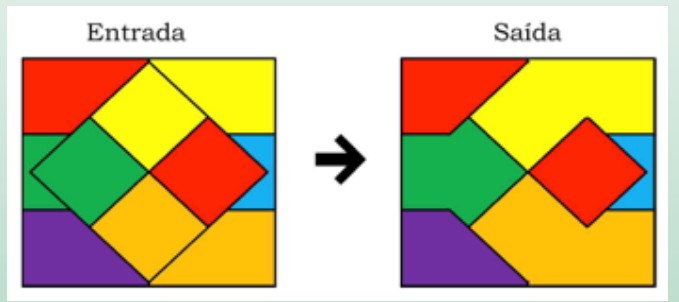
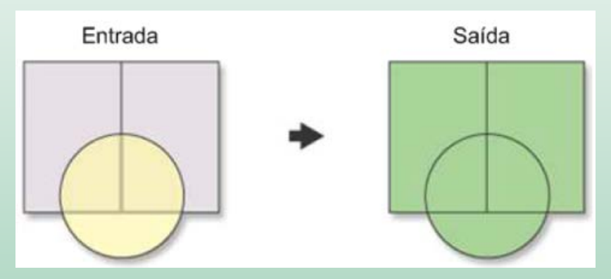
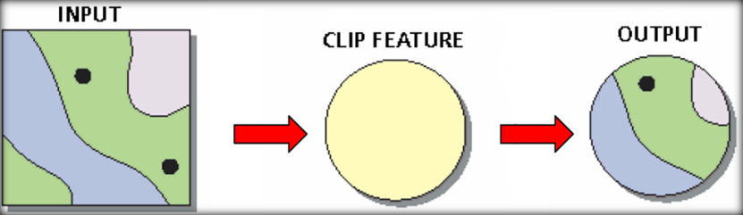
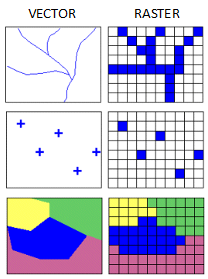

```{r setup, include=FALSE}
knitr::opts_chunk$set(echo = FALSE)
```

# Análise Espacial: O que representar?   

### Entidades realmente existentes (visíveis):

Exemplos: edificações, ruas.   

### Conceitos abstratos (invisíveis): 

Exclusão/inclusão social, violência, pobreza/riqueza, desigualdade

> Inclui transformações, manipulações e métodos que podem ser aplicados aos dados geográficos para adicionar valor a eles, apoiar decisões e revelar padrões e anomalias que não são óbvios à primeira vista. 

> Métodos de suporte ao **processo decisório**

---

## Visualização de fenômenos sociais no espaço {.tabset .tabset-fade .tabset-pills}

### Mapas coropléticos

```{r echo=FALSE, out.width='50%', fig.align = 'center'}
knitr::include_graphics('./img/coropl.png')
```

---

### Mapas de pontos

```{r echo=FALSE, out.width='50%', fig.align = 'center'}
knitr::include_graphics('./img/pontos.png')
```

---

### Representação de fluxos
```{r echo=FALSE, out.width='50%', fig.align = 'center'}
knitr::include_graphics('./img/fluxos.png')
```

---

### Mapas de calor

```{r echo=FALSE, out.width='60%', fig.align = 'center'}
knitr::include_graphics('./img/calor.png')
```

---

### Cartogramas
```{r echo=FALSE, out.width='50%', fig.align = 'center'}
knitr::include_graphics('./img/1_cartograma.png')
```

---

### Símbolos proporcionais

```{r echo=FALSE, out.width='55%', fig.align = 'center'}
knitr::include_graphics('./img/pontos_propo.png')
```

---

## Algumas operações com dados espaciais {.tabset .tabset-fade .tabset-pills}

### Agregação (Dissolve)
+ Elimina divisões indesejáveis considerando os valores de atributos.

```{r echo=FALSE, out.width='60%', fig.align = 'center'}

```

---

### União (Merge)
+ Combina layers diferentes

```{r echo=FALSE, out.width='55%', fig.align = 'center'}

```

---

### Interseção espacial e operações de recorte
+ Interseção - atributos de todas as feições estarão no arquivo de saída considerando a sobreposição 

```{r echo=FALSE, out.width='55%', fig.align = 'center'}
knitr::include_graphics('./img/4_intersecao.png')
```

+ Recortar - somente atributos das feições de entrada estarão no arquivo de saída

```{r echo=FALSE, out.width='55%', fig.align = 'center'}

```

```{r message=FALSE, warning=FALSE}
library(GISTools)
library(tmap)
library(sf)
```

```{r}
data(tornados)

# Converter para objetos `sf`
torn_sf <- st_as_sf(torn)
us_states_sf <- st_as_sf(us_states)

# Plotar a extensão da informação espacial e um fundo cinza
tm_shape(us_states_sf) +
  tm_polygons("grey90") +
  # adicionar os pontos de tornados 
  tm_shape(torn_sf) +
    tm_dots(col = "#FB6A4A", size = 0.04, shape = 1, alpha = 0.5) +
  # gerar mapa com os limites territoriais
  tm_shape(us_states_sf) +
    tm_borders(col = "black") +
      tm_layout(frame = F) 
```

Para gerar uma análise estatística exploratória dos pontos, utilize: 

```{r}
summary(torn_sf)
st_geometry(torn_sf)
```

Se for interessante analisar a incidência de tornados em uma determinada área, pode ser feito: 

```{r}
index <- us_states$STATE_NAME == "Texas"
AoI_sf <- us_states_sf[index,]
```

```{r}
tm_shape(AoI_sf) +
  tm_borders(col = "black") +
  tm_layout(frame = F) +
  # Adicionar os pontos de tornados
  tm_shape(torn_sf) +
    tm_dots(col = "#FB6A4A", size = 0.2, shape = 1, alpha = 0.5)
```

Há diferentes formas de recortar um dado espacial. A forma mais simples é usar a extensão espacial de um objeto espacial como um índice para gerar um subconjunto de outro. Veja o exemplo.

```{r}
torn_clip_sf <- torn_sf[AoI_sf,]
```
```{r}
tm_shape(torn_clip_sf) +
  tm_dots(col = "#FB6A4A", size = 0.2, shape = 1, alpha = 0.5) +
  tm_shape(AoI_sf) +
    tm_borders()
```

Entretanto, em alguns contextos, é interessante combinar atributos de diferentes conjuntos de dados com base na localização espacial. A função `st_intersection` do `sf` permite gerar a informação conforme exemplo:

```{r}
AoI_torn_sf <- st_intersection(AoI_sf, torn_sf)
tm_shape(AoI_sf) + tm_borders(col = "black") + tm_layout(frame = F) +
  # add the torn points 
  tm_shape(AoI_torn_sf) + 
  tm_dots(col = "#FB6A4A", size = 0.2, shape = 1, alpha = 0.5)
```

```{r echo=FALSE, message=FALSE, warning=FALSE, include=TRUE, results='hide'}
head(data.frame(AoI_torn_sf))
```

---

### Diferença
+ É o inverso da interseção

```{r echo=FALSE, out.width='60%', fig.align = 'center'}
knitr::include_graphics('./img/5_diferenca.png')
```

---
### Atribuir dado por localização
```{r echo=FALSE, out.width='75%', fig.align = 'center'}
knitr::include_graphics('./img/dados.png')
```

---

### Buffer

Em algumas situações, é necessário identificar eventos ou feições que também ocorreram próximas à área de interesse. Eventos ambientais, como tornados, também não estão contidos pelos limites administrativos. Assim, a operação do tipo _buffer_ auxilia na construção dessa área onde podem acontecer os eventos. 

No pacote `sf`, tem-se a função `st_buffer`. 

Se for necessário entender a dinâmica de formação dos tornados, seguindo o exemplo anterior, em até 25 km das fronteiras com o estado do Texas, é possível fazer a seguinte análise:

```{r}
us_states2_sf <- st_as_sf(us_states2) 
AoI_sf <- st_as_sf(us_states2_sf[us_states2_sf$STATE_NAME == "Texas",])
AoI_buf_sf <- st_buffer(AoI_sf, dist = 25000)
```

```{r}
tm_shape(AoI_buf_sf) + tm_borders("black") +
   tm_shape(AoI_sf) + tm_borders("blue") +
   tm_layout(frame = F)

```

---

### União espacial

Em determinadas análises, faz-se necessária a quando é interessante que as áreas de determinados estados, como no exemplo acima, sejam unidas a fim de analisar as feições internas a esse polígono maior. Essa operação pode ser realizada considerando a função `st_union` e `st_combine`. 

A função considerada para converter o resultado `sfc` da união realizada pela função `st_union` para um objeto `sf`antes de iniciar a representação pelas funções em `tmap`. 

```{r}
library(tmap)
us_states_sf <- st_as_sf(us_states)
AoI.merge_sf <- st_sf(st_union(us_states_sf)) # função considerada para converter o resultado `sfc` da união realizada pela função `st_union` para um objeto `sf`antes de iniciar a representação pelas funções em `tmap`. 
tm_shape(us_states_sf) + 
  tm_borders(col = "darkgreen", lty = 3) + 
  tm_shape(AoI.merge_sf) + 
    tm_borders(lwd = 1.5, col = "black") + 
    tm_layout(frame = F)
```

---

### Junção 

+ Junção relacional: Combina o conteúdo de duas tabelas usando uma chave comum.

+ Operação ponto em polígono: Compara as propriedades dos pontos com as das áreas onde estão contidos.

+ Sobreposição de feições: Permite determinar se duas áreas se sobrepõe, determinar a área de sobreposição e definir a área formada pela sobreposição.

#### Junção relacional
+ Junção relacional: combina o conteúdo de duas tabelas usando uma chave comum - **NÃO É ESPACIAL!**

```{r echo=FALSE, out.width='55%', fig.align = 'center'}
knitr::include_graphics('./img/bd_relacional.png')
```

#### Junção espacial
+ Operação ponto em polígono: compara as propriedades dos pontos com as das áreas onde estão contidos.

+ Sobreposição de feições: permite determinar se duas áreas se sobrepõe, determinar a área de sobreposição e definir a área formada pela sobreposição.

```{r echo=FALSE, out.width='65%', fig.align = 'center'}
knitr::include_graphics('./img/spatial_join.png')
```

---

### Seleção de polígonos que contêm pontos

Essa primeira abordagem só permite a seleção de polígonos que contenham pontos. A partir dessa operação, o dataframe do objeto de polígonos não é modificado. Essa operação apenas permite a seleção das feições. 
```{r}
torn.count <- poly.counts(torn, us_states) 
head(torn.count)
names(torn.count)
```

Para cômputo da junção espacial, faz-se necessário o uso da função `st_join`. Essa função promove a adição de uma nova coluna no objeto `x` a partir de outro `y`. Por padrão, a junção acontece da esquerda para a direita. 

```{r}
us_states_joined = st_join(torn_sf, us_states_sf["STATE_NAME"])
head(us_states_joined)

tm_shape(us_states_sf) + tm_borders(col = "black") + tm_layout(frame = F) +
  # add the torn points 
  tm_shape(us_states_joined) + 
  tm_dots(col = "#FB6A4A", size = 0.2, shape = 1, alpha = 0.5)
```

---

# Dados Matriciais

Operações de sobreposição são mais simples. Atributos de diferentes matrizes podem ser combinados por meio de álgebra de mapas. 

```{r echo=FALSE, out.width='55%', fig.align = 'center'}
knitr::include_graphics('./img/raster.png')
```

```{r echo=FALSE, out.width='55%', fig.align = 'center'}
knitr::include_graphics('./img/raster_vec.png')
```

```{r echo=FALSE, out.width='35%', fig.align = 'center'}

```

---

# Qual utilizar?

```{r echo=FALSE, out.width='90%', fig.align = 'center'}
knitr::include_graphics('./img/raster_vector.gif')
```

