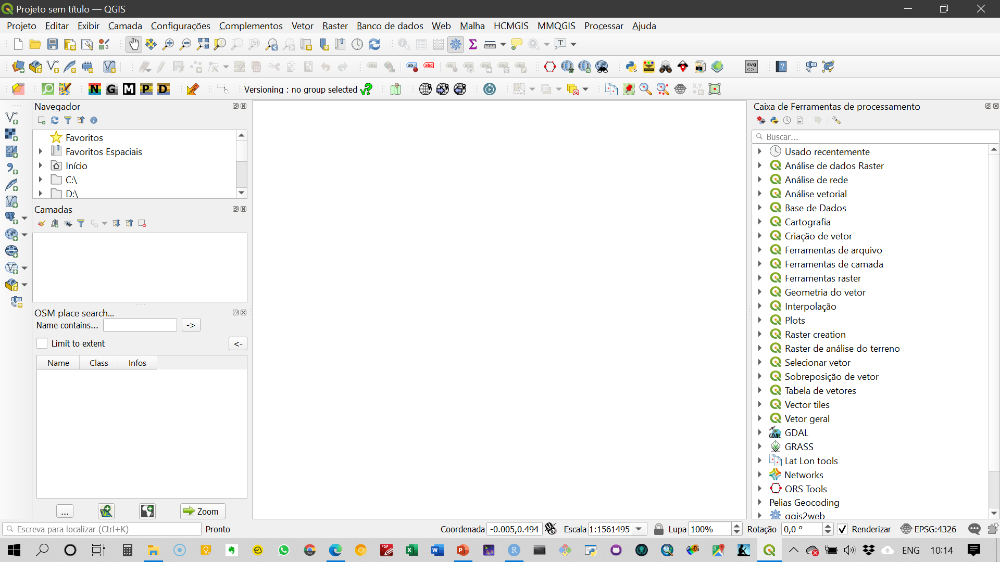
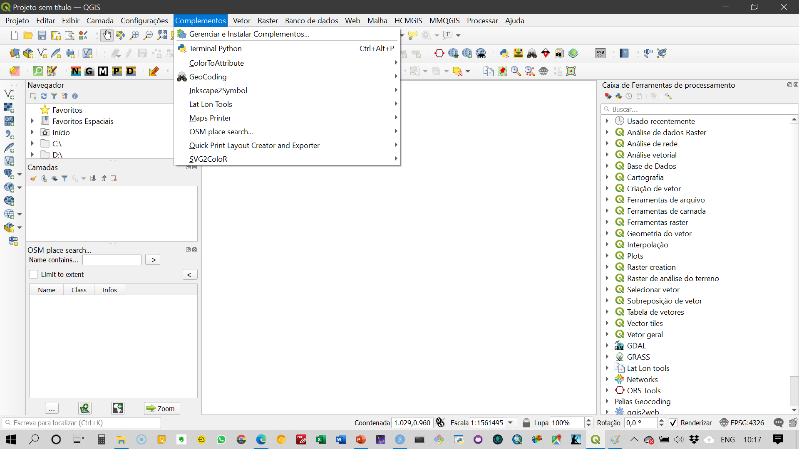
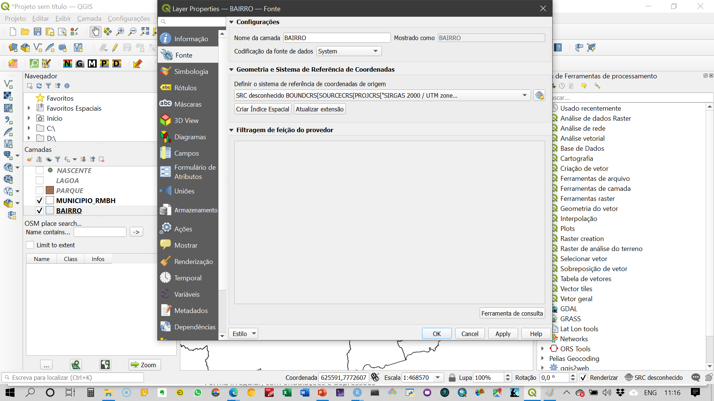
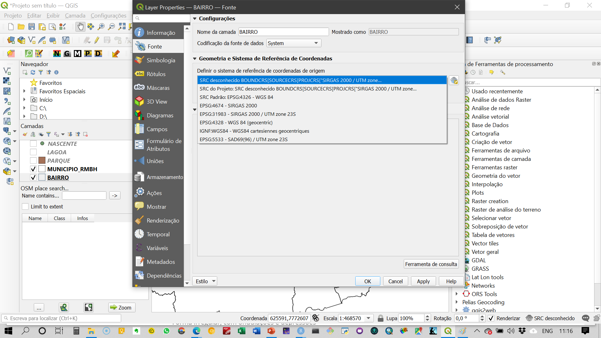
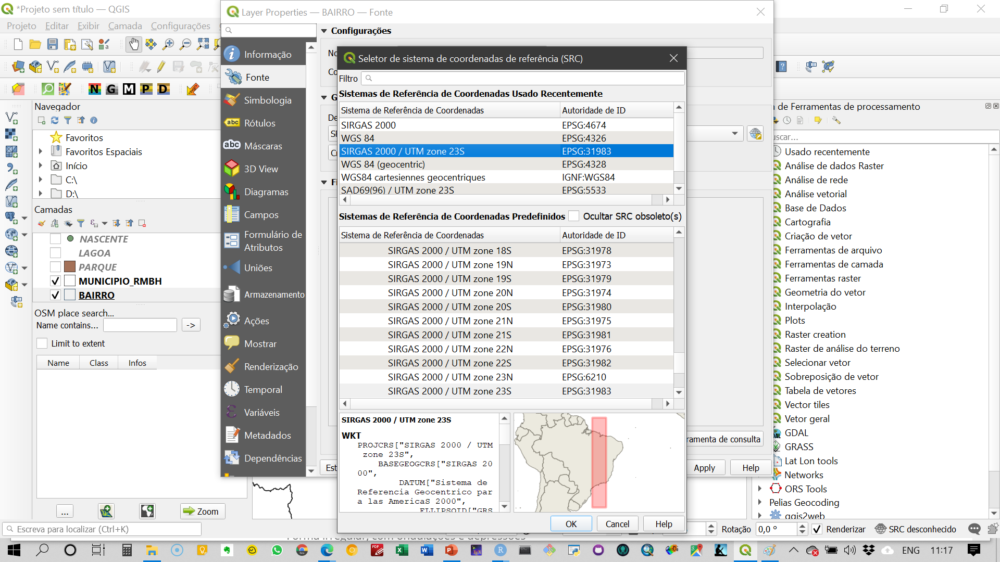

## Dados considerados para desenvolvimento das atividades práticas neste curso e respectivas fontes:

1. Dados de infecção por COVID-19 e suas consequências   
2. Dados da Google e da Apple sobre mobilidade na pandemia   
3. Dados socioeconômicos e demográficos dos recortes espaciais em análise
    - Belo Horizonte e RMBH
    - Unidades espaciais mais desagregadas de dados do COVID-19


Arquivo |	Unidade espacial | GCS/PCS |	Área de estudo |	Atributos |	Fonte
--------|------------------|---------|-----------------|------------|---------
bairro |	Polígons - bairros |	SIRGAS 2000 UTM 23S |	Belo Horizonte |	Dados gerais do censo 2010 |	BHMaps
creches |	pontos – equipamentos |	SIRGAS 2000 UTM 23S |	Belo Horizonte |	Dados gerais do censo 2010 |	BHMaps
edificação |	polígonos – unidades construídas |	SIRGAS 2000 UTM 23S |	Belo Horizonte |	Geometria das regionais |	BHMaps
ensino_superior |	pontos – equipamentos |	SIRGAS 2000 UTM 23S |	Belo Horizonte |	Geometria dos municípios |	BHMaps
escolas_estaduais |	pontos – equipamentos |	SIRGAS 2000 UTM 23S |	Lagoa |	Geometria da lagoa |	BHMaps
escolas_federais |	pontos – equipamentos |	SIRGAS 2000 UTM 23S |	Belo Horizonte |	Geometria dos municípios |	BHMaps
escolas_municipais_infantil |	pontos – equipamentos |	SIRGAS 2000 UTM 23S |	Belo Horizonte |	Dados do censo 2010 |	BHMaps
escolas_municipais_fundamental |	pontos – equipamentos |	SIRGAS 2000 UTM 23S |	Belo Horizonte |	Lojas |	 |BHMaps
escolas_particulares |	pontos – equipamentos |	SIRGAS 2000 UTM 23S |	Belo Horizonte |	Vias |	BHMaps
lagoa | 	polígono - lagoas |	SIRGAS 2000 UTM 23S |	Belo Horizonte |	Lojas |	BHMaps
município_rmbh |	polígono – divisa municipal |	SIRGAS 2000 UTM 23S |	Belo Horizonte |	 |	BHMaps
regional |	polígono – regionais |	SIRGAS 2000 UTM 23S |	Belo Horizonte |	 |	BHMaps
setor_censitario |	polígono – setor censitário |	SIRGAS 2000 UTM 23S |	Belo Horizonte |	 |	BHMaps
uso_solo |	polígono – unidades de ocupação dos lotes |	SIRGAS 2000 UTM 23S |	Belo Horizonte |		 |BHMaps
vila_favela |		 |SIRGAS 2000 UTM 23S |	Belo Horizonte |		 |BHMaps

---

## Arquivos de dados espaciais para Belo Horizonte   

 - [`shapefiles` - BHMaps](https://drive.google.com/drive/folders/1bZmcOwZLvs9op7kQYAHshvCELk4M35o4?usp=sharing)      
 
 - [Setores censitários sem renda](https://drive.google.com/drive/folders/1gRQ3pM__jGSPq-dk35hVlLS4S5hzlRWc?usp=sharing)   
 
 - [Setores censitários com renda](https://drive.google.com/drive/folders/1twMTRnrSY0ugLwC7xJq7LzuuPiXDYmRX?usp=sharing)
 
 - [Bairros](https://drive.google.com/drive/folders/1gDOdMb3elvcolWgV_3jBOV_xfwo7A08e?usp=sharing)  
 
 - [Estabelecimentos comerciais](https://drive.google.com/drive/folders/1ZVoVW7QG7uyxkHOAJLu1p9ViTm9TK5jW?usp=sharing)   
 
 - [Áreas de presevação permanente](https://drive.google.com/drive/folders/1i3Ax_Z6J93utrAkpRTMG13rF50u_WND6?usp=sharing)   
 
---

## Ambiente de Trabalho do QGIS {.tabset .tabset-fade .tabset-pills}
:::justa
Neste módulo são apresentados os elementos componentes do ambiente de trabalho do QGIS e suas respectivas finalidades. 
:::

### Ambiente geral

QGIS é um Sistema de Informações Geográficas aberto, colaborativo e que apresenta interface composta conforme o Vídeo 1.

<iframe width="560" height="315" src="https://www.youtube.com/embed/3ii17pnlpTs" frameborder="0" allow="accelerometer; autoplay; clipboard-write; encrypted-media; gyroscope; picture-in-picture" allowfullscreen></iframe>

```{r echo=FALSE, out.width='100%', fig.align = 'center'}

```

---

### Complementos   

As funcionalidades no QGIS estão disponíveis nas barras de ferramentas já instaladas e outras possibilidades estão presentes nos complementos que podem ser instalados conforme Vídeo 2

```{r echo=FALSE, out.width='100%', fig.align = 'center'}

```

---

## Sistemas de coordenadas {.tabset .tabset-fade .tabset-pills}  

### Mudança de datum e sistemas de coordenadas {.tabset .tabset-fade .tabset-pills}

#### Transformações on-the-fly 

O mecanismo de transformações `on-the-fly` realiza reprojeções automáticas para fins de visualização/renderização.

São reprojeções dinâmicas, que não afetam o dado original   

```{r echo=FALSE, out.width='100%', fig.align = 'center'}

```

```{r echo=FALSE, out.width='100%', fig.align = 'center'}

```

```{r echo=FALSE, out.width='100%', fig.align = 'center'}
knitr::include_graphics('./img/q11.png')
```

```{r echo=FALSE, out.width='100%', fig.align = 'center'}

```

---

#### Reprojetar ou converter   
Para reprojetar ou converter para outro formato: 
Salvar a camada com o novo sistema de referência/formato
Botão direito sobre a camada > Save as... 

```{r echo=FALSE, out.width='100%', fig.align = 'center'}
knitr::include_graphics('./img/q13.png')
```

```{r echo=FALSE, out.width='100%', fig.align = 'center'}
knitr::include_graphics('./img/q14.png')
```

--- 

### Verificação de aprendizagem
**Dados espaciais e sistemas de referência**

1. Abrir o `shapefile` e verificar qual o sistema de coordenadas ativo.    
2. Transformar o sistema de coordenadas em `WGS84` e salvar como um novo shapefile   
3. Transformar todos os `shapefiles` para coordenadas projetadas `SIRGAS 2000 - UTM 23 S`
4. Mudar a cor dos dados vetoriais para apresentações que permitam a análise da sobreposição de camadas.   
 
---

## Trabalhando com arquivos Shapefile {.tabset .tabset-fade .tabset-pills}  

### Acesso aos dados espaciais

Vamos trabalhar com dados na estrutura `shapefile` - camadas vetoriais   

```{r echo=FALSE, out.width='100%', fig.align = 'center'}
knitr::include_graphics('./img/q3.png')
```

```{r echo=FALSE, out.width='100%', fig.align = 'center'}

```

---

### Mudança de atributos dos shapefiles

Mudança de cores das camadas     

- acesso às propriedades da camada    

```{r echo=FALSE, out.width='100%', fig.align = 'center'}
knitr::include_graphics('./img/q7.png')
```

 
- mudanças das propriedades   

```{r echo=FALSE, out.width='100%', fig.align = 'center'}
knitr::include_graphics('./img/q8.png')
```


Pode haver incompatibilidade entre feições causadas pela qualidade do dado vetorial ou por uso de diferentes projeções. Isso não inviabiliza o uso do dado espacial, mas podem ser necessárias conversões de sistemas de referência ou mesmo tratamento da geometria das feições.   

---

### Tabela de atributos

A `tabela de atributos` pode ser acessada pelo mesmo menu da camada. Na `tabela de atributos` são apresentadas as observações e os atributos de cada feição geométrica gerreferenciada. É análoga a uma planilha ou a um data.frame (`R`). É importante lembrar que só é possível associar um banco de dados (tabela de atributos) a um dado vetorial. Cada observação é uma feição geométrica desse dado.    

```{r echo=FALSE, out.width='100%', fig.align = 'center'}

```

```{r echo=FALSE, out.width='100%', fig.align = 'center'}

```

---

### Verificação de aprendizagem

:::justa

**Tabela de atributos e manipulação de dados espaciais**      
1. Verificar o número de observações e o número de atributos na `tabela de atributos`   
2. Selecionar setores censitários com população menor do que 400 habitantes.    
3. Exportar apenas os dados selecionados como um novo shapefile.  
:::

---

## Layout de mapas 

### Edicação de Layout

Para gerarmos o layout de impressão dos mapas, é necessário acessar o ambiente de edição do layout. 

```{r echo=FALSE, out.width='100%', fig.align = 'center'}
knitr::include_graphics('./img/q19.png')
```

O ambiente de edição de layout tem a seguinte estrutura:

```{r echo=FALSE, out.width='100%', fig.align = 'center'}
knitr::include_graphics('./img/q20.png')
```

Para inserir os elementos gráficos e textuais no layout, você deve acessar o menu à esquerda da página em branco e incluir mapas, legendas, indicador de norte, escala, dentre outros elementos. 

```{r echo=FALSE, out.width='100%', fig.align = 'center'}
knitr::include_graphics('./img/q21.png')
```

---

## Geocodificação  {.tabset .tabset-fade .tabset-pills} 

### Material de suporte

O complemento que utilizo para geocodificação é o `MMQGIS`, que conecta direto com as APIs do Google e do OSM. Para fazer a geocodificação pelo Google, é necessária chave de acesso e token, pois acima de 2.500 requisiçoes por IP por dia são cobradas. Assim, recomendo a utilização do `OSM`. 

O arquivo a ser organizado e importado no `QGIS` para geocodificação é no formato `.csv` e codificação `UTF-8`. Nesse arquivo devem ser organizadas as informações sobre o endereço em quatro colunas:   
- address   
- city   
- state   
- country   

Na primeira coluna colocamos o endereço completo sem as informações de cidade, estado e país.   

```{r echo=FALSE, out.width='100%', fig.align = 'center'}
knitr::include_graphics('./img/q16.png')
```

<iframe width="560" height="315" src="https://www.youtube.com/embed/qvUgWpidJ5A" frameborder="0" allow="accelerometer; autoplay; encrypted-media; gyroscope; picture-in-picture" allowfullscreen></iframe>

<iframe width="560" height="315" src="https://www.youtube.com/embed/ZIeLmrR7Kz8" frameborder="0" allow="accelerometer; autoplay; encrypted-media; gyroscope; picture-in-picture" allowfullscreen></iframe>

<iframe width="560" height="315" src="https://www.youtube.com/embed/d9UAn8M9tZ8" frameborder="0" allow="accelerometer; autoplay; encrypted-media; gyroscope; picture-in-picture" allowfullscreen></iframe>

---

### Verificação de aprendizagem

Geocodificar a base de dados de supermercados [supermercados.xlsx](https://drive.google.com/file/d/1u6XG3WEU1nNCqmQCB3-xhOGmSytZvqWQ/view?usp=sharing)

---

## Mapas temáticos (categóricos e numéricos) {.tabset .tabset-fade .tabset-pills}

### Material de suporte

Mapas temáticos são representações em feições geométricas do atributo de interesse utilizando elementos visuais para visualização da estrutura espacial desses dados. 

```{r echo=FALSE, out.width='100%', fig.align = 'center'}
knitr::include_graphics('./img/q22.png')
```

```{r echo=FALSE, out.width='100%', fig.align = 'center'}
knitr::include_graphics('./img/q23.png')
```

```{r echo=FALSE, out.width='100%', fig.align = 'center'}
knitr::include_graphics('./img/q24.png')
```

```{r echo=FALSE, out.width='100%', fig.align = 'center'}
knitr::include_graphics('./img/q25.png')
```

```{r echo=FALSE, out.width='100%', fig.align = 'center'}
knitr::include_graphics('./img/q26.png')
```

---

### Verificação de aprendizagem

1. Gerar um mapa temático de renda do município de Belo Horizonte considerando a informação em setores censitários [dados espaciais vetoriais](https://drive.google.com/file/d/1ssHO72cZSzY3_pfBuKsxSl-XrwmBvpKh/view?usp=sharing).
2. Gerar um mapa contendo os supermercados com representações que reflitam a área do estabelecimento. 
3. Gerar layout de impressão para cada um dos mapas anteriories contendo legenda, indicação de norte, escala. Salvar o mapa em .pdf e enviar pelo Canvas [Prática 4](https://canvas.instructure.com/courses/2212138/assignments/17131701).


